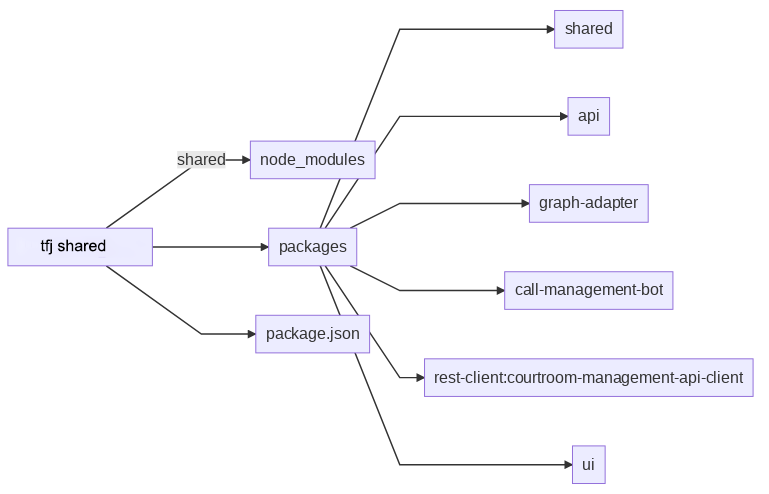
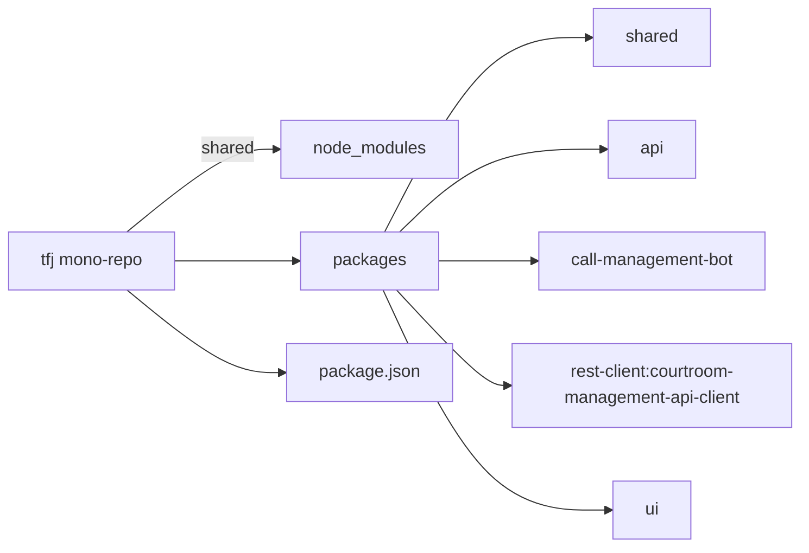
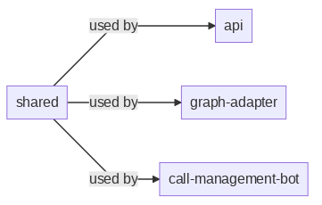
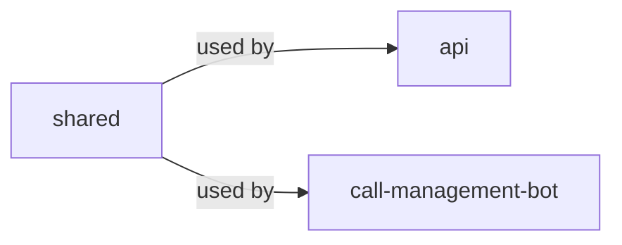
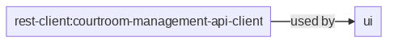
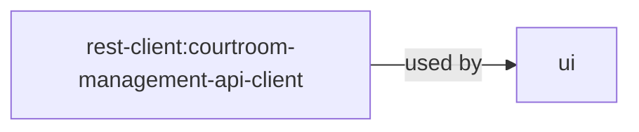
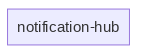
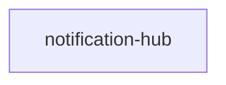

# Teams for Justice

Beginning with Australian courts and tribunals, Teams for Justice addresses the need to facilitate hearings online with
tooling that reflects the principles of case procedure. The COVID-19 pandemic has been a catalyst for this need.
By providing a Microsoft Teams experience that accommodates the general needs of courts and tribunals in an online setting,
we will materially improve what is currently considered a sub-optimal experience of managing and moderating online hearings.

Our goal is enabling the moderator to �bring back order to the courts.�

## Table of Contents <!-- omit in toc -->

- [Teams for Justice](#teams-for-justice)
  - [Documentation folder structure](#documentation-folder-structure)
  - [Solution Architecture](#solution-architecture)
    - [Data driven and system events](#data-driven-and-system-events)
    - [High level deployment architecture](#high-level-deployment-architecture)
    - [Linting](#linting)
  - [Development Overview](#development-overview)
  - [Azure Functions](#azure-functions)
    - [Extension Management](#extension-management)
  - [Development Container](#development-container)
  - [Building](#building)
  - [Deploying to Azure](#deploying-to-azure)
  - [MEGA Linting](#mega-linting)
  - [Azure Storage Emulation](#azure-storage-emulation)
  - [Contributing](#contributing)
  - [Trademarks](#trademarks)

## Documentation folder structure

The **[Wiki](./wiki/README.md)** folder has the following sub folders:

| Folder                                            | Description                                                                                         |
| :------------------------------------------------ | :-------------------------------------------------------------------------------------------------- |
| **[Architecture](./wiki/architecture/README.md)** | Solution architecture documentation and architecture drawings                                       |
| **[Events](./wiki/events/README.md)**             | Documentation of all events used in the solution and the relationships between the different events |
| **[Features](./wiki/features/README.md)**         | Design documentation for the key system features                                                    |
| **[UI](./wiki/ui/README.md)**                     | Design documentation for all UI components                                                          |
| **[Trade studies](./trade-studies/README.md)**    | Decisons made (see also [Trade Studies Template](trade-studies/trade-study-template.md))            |

## Solution Architecture

### Data driven and system events

The solution is built using microservices that communicate with each other via
different system and user data driven events, in more details described in
[Events](./wiki/events/README.md)

### High level deployment architecture

<!-- generated by mermaid compile action - START -->



<details>
  <summary>Mermaid markup</summary>



</details>
<!-- generated by mermaid compile action - END -->

<!-- generated by mermaid compile action - START -->



<details>
  <summary>Mermaid markup</summary>



</details>
<!-- generated by mermaid compile action - END -->

<!-- generated by mermaid compile action - START -->



<details>
  <summary>Mermaid markup</summary>



</details>
<!-- generated by mermaid compile action - END -->

<!-- generated by mermaid compile action - START -->



<details>
  <summary>Mermaid markup</summary>



</details>
<!-- generated by mermaid compile action - END -->

### Linting

A lint check validates all of the Markdown files on pull requests. The
validation rules on the markdown files can be found at
`.github/linters/.markdown-lint.yml`. There is a line length limit on the
documents. If you have
[rewrap](https://marketplace.visualstudio.com/items?itemName=stkb.rewrap) the
VsCode extension installed, you can highlight the long line and press `Alt+Q` to
reformat code comments and other text to a given line length.

## Development Overview

This project has been configured to work best with [VS Code](https://code.visualstudio.com/). There are two ways to open
this project:

1. As a folder - simply open VS code from the root of the repository.
2. As a workspace - After opening as a folder, click on the dialog in the bottom right to open the workspace, or go to
   `File -> Open Workspace` and select the `workspace.code-workspace` file.

## Azure Functions

Running and debugging Azure Functions locally works best when running as a workspace; the workspace gives access to most
of the same code files, organized as projects. If a file is not present in the workspace, feel free to either it to the
workspace, or open as a folder for full access.

### Extension Management

Azure Functions that wish to interop with different Azure Services require bindings for those services. We are using an
explicit approach to manage these extensions to minimize the build times as well as to ensure we stay locked into the
versions of these bindings we know work well through testing.

If you are just working with existing code, there is nothing to do as we have a build step that will synchronize your
local project with the already configured extensions (i.e. runs `func extensions sync`) whenever you call `yarn build`.
If a new binding is necessary, the developer should either add this binding explicitly by referencing it in the
`function.json` file and calling `func extensions install` which will crawl the `function.json` files in the project,
discover all bindings used and update the `extensions.csproj` or manually install the extension using
`func extensions install -p <extension-package-name> [-v <version>]`.

For more on registering extensions, [please refer to this Azure Functions CLI documentation](https://docs.microsoft.com/en-us/azure/azure-functions/functions-run-local?tabs=windows%2Ccsharp%2Cbash#register-extensions).

## Development Container

**Prerequisites:**

- [Docker Desktop](https://www.docker.com/products/docker-desktop)
- [VS Code](https://code.visualstudio.com/)
- [Remote Development extension pack](https://marketplace.visualstudio.com/items?itemName=ms-vscode-remote.vscode-remote-extensionpack)

This project supports the use of [development containers](https://code.visualstudio.com/docs/remote/containers). Dev
containers are a great way to package all development requirements into a docker image and running VS code from the
context of that docker image. Dev containers can also be used with [Github
Codespaces](https://code.visualstudio.com/docs/remote/codespaces) for a hosted development environment.

To use the dev container, follow the [Quick Start
instructions](https://code.visualstudio.com/docs/remote/containers#_quick-start-open-an-existing-folder-in-a-container)
in the VS code documentation. VS Code will restart itself and open in the context of the docker container with your
local repo mounted directly into the container so you will not lose any work if the container stops.

## Building

**Pre-requisites**:

- [Node 14](https://nodejs.org/en/download/)
- Yarn (run `npm install -g yarn`)
- [Azure Functions Core Tools v3](https://docs.microsoft.com/en-us/azure/azure-functions/functions-run-local?tabs=linux%2Ccsharp%2Cbash)
  - Can be installed with `npm i -g azure-functions-core-tools@3 --unsafe-perm true`

All project source code is located in the `src` folder. This project utilizes [yarn
workspaces](https://yarnpkg.com/features/workspaces) to support all the projects as separate packages in a monorepo. To
install dependencies and build and test all the projects, run the following from the `src` folder:

```shell
yarn install        # installs all dependencies
yarn build          # builds all projects
yarn test           # run all unit tests
```

Using yarn workspaces means all dependencies are co-located in a single node_modules folder in the `src` folder. To run
any script present in a package.json for one of the projects within the workspace, you can use the following command:

```shell
yarn <project name> <command>
```

Or to run against all projects:

```shell
yarn workspaces run <command>
```

See [`src/package.json`](../src/package.json) for examples of this usage.

## Deploying to Azure

To deploy Teams for Justice (T4J) solution to Azure, you'd need to follow the
steps and provided instructions in the various documents spread across this Wiki
folder. To help you with navigating throught a myriad of documents for how to
deploy Teams for Justice into a new Azure and Teams environment, this section
provides you with an list of documents and helpful guidelines that you can
follow along in the process of deploying all Teams for Justice Azure and Teams
components.

Here is the list of operations we suggest you to perform in the order they are outlined:

1. Create a new or sign in as a global administrator into a targeted Microsoft Azure subscription
2. Create a new or sign in as a Teams administrator into a targeted Microsoft Teams tenant
3. Obtain M365 licenses (E3 or E5) as you'd need them later when provisioning Teams for Justice application
4. Fork the `teams4justice` solution in GitHub to your own GitHub account
5. Create Azure AD App Registrations for all T4J microservices (see more [Application Security](wiki/application-security.md))
6. Configure Microsoft Teams tenant with the PowerShell scripts (see more [Setting Up Teams Tenant](wiki/setting-up-teams-tenant.md))
7. Deploy baseline Azure infrastructure using Terraform scripts (see more [Set up Terraform Infrastructure](../terraform/README.md))
8. Follow the remaining steps in [Setting up a new environment](wiki/setting-up-a-new-environment.md))

## MEGA Linting

**Prerequisites:**

- [Docker Desktop](https://www.docker.com/products/docker-desktop)
- [Node 14](https://nodejs.org/en/download/)

This project uses a variety of linters to ensure code quality and style. Most of the linters are integrated into the VS
Code dev container or are recommended extensions. This project also uses the
[mega-linter](https://github.com/nvuillam/mega-linter/) to run linting for all PRs automatically via GitHub Actions.

This tool is automatically installed in the dev container; to install it on your local machine, run
`npm install -g mega-linter-runner`. To run the mega-linter locally, run `mega-linter-runner` in the root of the
repository. Configuration for the mega-linter can be found in `.mega-linter.yml`.

## Azure Storage Emulation

Several of the projects in this repo, such as the Azure Functions, are reliant on Azure Storage features to run.
[Azurite] solves this problem well for local development. Azurite can either be installed as a global tool using
[its `npm` package](https://www.npmjs.com/package/azurite) or as
[a container](https://hub.docker.com/_/microsoft-azure-storage-azurite) which you can spin up using Docker Desktop.
Documentation for how to work with each specific approach is provided at each of the respective links.

Then, in the project(s) that depends on Azure Storage, just make sure you set any Azure Storage connection strings
setting (e.g. `AzureWebJobsStorage`) in your configuration files (e.g. environment vars or appsettings) to the value:
`UseDevelopmentStorage=true`. This tells the SDK to specifically look for the emulator running on a specific set of
default ports.

## Contributing

This project welcomes contributions and suggestions. Most contributions require you to agree to a
Contributor License Agreement (CLA) declaring that you have the right to, and actually do, grant us
the rights to use your contribution. For details, visit <https://cla.opensource.microsoft.com>.

When you submit a pull request, a CLA bot will automatically determine whether you need to provide
a CLA and decorate the PR appropriately (e.g., status check, comment). Simply follow the instructions
provided by the bot. You will only need to do this once across all repos using our CLA.

This project has adopted the [Microsoft Open Source Code of Conduct](https://opensource.microsoft.com/codeofconduct/).
For more information see the [Code of Conduct FAQ](https://opensource.microsoft.com/codeofconduct/faq/) or
contact [opencode@microsoft.com](mailto:opencode@microsoft.com) with any additional questions or comments.

## Trademarks

This project may contain trademarks or logos for projects, products, or services. Authorized use of Microsoft
trademarks or logos is subject to and must follow
[Microsoft's Trademark & Brand Guidelines](https://www.microsoft.com/en-us/legal/intellectualproperty/trademarks/usage/general).
Use of Microsoft trademarks or logos in modified versions of this project must not cause confusion or imply Microsoft sponsorship.
Any use of third-party trademarks or logos are subject to those third-party's policies.
