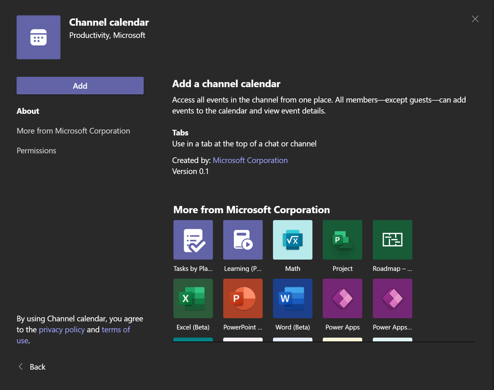
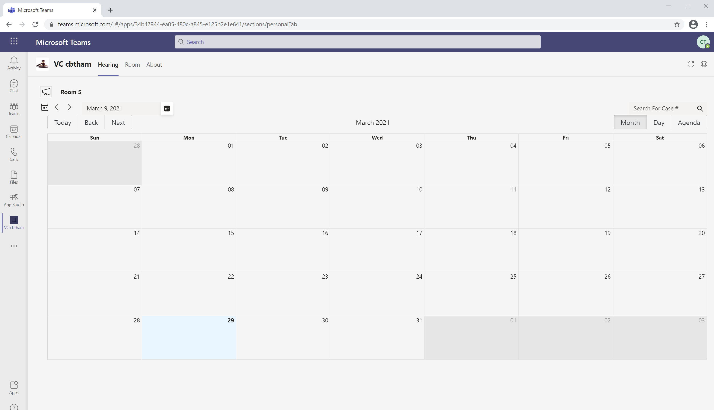

# Trade Study: Calendar Component

|                 |                                            |
| --------------: | ------------------------------------------ |
| _Conducted by:_ | Cheng Bin Tham, Danny Garber               |
|  _Sprint Name:_ | Calendar Spike UI                          |
|         _Date:_ | Apr 2021                                   |
|     _Decision:_ | Use 3rd Party Library - React Big Calendar |

- [Trade Study: Calendar Component](#trade-study-calendar-component)
  - [Overview](#overview)
  - [Goals](#goals)
  - [Open questions](#open-questions)
  - [Solutions](#solutions)
    - [Solution 1 - Using Channel Calendar tab from App Catalog](#solution-1)
      - [Pros](#pros)
      - [Cons](#cons)
    - [Solution 2 - Using 3rd Party Library](#solution-2)
      - [Pros](#pros-1)
      - [Cons](#cons-1)
  - [Comparison](#comparison)
  - [Decision](#decision)

## Overview

Investigate how to build court room scheduling experience.
Fluent-northstar does not have a calendar view component and Teams SDK does not allow extending into using native calendar.

## Goals

- Render native Teams calendar experience for scheduling court room activities.

## Open questions

- Can we use "Channel Calendar" from app catalog?
- Do we use third party library to render calendar?
- Can design and requirements be fulfilled going with either option?

## Solutions

### Solution 1 - Using Channel Calendar tab from App Catalog

[Channel Calendar](https://office365itpros.com/2021/01/11/teams-channel-calendar-app/)
is a first party app from App Catalog by Microsoft.
It allows team members to access channel meetings in a calendar view grid, which looks like the Teams calendar app.

#### Pros

- Native look and feel to Teams client.
- Scheduling and new meeting event handled natively.
- Calendar for different Teams channel is seperated. i.e. not using a group/personal calendar.
- Low to no code maintenence as this is published and maintained by Microsoft.

#### Cons

- Strict UI and scheduling flow customization.
- Relies on private Teams API and Exchange parameter in the backend to tag meetings, enable search.
  No customization or workarounds for this.

### Solution 2 - Using 3rd Party Library

React-big-calendar ([NPM](https://www.npmjs.com/package/react-big-calendar), [Github](https://github.com/jquense/react-big-calendar))
is an event calendar component built for React made for modern browsers (read: IE10+).
It uses flexbox over the classic tables-ception approach.
It supports custom styling with [SAAS](https://sass-lang.com/) that uses variable file containing color and sizing variables.

#### Pros

- Does not rely on Teams client backend API.
- Flexible and customizable.
- Open source.

#### Cons

- Long term maintainence(updates) - when Teams client gets updated, we may need to change the look & feel to match.
- Additional effort to theme look and feel to Teams desktop & mobile.

### Comparison

The table below summarizes the differences between the solutions:

| Solution                               | Consideration 1                                                | Consideration 2                                             | Consideration 3                                                                 |
| -------------------------------------- | -------------------------------------------------------------- | ----------------------------------------------------------- | ------------------------------------------------------------------------------- |
| Channel calendar                       | Need to rework design to fit component & customer requirements | Require collaboration with PG development team to customize | Heavy use of private API that may not be supported in the next version of Teams |
| 3rd party library (react-big-calendar) | Customisability                                                | Used by Bookings app (app available on App Catalog)         | Open source                                                                     |

### Decision

**React-big-calendar is the way to go** based on the considerations above.
The Bookings App for scheduling which works very similar to what we set out to achieve uses the same library.
However, given this is a third party library, additional theming effort
is required to make it look and feel like native Teams experience.
With the library being open sourced and referenced by Bookings app,
this stands out as a superior choice
with design flexiblity and lesser reliance on private API.
