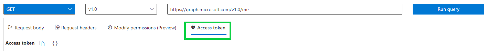
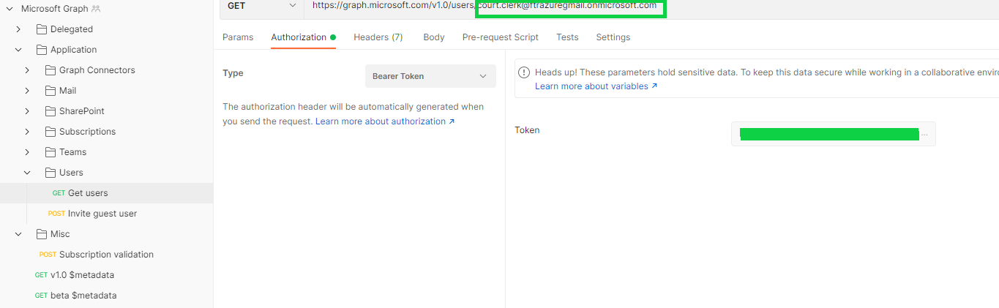
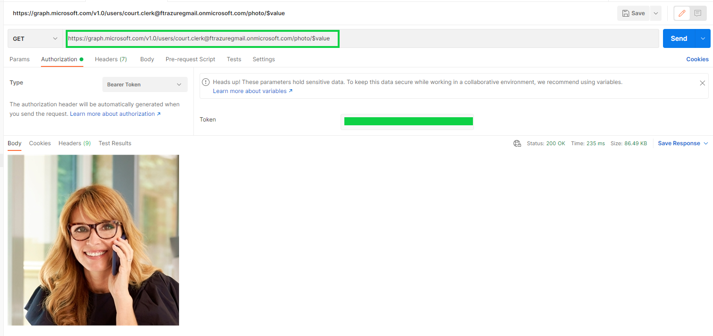

# Trade Study: TODO

|                 |                    |
| --------------: | ------------------ |
| _Conducted by:_ | Namit.T.S          |
|  _Sprint Name:_ | <SPRINT_NAME>      |
|         _Date:_ | July 2021          |
|     _Decision:_ | Feasibility proved |

## Overview

Perform a feasibility test to evaluate the capability of the present service account (t4j-service-teams@t4jdev.com)
to extract the details of users invited to a hearing.

## Goals

The primary goals of this trade study are the following:

1. Ensure that the current app has the required permissions and can we use the current graph token to get any user details
   (first name, last name, display name) by providing an email

2. Ensure that the current app has the required permissions and can we use the current graph token to get any user's
   profile picture 1. Determine the file format of the profile picture 2. Determine the response message when a user does
   not have a profile picture set

3. Create a postman request for testing

4. Propose a component to host the logic for querying user details

## Open questions

- How is the user information (first name, last name, display name, etc) configured for guest users?
- When a moderator updates the name of a participant, does he update the AD or the application datastore?
- If the user information is updated by an external source, should the application be notified?

## solutions

The feasibility of using the current service account (documented [here](../../src/call-management-bot/README.md)) to access
the user information of participating users is proved.

The following steps were performed to prove the feasibility:

1. Login to [Microsoft Graph Explorer](https://developer.microsoft.com/en-us/graph/graph-explorer) with the service
   account with the following credentials:

   - User Name: [username]
   - Password: Refer to the Key vault [username-keyvault] in the dev subscription

2. Copy the generated access token 

3. Fork (Export and Import) the postman collection from [here](https://docs.microsoft.com/en-us/graph/use-postman)
   to the local machine.

4. Find the 'Get users' API in the postman collection and update the access token to the copied value. Also, pass a valid
   user ID or userPrincipalName(email ID) as a query parameter to retrieve details of that specific user

5. You should receive output in the following format:

   ```json
   {
     "@odata.context": "https://graph.microsoft.com/v1.0/$metadata#users/$entity",
     "businessPhones": [],
     "displayName": "Display Name",
     "givenName": "Given Name",
     "jobTitle": null,
     "mail": "email address",
     "mobilePhone": null,
     "officeLocation": null,
     "preferredLanguage": null,
     "surname": "Surname",
     "userPrincipalName": "UPN",
     "id": "ID"
   }
   ```

6. To the 'Get users' API (found in step 4) add the following parameter"/photo". Once added, your URL should look like
   the following:

   ```url
   https://graph.microsoft.com/v1.0/users/{UPN/ID}/photo
   ```

7. You should receive output in the following format with metadata about the profile picture:

   ```json
       {
           "@odata.context": "https://graph.microsoft.com/v1.0/$metadata#users('{UPN}')/photo/$entity",
           "@odata.mediaContentType": "{file format}",
           "@odata.mediaEtag": "\"{tag}}\"",
           "id": "{ID}",
           "height": {height}},
           "width": {width}}
       }
   ```

If no photo exists, the operation returns '404 Not Found' as per the documentation found [here](https://docs.microsoft.com/en-us/graph/api/profilephoto-get?view=graph-rest-1.0).

Note: After testing we found that if you belong to the same tenant, you can see profile pictures of "Members" in
the same tenant (but not guests), but if you're a guest in this tenant you wouldn't be able to see any profile pictures.

| Participant picture you want to see              | Participant logging into the Teams for Justice App                                                 | Comments                  |
| ------------------------------------------------ | -------------------------------------------------------------------------------------------------- | ------------------------- |
| Home Tenant User (Member or Admin)               | Home Tenant User (Member or Admin)                                                                 | See profile picture       |
| Home Tenant User (Member or Admin)               | Guest (but also setup as a member) to the tenant on the participant's picture that you want to see | See profile picture       |
| Guest (but also setup as a member) to the tenant | Home Tenant User (Member or Admin)                                                                 | Don't see profile picture |

```json
{
  "error": {
    "code": "ErrorItemNotFound",
    "message": "The photo wasn't found.",
    "innerError": {
      "date": "2021-07-28T00:53:38",
      "request-id": "b06768cb-be6a-47c3-a799-3811cac57c62",
      "client-request-id": "b06768cb-be6a-47c3-a799-3811cac57c62"
    }
  }
}
```

You may also receive the following error if the user's mailbox is not setup

```json
{
  "error": {
    "code": "MailboxNotEnabledForRESTAPI",
    "message": "The mailbox is either inactive, soft-deleted, or i hosted on-premise.",
    "innerError": {
      "date": "2021-07-29T22:37:40",
      "request-id": "c4cbd3b2-3560-4ebe-83c4-d8b2adc913cd",
      "client-request-id": "c4cbd3b2-3560-4ebe-83c4-d8b2adc913cd"
    }
  }
}
```

The photo can be directly retrieved by adding a "\$value" parameter.

```html
https://graph.microsoft.com/v1.0/users/{UPN/ID}/photo/$value
```

Following is a sample output of such a query.



### Proposed sequence for retrieving user details

The proposed event-driven sequence for retrieving users details is captured [here](../wiki/graph-sequence.md)

### Decision

The existing service account and the graph client library can be used to extract user information
(first, last, display names and profile picture) of participating users. The design of the sub-system for extracting this
information will be captured as a part of the JIRA ticket.

### Links of interest

[Get User Graph API](https://docs.microsoft.com/en-us/graph/api/user-get?view=graph-rest-1.0&tabs=http)

[Get User Photo Graph API](https://docs.microsoft.com/en-us/graph/api/profilephoto-get?view=graph-rest-1.0)

[Permissions and consent in the Microsoft identity platform](https://docs.microsoft.com/en-us/azure/active-directory/develop/v2-permissions-and-consent)

[Microsoft Graph Permissions](https://docs.microsoft.com/en-us/graph/permissions-reference)

[Microsoft Graph throttling guidance](https://docs.microsoft.com/en-us/graph/throttling)
