# Trade Study (Technical design) - Ability for the moderator to send a message to an existing meeting room

|                 |               |
| --------------: | ------------- |
| _Conducted by:_ | Namit.T.S     |
|  _Sprint Name:_ | <SPRINT_NAME> |
|         _Date:_ | August 2021   |
|     _Decision:_ | Decision made |

## Overview

Create a technical design for a solution to enable the moderator to send a message to an online meeting's chat thread.

## Goals

- Detailed documentation of the design
- Alignment with the current architecture
- Leverage existing access privileges as much as possible
- This design assumes a fire and forget call for send message

## Assumptions

- The option of implementing [Microsoft Bot Framework](https://github.com/Microsoft/BotBuilder-Samples/tree/main/samples/typescript_nodejs)
  for the bot is already evaluated and dismissed
- Presently, Call Management Bot code only communicates with teams using Graph API. No Direct line integration is implemented
- Azure Bot Registration Channel is used as an orchestrator
- Existing Bot code does not use delegated (on behalf of) token.

## Considered solutions

### Using Call Management Bot (aligned with current design pattern)

The following diagram illustrates the considered option:

<!-- generated by mermaid compile action - START -->

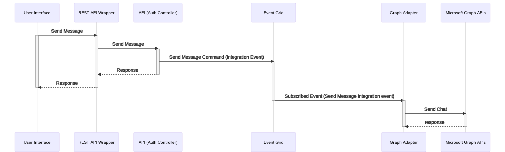

  
Mermaid markup

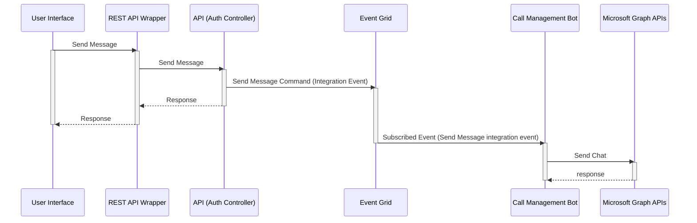

<!-- generated by mermaid compile action - END -->

#### Pros

- Aligned with existing asynchronous eventing pattern
- No dependency on Call Management Bot

#### Cons

- The Application token currently used by Call Management Bot can not be used to [send messages](https://docs.microsoft.com/en-us/graph/api/chat-post-messages?view=graph-rest-1.0&tabs=http)
  to chat threads. Send message API requires a delegated token.
- Can't leverage existing identity on Call Management Bot to represent the moderator

### Using the Bot - Synchronous call

The following diagram illustrates the considered option:

<!-- generated by mermaid compile action - START -->

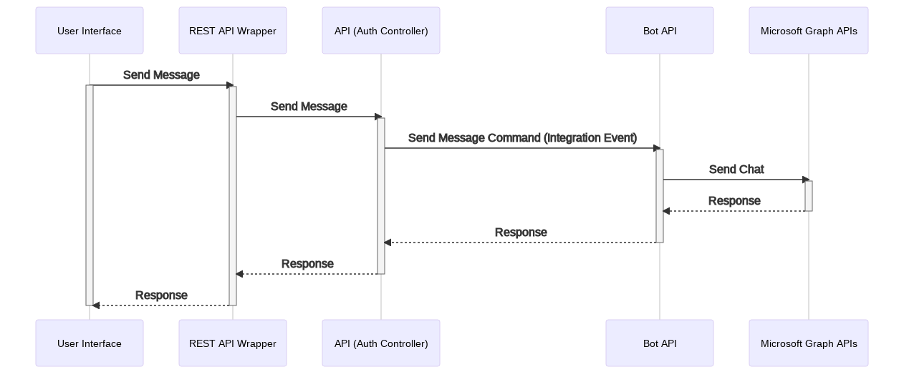

  
Mermaid markup

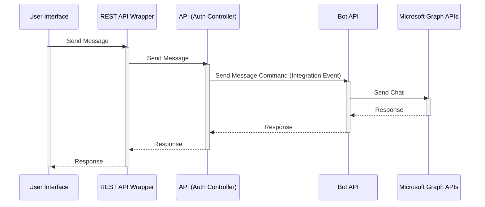

<!-- generated by mermaid compile action - END -->

#### Pros

- Simple design. Very synchronous
- Fastest turn-around time
- No dependency on messaging infrastructure
- Very predictable and assured delivery
- Leverages existing Call Management Bot's identity to represent moderator

#### Cons

- Introduction of a new communication pattern
- Bot API tier does not exist. Current function in Call management Bot only have listeners wired to Event Grid. No HTTP
  endpoints are exposed.
- Less granular abilities to set retry logic and time to live on events
- We would need to implement authentication between API and Bot

### Using the Bot - Asynchronous call using Event Grid

The following diagram illustrates the considered option:

<!-- generated by mermaid compile action - START -->

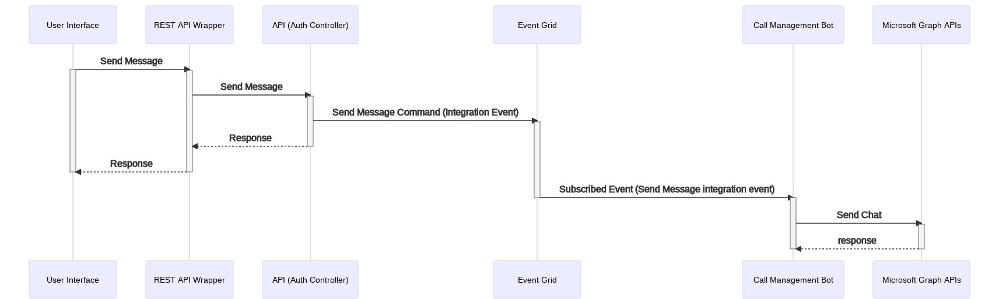

  
Mermaid markup

<!-- generated by mermaid compile action - END -->

#### Pros

- Aligned with existing asynchronous eventing pattern
- Highly decoupled design
- No new type of endpoints exposed out of the Call Management Bot tier
- Event Grid can handle transient failures gracefully
- Leverages existing Call Management Bot's identity to represent moderator

#### Cons

- The Event Grid is only used for events, not commands. Sending a message is classified as a command. This may result in
  a potential violation of the architecture.
- Dependency on Call Management Bot

### Using the Bot - Asynchronous call using Storage/Service_Bus queues

The following diagram illustrates the considered option:

<!-- generated by mermaid compile action - START -->

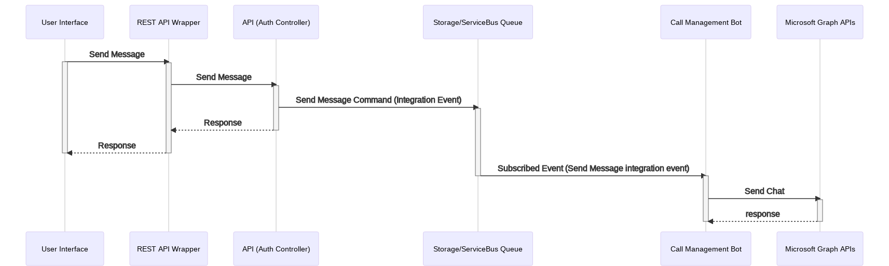

  
Mermaid markup

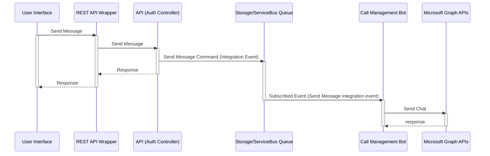

<!-- generated by mermaid compile action - END -->

#### Pros

- Aligned with existing asynchronous eventing pattern
- Highly decoupled design
- Leverages existing Call Management Bot's identity to represent moderator
- Clear differentiation of commands and events communications
- We will have better throughput through the use of batching. Event grid could potentially introduce a delay and with
  user initiated actions we want them done ASAP

#### Cons

- New Storage Queue needs to be stood up
- Introduction of a new trigger for Call Management Bot functions
- Need to handle transient failures for synchronous operations
- Dependency on Call Management Bot

### Comparison

The table below summarizes the differences between the solutions:

| Solution                   | Complexity | New Pattern | New Infra Requirement | New Trigger |
| -------------------------- | ---------- | ----------- | --------------------- | ----------- |
| Using Call Management Bot  | Low        | No          | No                    | No          |
| Using the Bot + API        | High       | Yes         | No                    | Yes         |
| Using the Bot + Event Grid | Low        | Yes         | No                    | No          |
| Using the Bot + Queue      | Medium     | Yes         | Yes                   | Yes         |

### Decision

After considering the existing architectural pattern, 'Using the Bot - Synchronous call (API)' is recommended as the
most efficient design.

#### Detailed design for the command orchestrator

<!-- generated by mermaid compile action - START -->

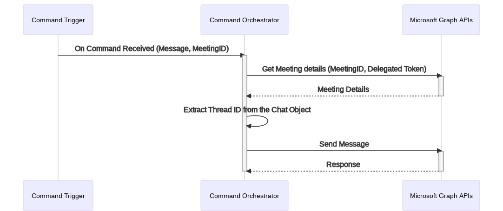

  
Mermaid markup

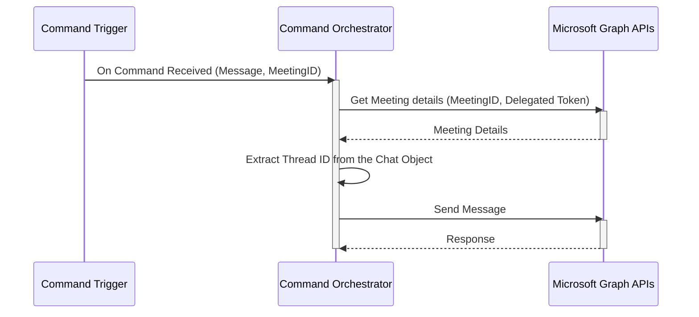

<!-- generated by mermaid compile action - END -->

### Links of interest

- [Send message in a chat using Graph APIs](https://docs.microsoft.com/en-us/graph/api/chat-post-messages?view=graph-rest-beta&tabs=http)
- [List chats using Graph APIs](https://docs.microsoft.com/en-us/graph/api/chat-list?view=graph-rest-beta&tabs=http)

### Graph API calls

The graph endpoint 'GET /me/onlineMeetings/{meetingId}' can be used to retrieve the meeting details

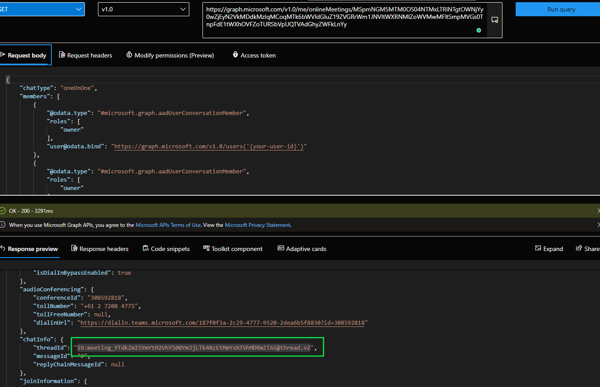

The graph endpoint 'GET /chats/{chat-id}' can be used to retrieve a chat

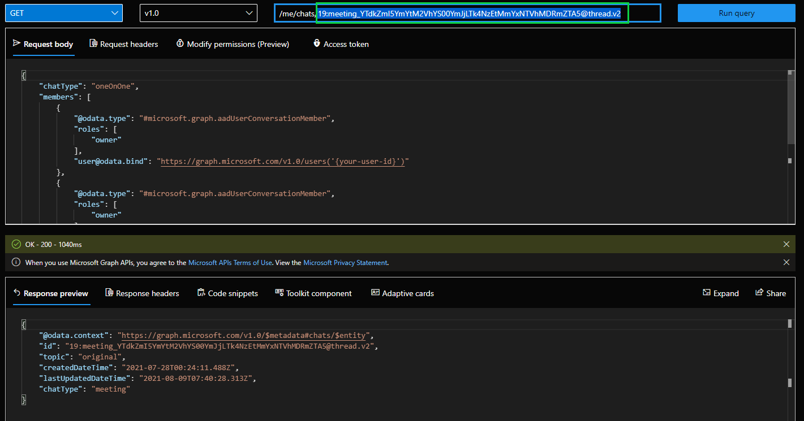

The graph endpoint 'POST /me/messages/{chat-id}/send' can be used to send a message to the meeting room chat thread

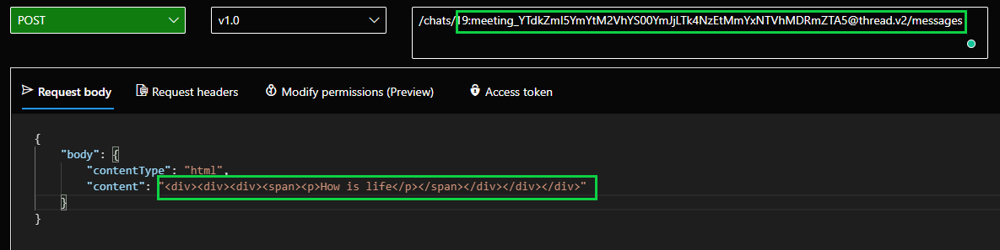
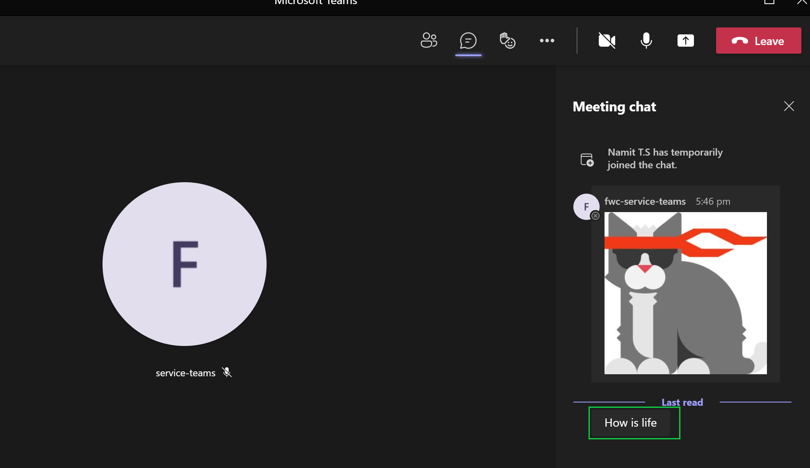
