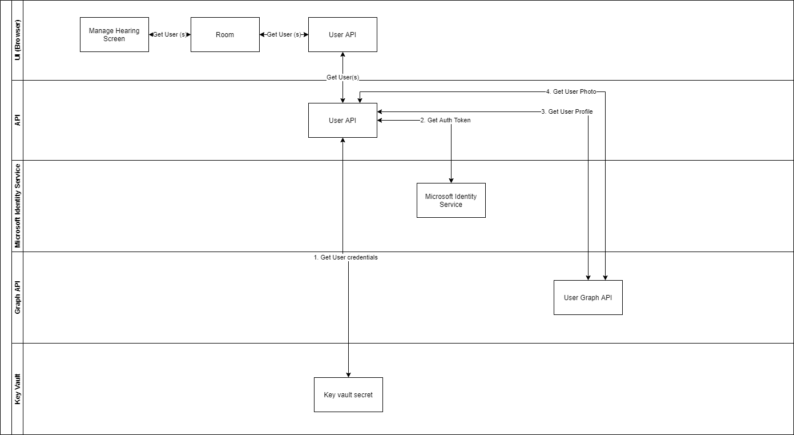
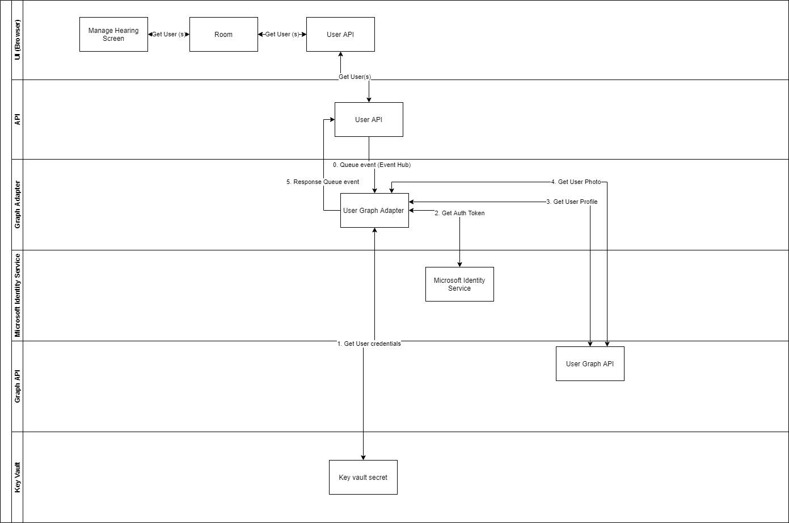
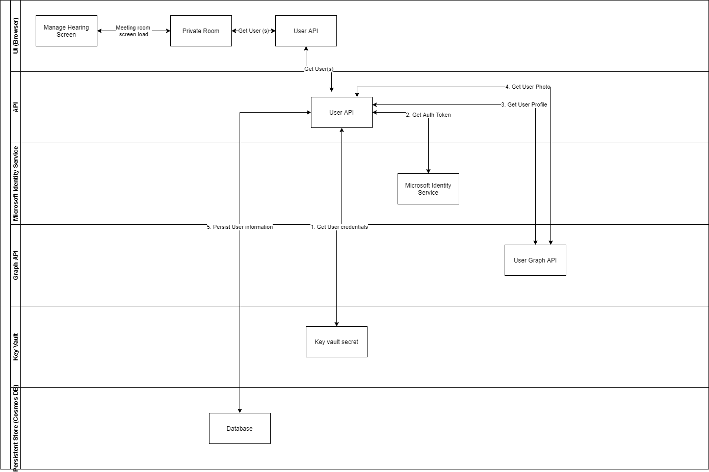
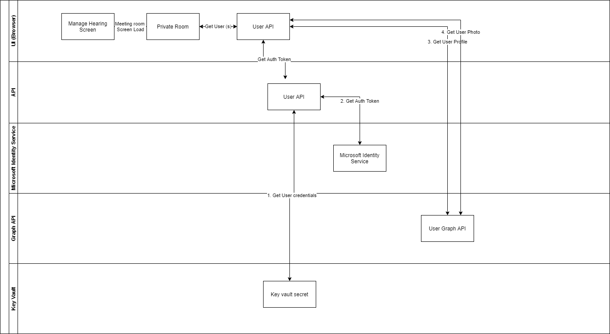
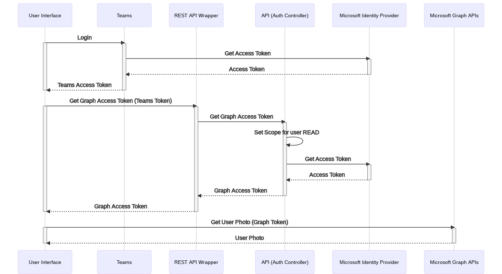
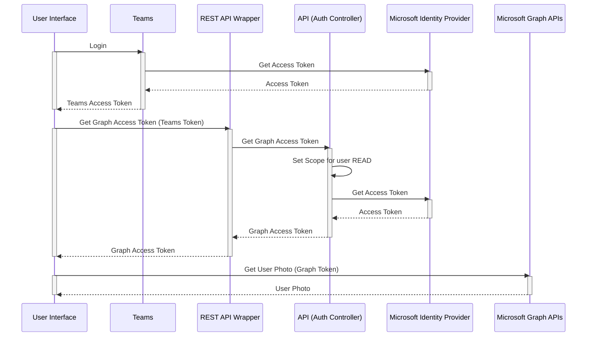

# Technical design - Get Participant Details

|                 |                        |
| --------------: | ---------------------- |
| _Conducted by:_ | Tomomi Sako, Namit.T.S |
|  _Sprint Name:_ | <SPRINT_NAME>          |
|         _Date:_ | August 2021            |
|     _Decision:_ | Design finalized       |

## Overview

This is a trade study performed to evaluate the feasible designs for extracting participant details from the
Microsoft Graph API to be surfaced on the UI layer.

## Goals

The objective is to capture design options, and their pros and cons in order to arrive at the most efficient design for
this use case.

## Assumptions

- The maximum number of concurrent calls to the graph API is estimated as 20000 as per the following calculation

  - 40 courts X 5 courtrooms X 100 (max) participants

- The average number of concurrent calls to the graph API (90% of the time) is estimated as 1600 as per the following calculation

  - 40 courts X 5 courtrooms X 8 (max) participants

## Open questions

- How is the user information (first name, last name, display name, etc) configured for guest users?
- When a moderator updates the name of a participant, does he update the AD or the application datastore?
- If the user information is updated by an external source, should the application be notified?

## Solutions

### API Orchestration



#### Pros

- UI is unaware of the graph components.
- More secure compared to UI holding the access token.

#### Cons

- New implementation pattern as the current solution only uses asynchronous communication to interact with graph API.
- Refreshing data on UI can be complex.

### Call Management Bot Orchestration



#### Pros

- Existing implementation pattern. The solution uses this pattern for creating meeting rooms
- High level of decoupling

#### Cons

- Heavy performance impact
- Complex implementation, as it involves multiple asynchronous events

### Persistent store Orchestration



#### Pros

- UI is unaware of the graph components.
- More secure compared to UI holding the access token.
- Datastores acts like a cache optimizing the turnaround time of calls for the same resources.

#### Cons

- New implementation pattern as the current solution only uses asynchronous communication to interact with Graph API.
- Refreshing data on UI can be complex.
- Need to deploy logic for maintaining a duplicate copy of the information to address use cases like user removal.

### User Interface Orchestration



#### Pros

- High level of data freshness as the UI is always up-to-date with the state in Graph.
- Authtoken fetching logic is already implemented in the API layer.
- Use on-behalf-of (delegated access) to ensure the right privileges are cascaded.
- Simpler implementation.

#### Cons

- New implementation pattern as the current solution only uses asynchronous communication to interact with graph API.
- Tight coupling between UI and graph components

### Comparison

The table below summarizes the differences between the solutions:

| Solution                          | Auth Token caching       | Response caching                              | Throttling limits                             | Latency  | Cost (Implementation + Operation) | Refresh cycles (data freshness)  |
| --------------------------------- | ------------------------ | --------------------------------------------- | --------------------------------------------- | -------- | --------------------------------- | -------------------------------- |
| API Orchestration                 | Not required             | Can be implemented at the API layer           | Graph API trotting limits apply               | Medium   | Medium                            | Medium                           |
| Call Management Bot Orchestration | Not required             | Can be implemented at the Call Management Bot | Event Hub and Graph API trotting limits apply | High     | High                              | Medium                           |
| Persistent store Orchestration    | Not required             | Not required                                  | Cosmos DB and Graph API trotting limits apply | Medium   | High                              | Low                              |
| User Interface Orchestration      | Can be implemented on UI | Will need a new layer (like APIM)             | Graph API trotting limits apply               | Low      | Low                               | High                             |

### Decision

Considering the simplicity of the design, efficiency in keeping the data fresh and implementation complexity, the design
"**User Interface Orchestration**" is chosen as the preferred design option for this component.

#### Control Sequence

<!-- generated by mermaid compile action - START -->



<details>
  <summary>Mermaid markup</summary>



</details>
<!-- generated by mermaid compile action - END -->

#### Consideration

- Teams user will need the required [access privileges](https://docs.microsoft.com/en-us/graph/permissions-reference)
  (User.Read, User.ReadBasic.All ) in AD to retrieve the appropriate
  Graph token. In case these
  privileges are not set up correctly, the Graph API will throw the following error:

```JSON
{
    "error": {
        "code": "UnknownError",
        "message": "{\"error\":{\"code\":\"NoPermissionsInAccessToken\",\"message\":\"The token contains no permissions, or permissions can not be understood.\",\"innerError\":{\"oAuthEventOperationId\":\"c12fea48-cafb-4867-a214-2d8765be25a0\",\"oAuthEventcV\":\"Gmp2hLHqui7O6A8Ob8UiOA.1.1\",\"errorUrl\":\"https://aka.ms/autherrors#error-InvalidGrant\",\"requestId\":\"2263fb31-9732-4358-a5a7-62022a0e7296\",\"date\":\"2021-08-03T07:34:21\"}}}",
        "innerError": {
            "date": "2021-08-03T07:34:21",
            "request-id": "2263fb31-9732-4358-a5a7-62022a0e7296",
            "client-request-id": "2263fb31-9732-4358-a5a7-62022a0e7296"
        }
    }
}
```

- For users without a profile picture configured,
  [Fluent UI Avatar](https://statics.teams.cdn.office.net/evergreen-assets/safelinks/1/atp-safelinks.html) can be used to
  generate one with initials.
- This design does not consider optimization patterns like response caching. Design however is flexible to accommodate
  response caching pattern, if required. Following are the considerations for implementing response caching:
  - Cache decay duration - For cache misses
  - Caching technology - APMI or Custom implementation using Redis cache
  - Circuit breaking cache refresh for participants without a photo set
- Please refer to [Get User Details](get-user-details.md) trade study for more information on the implementation.

#### Links of interest

- [Graph API permissions](https://docs.microsoft.com/en-us/graph/permissions-reference)
- [Graph API throttling](https://docs.microsoft.com/en-us/graph/throttling)
- [Token using 'On Behalf Of'](https://docs.microsoft.com/en-us/azure/active-directory/develop/v2-oauth2-on-behalf-of-flow)
- [Token using Client credentials](https://docs.microsoft.com/en-us/azure/active-directory/develop/v2-oauth2-client-creds-grant-flow)
