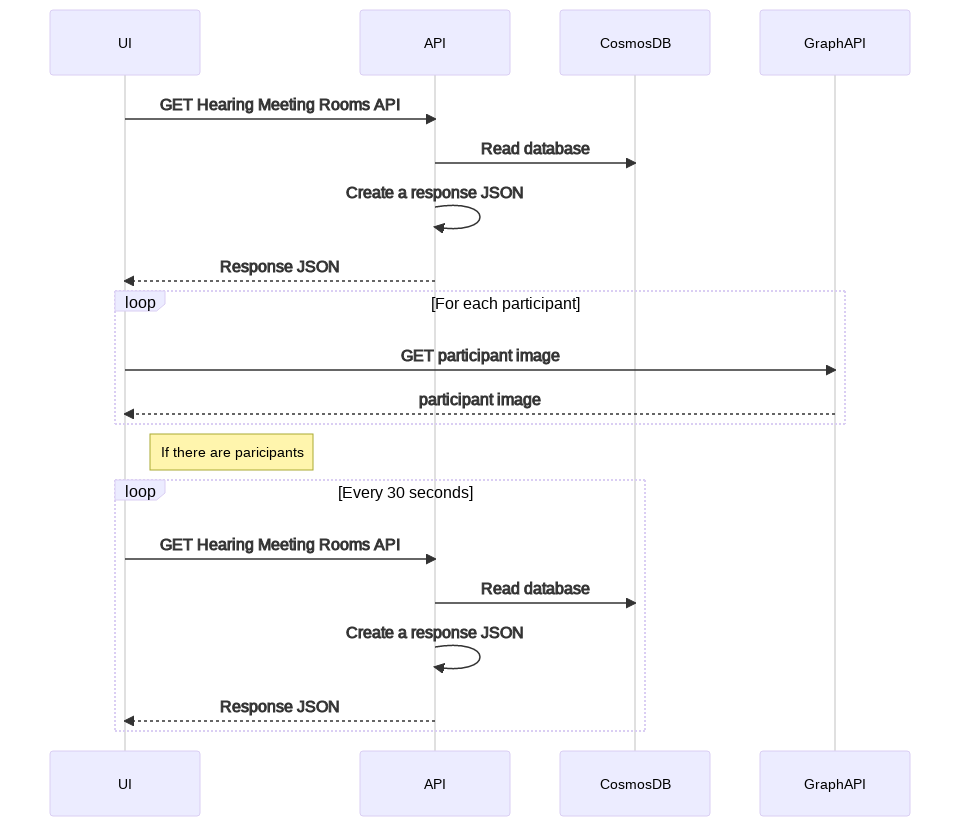
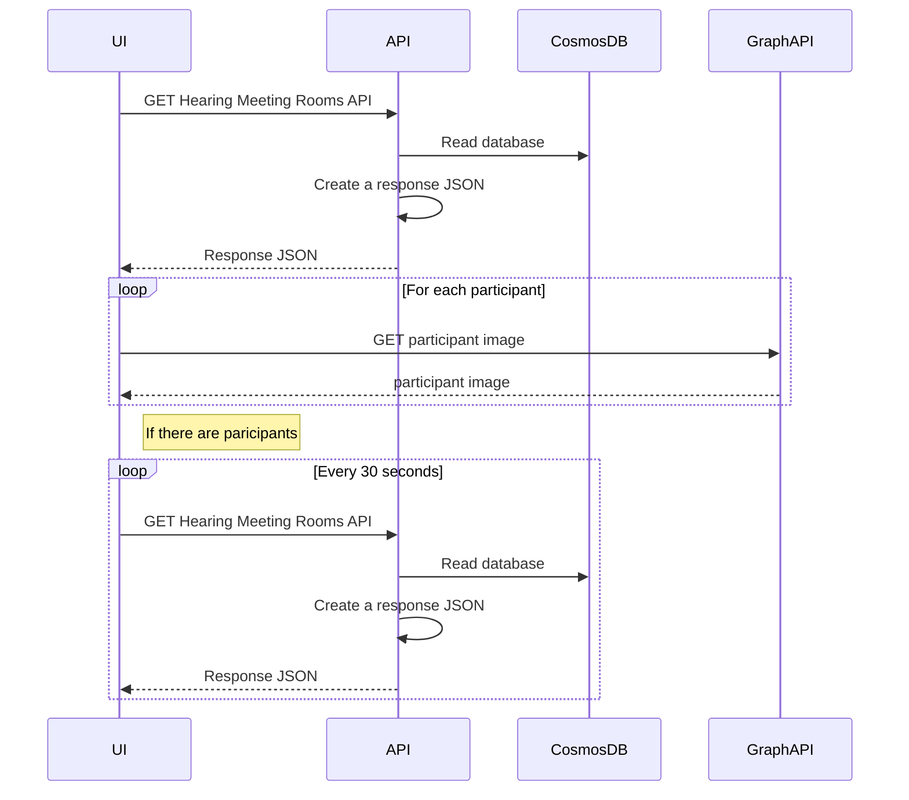
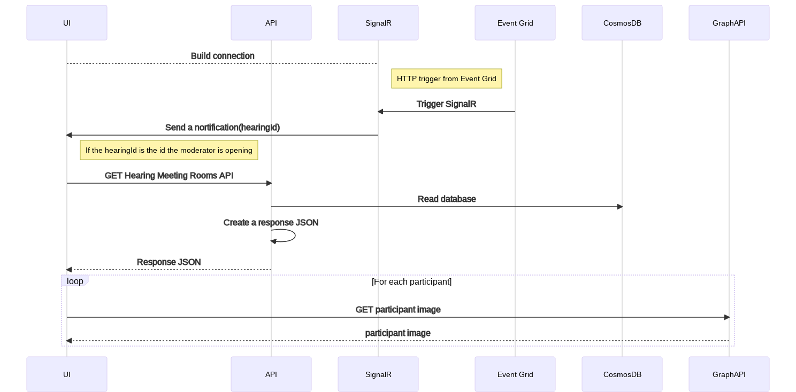
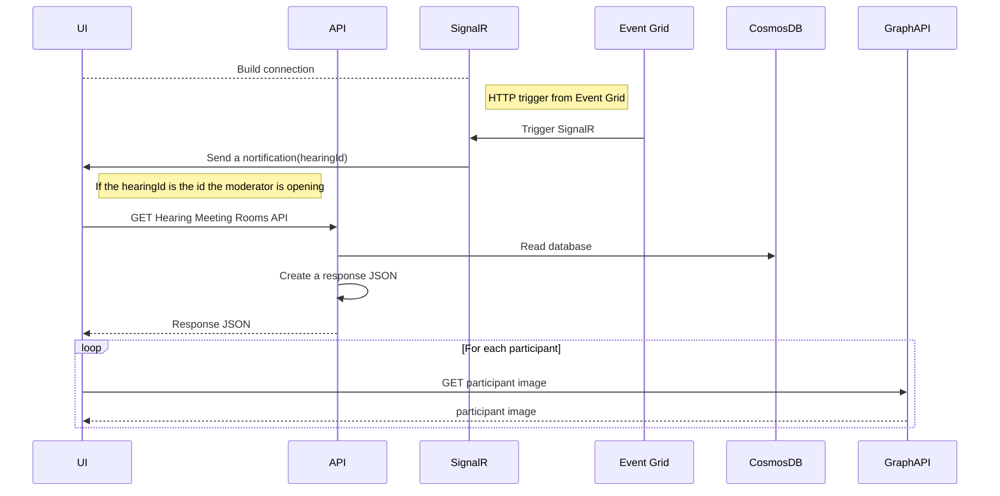
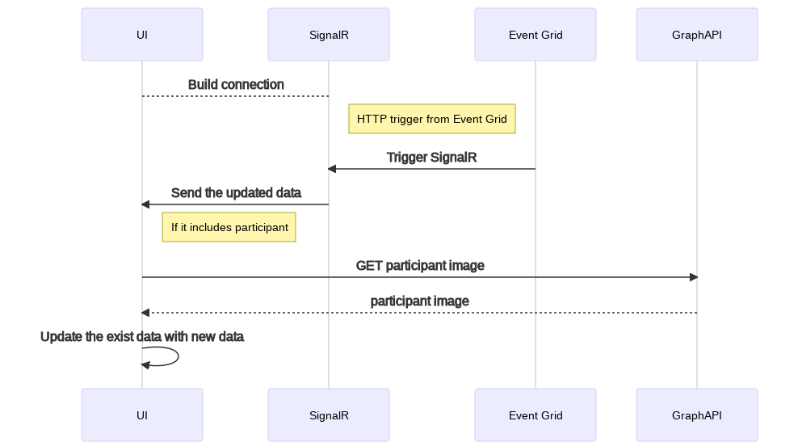
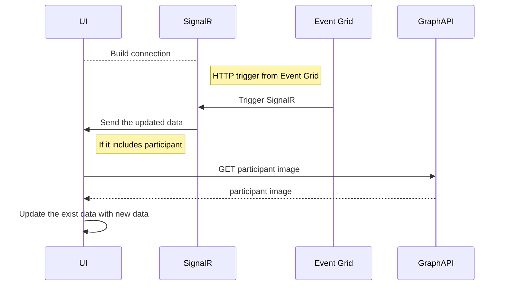

# Trade Study: Realtime view of rooms and participants

|                 |                                                     |
| --------------: | --------------------------------------------------- |
| _Conducted by:_ | Tomomi Sako                                         |
|  _Sprint Name:_ | Sprint 19                                           |
|         _Date:_ | August 2021                                         |
|     _Decision:_ | Solution 1 -Timer, and shift to Solution 3 -SignalR |

## Overview

This is a trade study on how the moderator can get the latest view of the meeting room when it has been updated.

## Goal

To compare options for implementing the view update,
and to make a decision based on the functionality, ease of implementation and user experience.

## Open question

- How many concurrent users are expected?

### Solution 1 - Timer

Set a timer `setTimeout()` and call GET Hearing Meeting Rooms API every 30 seconds.

<!-- generated by mermaid compile action - START -->

  
Mermaid markup

<!-- generated by mermaid compile action - END -->

#### Pros

- Can achieve without any extra service.
- The easiest solution.

#### Cons

- Polling results in excessive network traffic.
- Won't scale well for a large number of users.

#### Summary

Although we can achieve this solution in time, excessive network traffic will be an issue.
The GET Hearing Meeting Rooms API gets all data related to the hearing which means the cost of API calls will be high.
Also, a Graph API call will be triggered for each participant so we may need some logic avoid calling the API so often.

### Solution 2 - SignalR + API call

Create a new service (we assume it as SignalR) to inform the UI side that there is a change,
and if the UI receives the notification it calls GET Hearing Meeting Rooms to get the latest hearing.

<!-- generated by mermaid compile action - START -->

  
Mermaid markup

<!-- generated by mermaid compile action - END -->

#### Pros

- We only call the API when we know there is a change in the data.
- The existing code to call the API, and update the UI doesn't need to be modified.

#### Cons

- SignalR will only notify that there are changes, the new data still needs to be retrieved using the API.

#### Summary

Since we will have signalR to trigger the API call, this solution is better than solution 1
in terms of optimizing the API calls.
But it still needs to call the GET Hearing Meeting Rooms API often,
so we may need to have another API that returns a specific part of updated data or create a materialized view in Cosmos DB.

We also need to consider which trigger makes sense to achieve this solution.
Currently, the options are HTTP (Event grid) or CosmosDB trigger.

### Solution 3 - SignalR

Create a new service (we assume it as SignalR) to send the differences to the UI side
so that UI will update the specific changes.

<!-- generated by mermaid compile action - START -->

  
Mermaid markup

<!-- generated by mermaid compile action - END -->

#### Pros

- Except for the first time, the UI doesn't need to call API again.

#### Cons

- UI side doesn't have the logic to update the specific UI parts so we need to implement it from scratch for all components.

#### Summary

Since signalR sends updated data the UI doesn't need to call the API again. So this solution is the best one of those 3 options.

But we may need a new logic to send the updated data to the UI.
It may even require refactoring the data model or having a materialized view in CosmosDB.

Also, the UI currently renders the whole hearing data at once after calling the GET Hearing Meeting Rooms API.
That means it doesn't have individual json data to render specific parts.
So we will need new logic to perform a partial update to the larger json data model.

We also need to consider which trigger makes sense to achieve this solution.
Currently, the options are HTTP (Event grid) or CosmosDB trigger.

### Comparison

The table below summarizes the differences between the solutions:

| Solution              | Functionality | Ease of Implementation | User experience | Total |
| --------------------- | ------------- | ---------------------- | --------------- | ----- |
| 1. Timer              | 3             | 10                     | 6               | 19    |
| 2. SignalR + API call | 7             | 5                      | 7               | 19    |
| 3. SignalR            | 10            | 1                      | 10              | 21    |

The above table attempts to rate the aspects of each solution out of 10, with higher scores being better.

### Decision

Solution 1 -Timer, and shift to Solution 3 -SignalR

In order to delivery the functionality we will start from solution 1 as this is the most achievable in the given time.
After that, we will shift to solution 3 to try and improve the network efficiency and user experience.
