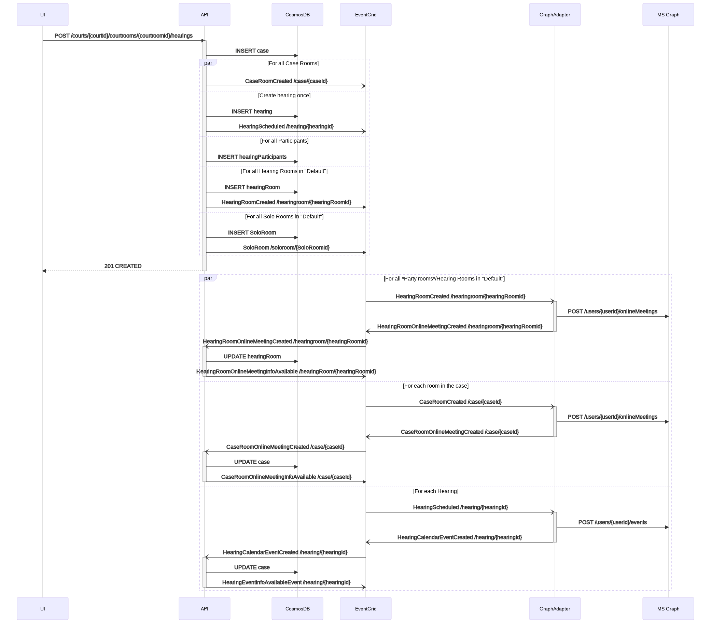
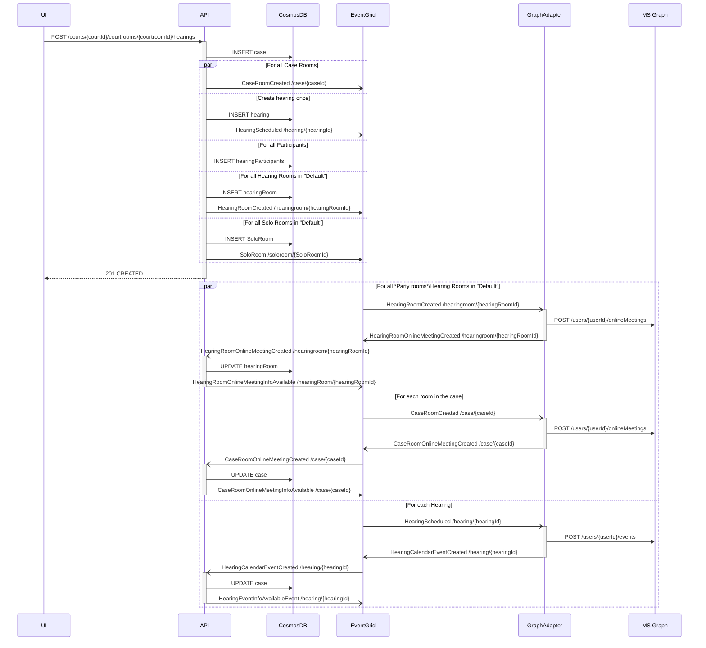

# Trade Study: Solo Rooms

|                    |                                                                                                                                                                                                                                                                                                                                                    |
| -----------------: | -------------------------------------------------------------------------------------------------------------------------------------------------------------------------------------------------------------------------------------------------------------------------------------------------------------------------------------------------- |
|    _Conducted by:_ | Azadeh Khojandi, Jacob Zhou                                                                                                                                                                                                                                                                                                                        |
|     _Sprint Name:_ | 16                                                                                                                                                                                                                                                                                                                                                 |
|            _Date:_ | 09/08/2021                                                                                                                                                                                                                                                                                                                                         |
| _Decision:_ Part 1 | Solution 2: Update `RoomDefinition` entity, Add `roomType`, Add new entity `soloRoom`, Update `create-hearing.commandhandler.ts`                                                                                                                                                                                                                   |
| _Decision:_ Part 2 | Solution 2: Add new entity `roomOnlineMeeting`, Remove `onlineMeeting` from `HearingRoom`, Update `HearingRoomOnlineMeetingCreated` event handler. _solo rooms will not be online meeting, `roomOnlineMeeting` should support both Online Meetings and Calls. based on [meeting-participant-transfer.md](../wiki/meeting-participant-transfer.md)_ |

## Overview

In the system, we have two types of rooms:

- solo rooms
- party rooms

**party rooms** are Teams meeting rooms that can host multiple participants.
**solo rooms** are Teams meetings with only one participant. At the time of
creating a hearing, the system creates default hearing rooms.
`defaultRooms` are set at court level entity and these rooms are treated as
party rooms. [create-new-hearing.md](../wiki/features/create-new-hearing.md).
All of the `hearingParticipant` invitees will join the
`receptionRoomOnlineMeeting` teams meeting. call management bot will be in the
Teams meeting to route users to their rooms. If the call management bot cannot
map the participant to a known `hearingParticipant`, the call management bot
will mark the user unkown and move the user to a solo room. If the call
management bot maps the user but cannot find a dedicated hearingRoom for their
participantParty, call management bot will move the user to a solo room. System
moderator uses the dashboard (arena view) to manage court, moderator should be
able to see both solo room and party rooms even when there are no participants
in the rooms.

## Goals

- finding solution for getting solo rooms list for the hearing, making sure it
  supports [consistent-join.md](../wiki/features/consistent-join.md) and
  [create-new-hearing.md](../wiki/features/create-new-hearing.md).

## solutions

We need to break down the problem

1. How to save the name of solo rooms same as party rooms in the Cosmos DB
2. How to save `meetinginfo` for each solo room

## Part 1

How to save name of solo rooms same as party rooms in the cosmos db

### Solution 1

1. Update `Court` entity and replace `defaultRooms` with two fields:

   - defaultPartyRooms?: RoomDefinition[];
   - defaultSoloRooms?: RoomDefinition[];

   ```typescript
   RoomDefinition {
       expectedParticipantParty: string;
       name: string;
   }
   ```

   ```json
   "defaultPartyRooms": [
               {
                   "name": "Defendant Parties Room",
                   "expectedParticipantType": "Defendant"
               },
               {
                   "name": "Plaintiff Parties Room",
                   "expectedParticipantType": "Plaintiff"
               }
           ],
   "defaultSoloRooms": [
               {
                   "name": "plaintiff Witness(es)",
                   "expectedParticipantType": "applicantWitness"
               },
               {
                   "name": "Defendant Witness(es)",
                   "expectedParticipantType": "defendantWitness"
               },
               {
                   "name": "Lobby",
                   "expectedParticipantType": "lobby"
               }
           ],
   ```

2. Add new entity `soloRoom`

   _both `soloRoom` and `hearingRoom` entity share same fields ; except
   onlinemeeting_

   ```typescript

   export interface RoomBase {
     hearingId!: string;
     organisationId!: string;
     courtId!: string;
     courtroomId!: string;
     caseId!: string;
     name!: string;
     expectedParticipantParty!: string;
     editMetadata!: EditMetadata;
     isDefault!: boolean;
     status!: string;
   }

   export default class SoloRoom implements EntityBase, RoomBase {
     static entityType = 'soloRoom';
     static entitySchema = 'urn:soloRoom/v1';
     id!: string;
     readonly partitionKey = 'id';
     readonly type = SoloRoom.entityType;
     readonly schema = SoloRoom.entitySchema;
   }


   export default class HearingRoom implements EntityBase, RoomBase {
     static entityType = 'hearingRoom';
     static entitySchema = 'urn:hearingRoom/v1';
     id!: string;
     readonly type = HearingRoom.entityType;
     readonly schema = HearingRoom.entitySchema;
     readonly partitionKey = 'id';
     onlineMeeting?: OnlineMeeting;
   }

   ```

3. Update `create-hearing.commandhandler.ts`

   Create`hearingRoom`s for party rooms and create `soloRoom`s for solo rooms.
   During create hearing, based on value of `defaultPartyRooms`.

## Solution 2

1. Update `RoomDefinition` entity and add roomType

   ```typescript
   RoomDefinition {
       expectedParticipantParty: string;
       name: string;
       roomType: string;
   }
   ```

   ```json
   "defaultRooms": [
               {
                   "name": "Defendant Parties Room",
                   "expectedParticipantType": "Defendant",
                   "roomType":"party"
               },
               {
                   "name": "Plaintiff Parties Room",
                   "expectedParticipantType": "Plaintiff",
                   "roomType":"party"
               },
               {
                   "name": "plaintiff Witness(es)",
                   "expectedParticipantType": "applicantWitness",
                   "roomType":"solo"
               },
               {
                   "name": "Defendant Witness(es)",
                   "expectedParticipantType": "defendantWitness",
                   "roomType":"solo"
               },
               {
                   "name": "Lobby",
                   "expectedParticipantType": "lobby",
                   "roomType":"solo"
               }
           ]
   ```

2. Add new entity `soloRoom` as soloution 1

3. Update `create-hearing.commandhandler.ts` Create `hearingRoom`s for `party`
   rooms and create `soloRoom`s for solo rooms.During create hearing, based on
   value of `roomType`.

<!-- generated by mermaid compile action - START -->



<details>
  <summary>Mermaid markup</summary>



</details>
<!-- generated by mermaid compile action - END -->

## Part 2

How to save meetinginfo for each solo room

### Solution 1 - Array of OnlineMeeting[]

1. Add `onlineMeetings` fields which holds arrays of `OnlineMeeting`s

   ```typescript
   export default class SoloRoom implements EntityBase, RoomBase {
     static entityType = "soloRoom";
     static entitySchema = "urn:soloRoom/v1";
     id!: string;
     readonly type = SoloRoom.entityType;
     readonly schema = SoloRoom.entitySchema;
     readonly partitionKey = "id";
     onlineMeetings?: OnlineMeeting[];
   }
   ```

   The value of `onlineMeeting` fields for solo rooms will be null at the time of
   creation

2. Add event handler for `HearingParticipantSoloRoomCreated` event to Update the
   `onlineMeetings` value accordingly
3. Update Edit and Cancel Hearing logic

### Solution 2

1. Add new entity `roomOnlineMeeting`

   ```typescript
   export default class RoomOnlineMeeting implements EntityBase {
     static entityType = "roomOnlineMeeting";
     static entitySchema = "urn:roomOnlineMeeting/v1";
     id!: string;
     readonly type = RoomOnlineMeeting.entityType;
     readonly schema = RoomOnlineMeeting.entitySchema;
     readonly partitionKey = "id";
     roomId!: string;
     joinWebUrl!: string;
     joinInformation?: string;
   }
   ```

2. Remove `onlineMeeting` from `HearingRoom`

3. update event handler for `HearingRoomOnlineMeetingCreated` event to create a
   `RoomOnlineMeeting` document instead.

4. Add event handler for `HearingParticipantSoloRoomCreated` event to create
   `RoomOnlineMeeting` document .
5. Update Edit and Cancel Hearing logic
