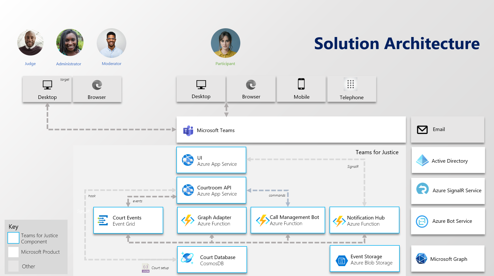
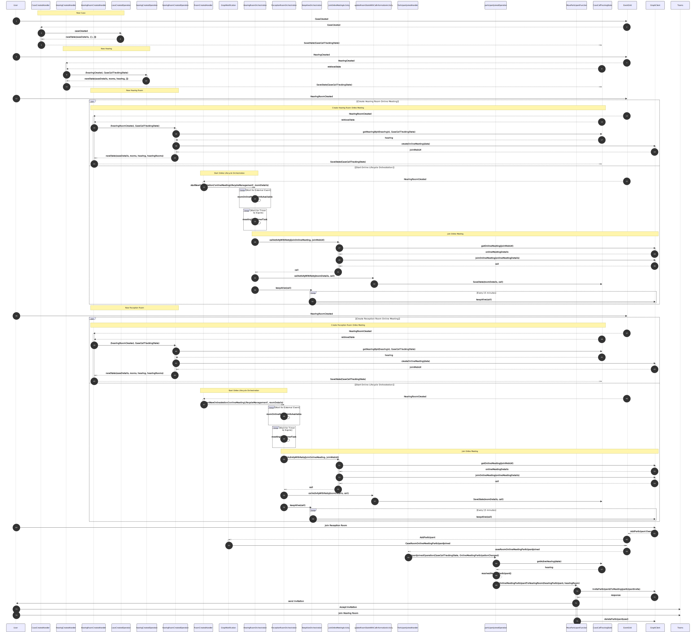
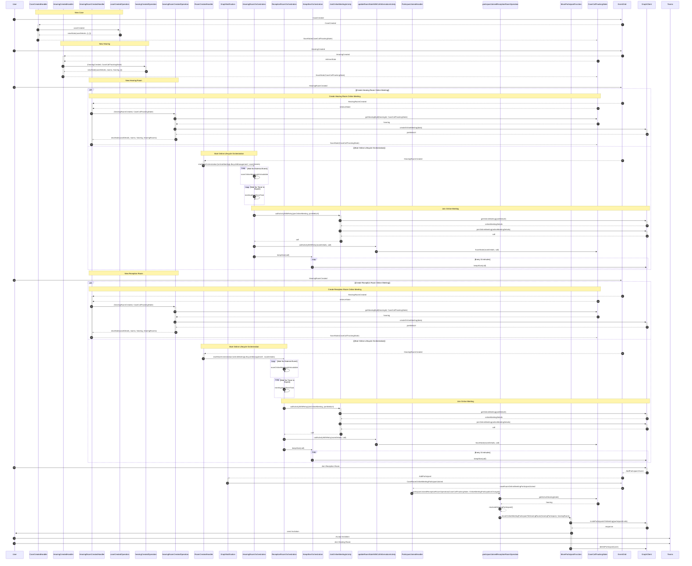

# Solution Architecture

## General principles

This solution presents a simple architecture that is well known to scale and is a cost effective option for customers.

It employs an event driven architecture and the following application domains:

1. UI
2. Courtroom API
3. Integration Handlers
4. Database

### UI

The solution is fronted as a single React application that will be hosted in an Azure App Service. We will be using the
[Fluent UI Northstar library](https://fluentsite.z22.web.core.windows.net/) to have a consistent Microsoft Teams-like experience.

**Note**: The primary experience is for the moderator who will, by in large, be using the Microsoft Teams desktop client.

### Call Management Events Flow

The Call Management represents the heart of the solution as it is responsible
for managing all aspects of the application events flow. The following diagram
depicts the user interactive event driven flow events:

  
Mermaid markup

<!-- generated by mermaid compile action - END -->

### Courtroom API

The Coutroom API is written in TypeScript using NestJS and hosted on an Azure App Service. The API communicates with a CosmosDB
instance to store entity data. The Web API dispatches events to the Event Grid to notify the different handlers that an
action has been taken by the user (or later by external CMS systems - pending security model for calls).
Internally the Web API uses the [Mediator Pattern](https://en.wikipedia.org/wiki/Mediator_pattern), implemented by
using the [nestjs CQRS module](https://docs.nestjs.com/recipes/cqrs), to decouple business logic from the specific
implementation of the handlers. This provides flexibility in deciding how to route different types of requests.

### Notification Hub

The Azure SignalR Service provides real-time UI updates to the client. The notification hub will pull events directly
from the Event Grid and send updates to the client as necessary. Rather than deploying a new Web API instance, which may
require additional resources such as a Redis Cache, we will use the Azure SignalR service integration with Azure Functions.

### Integration Handlers

The primary application domain or Integration Handlers are a collection of Azure Functions that either listens to external
events or internal domain events from the Event Grid.

There are two primary categories of Integration handlers:

1. Call management bot
   - Receives events from the Bot Framework which includes all the external
     notifications from the Teams meetings. The purpose of this listener is to
     take the external Teams events and convert them to an internal domain
     representation of that event and then send that event to the Event Grid.
     This allows abstraction of the bot functionality into generic domain
     events.
   - Receives internal domain events and converts those into Graph API service
     calls. This is our primary integration point with the Graph SDK, and
     abstracts the Graph SDK into a single, multi-function adapter.
2. Notification Hub
   - Receives a subset of internal domain events that would need to reflect a UI
     update and using the SignalR output binding in the Azure Function sends
     those messages to the users.

### Courtroom Database

The solution uses CosmosDB to store entity information and state of attendance in the various hearing rooms. CosmosDB has
court specific JSON that can be amended to suit the court preferred terminology and Microsoft Teams layout.

### Azure Blob Storage

Use for various persisted hearing specific data including emails and future audio cues.

## Architecture Notes

The following diagram highlights a more complete picture of the interactions in this solution architecture:

### Bot

The term bot here is a bit deceiving; many of the bot operations are handled in the Integration Handlers as the
notifications that we receive via the [Azure Bot Service](https://docs.microsoft.com/en-us/azure/bot-service) are
Graph notifications that are processed. The bot component is registered, via Terraform, to the
[Azure Bot Service](https://docs.microsoft.com/en-us/azure/bot-service). The full details of how the bot is used to
communicate with this [Azure Bot Service](https://docs.microsoft.com/en-us/azure/bot-service) and the Microsoft Graph
are documented [here](..\features\consistent-join.md#Azure-Bot-Service).

The bot is also unique in that it accepts direct "Commands" in addition to Events. This is where we expect an HTTP REST
call to return a response directly to the Courtroom API. For example, sending messages to participants in a
private party room.git u

### Monitoring & Observability

There are no customer requirements for monitoring & observability, however we use the
[WinstonJs](https://github.com/winstonjs/winston) inside our Courtroom API to log to Application Insights.
Our UI code also logs to the same Application Insights instance.
