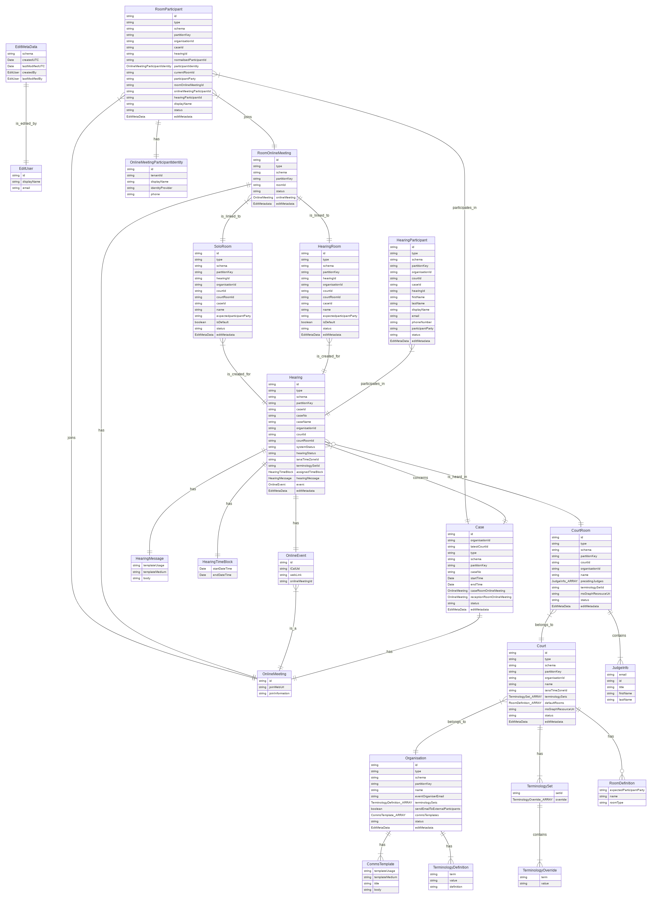

# Entities and Terminologies

## API Entities

```mermaid
erDiagram
    Case ||--|| OnlineMeeting: has
    Court }|--|| Organisation: belongs_to
    Court ||--|{ TerminologySet: has
    Court ||--o{ RoomDefinition: has
    CourtRoom }|--|| Court: belongs_to
    CourtRoom ||--|{ JudgeInfo: contains
    EditMetaData ||--|| EditUser: is_edited_by
    Hearing }|--|| Case: concerns
    Hearing }o--|| CourtRoom: is_heard_in
    Hearing ||--|| HearingMessage: has
    Hearing ||--|| HearingTimeBlock: has
    Hearing ||--|| OnlineEvent: has
    HearingParticipant }|--|| Hearing: participates_in
    HearingRoom }|--|| Hearing: is_created_for
    OnlineEvent }|--|| OnlineMeeting: is_a
    Organisation ||--|{ CommsTemplate: has
    Organisation ||--|{ TerminologyDefinition: has
    RoomOnlineMeeting }|--|| SoloRoom: is_linked_to
    RoomOnlineMeeting ||--|| HearingRoom: is_linked_to
    RoomOnlineMeeting ||--|| OnlineMeeting: has
    RoomParticipant }|--|| Case: participates_in
    RoomParticipant }|--|| RoomOnlineMeeting: joins
    RoomParticipant }|--|| OnlineMeeting: joins
    RoomParticipant ||--|| OnlineMeetingParticipantIdentity: has
    SoloRoom }|--|| Hearing: is_created_for
    TerminologySet ||--|{ TerminologyOverride: contains

    Case {
        string id
        string organisationId
        string latestCourtId
        string type
        string schema
        string partitionKey
        string caseNo
        Date startTime
        Date endTime
        OnlineMeeting caseRoomOnlineMeeting
        OnlineMeeting receptionRoomOnlineMeeting
        string status
        EditMetaData editMetadata
    }
    CommsTemplate {
        string templateUsage
        string templateMedium
        string title
        string body
    }
    Court {
        string id
        string type
        string schema
        string partitionKey
        string organisationId
        string name
        string ianaTimeZoneId
        TerminologySet_ARRAY terminologySets
        RoomDefinition_ARRAY defaultRooms
        string msGraphResourceUri
        string status
        EditMetaData editMetadata
    }
    CourtRoom {
        string id
        string type
        string schema
        string partitionKey
        string courtId
        string organisationId
        string name
        JudgeInfo_ARRAY presidingJudges
        string terminologySetId
        string msGraphResrouceUri
        string status
        EditMetaData editMetadata
    }
    EditMetaData {
        string schema
        Date createdUTC
        Date lastModifiedUTC
        EditUser createdBy
        EditUser lastModifiedBy
    }
    EditUser {
        string id
        string displayName
        string email
    }
    Hearing {
        string id
        string type
        string schema
        string partitionKey
        string caseId
        string caseNo
        string caseName
        string organisationId
        string courtId
        string courtRoomId
        string systemStatus
        string hearingStatus
        string ianaTimeZoneId
        string terminologySetId
        HearingTimeBlock assignedTimeBlock
        HearingMessage hearingMessage
        OnlineEvent event
        EditMetaData editMetadata
    }
    HearingMessage {
        string templateUsage
        string templateMedium
        string body
    }
    HearingParticipant {
        string id
        string type
        string schema
        string partitionKey
        string organisationId
        string courtId
        string caseId
        string hearingId
        string firstName
        string lastName
        string displayName
        string email
        string phoneNumber
        string participantParty
        string status
        EditMetaData editMetadata
    }
    HearingRoom {
        string id
        string type
        string schema
        string partitionKey
        string hearingId
        string organisationId
        string courtId
        string courtRoomId
        string caseId
        string name
        string expectedparticipantParty
        boolean isDefault
        string status
        EditMetaData editMetadata
    }
    HearingTimeBlock {
        Date startDateTime
        Date endDateTime
    }
    JudgeInfo {
        string email
        string id
        string title
        string firstName
        string lastName
    }
    OnlineEvent {
        string id
        string iCalUid
        string webLink
        string onlineMeetingId
    }
    OnlineMeeting {
        string id
        string joinWebUrl
        string joinInformation
    }
    OnlineMeetingParticipantIdentity {
        string id
        string tenantId
        string displayName
        string identityProvider
        string phone
    }
    Organisation {
        string id
        string type
        string schema
        string partitionKey
        string name
        string eventOrganiserEmail
        TerminologyDefinition_ARRAY terminologySets
        boolean sendEmailToExternalParticipants
        CommsTemplate_ARRAY commsTemplates
        string status
        EditMetaData editMetadata
    }
    RoomDefinition {
        string expectedParticipantParty
        string name
        string roomType
    }
    RoomOnlineMeeting {
        string id
        string type
        string schema
        string partitionKey
        string roomId
        string status
        OnlineMeeting onlineMeeting
        EditMetadata editMetadata
    }
    RoomParticipant {
        string id
        string type
        string schema
        string partitionKey
        string organisationId
        string caseId
        string hearingId
        string normalisedParticipantId
        OnlineMeetingParticipantIdentity participantIdentity
        string currentRoomId
        string participantParty
        string roomOnlineMeetingId
        string onlineMeetingParticipantId
        string hearingParticipantId
        string displayName
        string status
        EditMetaData editMetadata
    }
    SoloRoom {
        string id
        string type
        string schema
        string partitionKey
        string hearingId
        string organisationId
        string courtId
        string courtRoomId
        string caseId
        string name
        string expectedparticipantParty
        boolean isDefault
        string status
        EditMetaData editMetadata
    }
    TerminologyDefinition {
        string term
        string value
        string definition
    }
    TerminologyOverride {
        string term
        string value
    }
    TerminologySet {
        string setId
        TerminologyOverride_ARRAY override
    }
```

<!-- generated by mermaid compile action - START -->

  
Mermaid markup

<!-- generated by mermaid compile action - END -->

Notes:

- Not all entities are connected. `EditMetaData` is not connected to keep the diagram clean.
- There are `id` fields that are not directly used for establishing direct relationships so those indirect relationships
  are not shown in the diagram.

## Terminology Sets

The UI makes use of a Terminology Set queried via the API. The `Term` and `Value` pairs are defined within the database.
The following table outlines the terms that are available to the UI along with a sample of the default and non-default
values that maybe in use.

| Term              | Default Value | Non default examples                                               |
| ----------------- | ------------- | ------------------------------------------------------------------ |
| Judge             | Judge         | Magistrate, Senior Member, Commissioner, President, Vice-president |
| Hearing           | Hearing       | -                                                                  |
| Case              | Case          | -                                                                  |
| Plaintiff         | Plaintiff     | Applicant                                                          |
| Defendant         | Defendant     | Respondent, Accused                                                |
| Witness           | Witness       | -                                                                  |
| OtherParticipants | Other         | -                                                                  |
| CourtStaff        | Court Staff   | -                                                                  |
