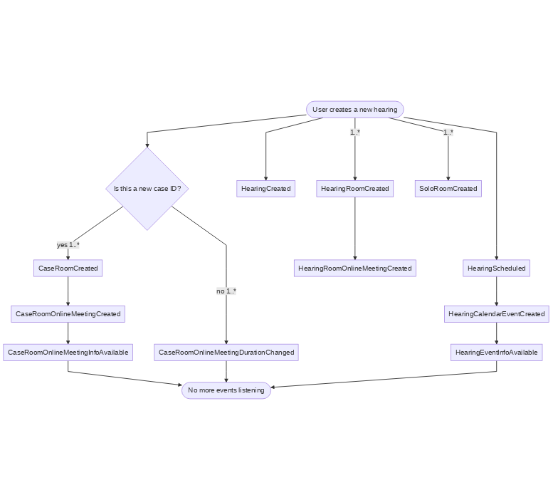
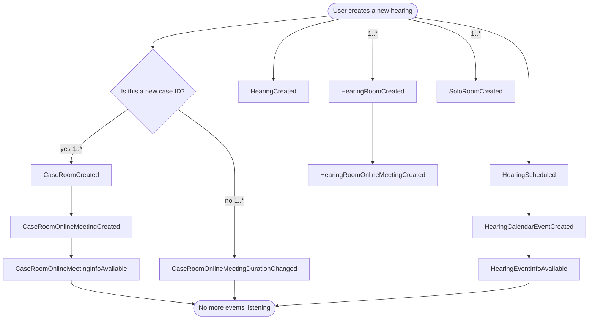

# Events

Events are the primary asynchronous mechanism used in the solution architecture typically communicating between API and
the various Azure Functions.

## List of events

Each event is described by using this [template](./template.md)

- [CaseCreated](./CaseCreated.md)
- [CaseRoomCreated](./CaseRoomCreated.md)
- [CaseRoomOnlineMeetingChanged](./CaseRoomOnlineMeetingChanged.md)
- [CaseRoomOnlineMeetingCreated](./CaseRoomOnlineMeetingCreated.md)
- [CaseRoomOnlineMeetingDurationChanged](./CaseRoomOnlineMeetingDurationChanged.md)
- [CaseRoomOnlineMeetingInfoAvailable](./CaseRoomOnlineMeetingInfoAvailable.md)
- [CaseRoomOnlineMeetingParticipantJoined](./CaseRoomOnlineMeetingParticipantJoined.md)
- [CaseRoomOnlineMeetingParticipantLeft](./CaseRoomOnlineMeetingParticipantLeft.md)
- [CaseRoomOnlineMeetingParticipantMuteToggled](./CaseRoomOnlineMeetingParticipantMuteToggled.md)
- [CaseRoomOnlineMeetingSubjectChanged](./CaseRoomOnlineMeetingSubjectChanged.md)
- [HearingCalendarEventCreated](./HearingCalendarEventCreated.md)
- [HearingCalendarEventRemoved](./HearingCalendarEventRemoved.md)
- [HearingCancelled](./HearingCancelled.md)
- [HearingCreated](./HearingCreated.md)
- [HearingEdited](./HearingEdited.md)
- [HearingEventInfoAvailable](./HearingEventInfoAvailable.md)
- [HearingEventInfoChanged](./HearingEventInfoChanged.md)
- [HearingParticipantsChangedEvent](./HearingParticipantsChangedEvent.md)
- [HearingRescheduled](./HearingRescheduled.md)
- [HearingRoomCreated](./HearingRoomCreated.md)
- [HearingRoomOnlineMeetingChanged](./HearingRoomOnlineMeetingChanged.md)
- [HearingRoomOnlineMeetingCreated](./HearingRoomOnlineMeetingCreated.md)
- [HearingRoomOnlineMeetingInfoAvailable](./HearingRoomOnlineMeetingInfoAvailable.md)
- [HearingRoomOnlineMeetingParticipantJoined](./HearingRoomOnlineMeetingParticipantJoined.md)
- [HearingRoomOnlineMeetingParticipantLeft](./HearingRoomOnlineMeetingParticipantLeft.md)
- [HearingRoomOnlineMeetingParticipantMuteToggled](./HearingRoomOnlineMeetingParticipantMuteToggled.md)
- [HearingRoomOnlineMeetingRemoved](./HearingRoomOnlineMeetingRemoved.md)
- [HearingRoomRemoved](./HearingRoomRemoved.md)
- [HearingScheduled](./HearingScheduled.md)
- [SoloRoomCreated](./SoloRoomCreated.md)
- [SoloRoomOnlineMeetingParticipantJoined](./SoloRoomOnlineMeetingParticipantJoined.md)
- [SoloRoomOnlineMeetingParticipantLeft](./SoloRoomOnlineMeetingParticipantLeft.md)
- [SoloRoomOnlineMeetingParticipantMuteToggled](./SoloRoomOnlineMeetingParticipantMuteToggled.md)
- [SoloRoomRemoved](./SoloRoomRemoved.md)

## Event Flows

Below are some diagrams showing the relationships between different events and the cascading way that events flow into
one-another. For more details on what services operate on those events, see the associated diagrams in the feature
documentation.

The flow charts below show the start and end of an event flow, as well as the relationships and numbers of events.

Flowchart guidelines:

- Rounded rectangles indicate the start or end of a flow
- Rectangles indicate an event
- Numbers on a line indicate the number of times this event gets created. If there is no number, the relationship is
  implied to be 1:1. An asterisk can be used to indicate an unknown number (e.g. `1..*` indicates at least one and up to
  any number)
- A diamond shape indicates a decision point. Lines exiting a diamond shape should describe the state that would go down
  that decision path.

### Creating a new hearing

- [Feature Documentation](../features/create-new-hearing.md)

### Event Flow

<!-- generated by mermaid compile action - START -->

  
Mermaid markup

<!-- generated by mermaid compile action - END -->
