# Moderator Actions <!-- omit in toc -->

- [Overview](#overview)
- [Actions Protocol](#actions-protocol)
  - [Endpoint Security](#endpoint-security)
- [Supported Actions](#supported-actions)
  - [Admit Participant(s) to Case Room](#admit-participants-to-case-room)
  - [Move Participant(s) back to Respective Party Rooms/Solo Rooms](#move-participants-back-to-respective-party-roomssolo-rooms)
  - [Mute Participants](#mute-participants)
  - [Send Message to Room(s)](#send-message-to-rooms)
  - [Send Message to Case Room](#send-message-to-case-room)
  - [Reassign Participant Party](#reassign-participant-party)
- [Future Improvements](#future-improvements)

## Overview

During the course of a hearing a moderator may need to perform several actions targeting either an entire group or an
individual participant. These actions include: muting, sending a message, inviting to a room, etc.

🚧 Would be great to link to a more business focused document that covers all of these in more detail 🚧

## Actions Protocol

Actions will be delivered using HTTP(S) to an endpoint owned by the bot; that endpoint will be:

```plain
<bot-base-url>/cases/<caseId>/hearings/[active|<hearingId>]/actions
```

> NOTE: Specifying the well-known value `active` in place of a specific `hearingId` indicates that the bot should apply
> the command in the context of the currently active hearing.

Requests should be sent to this endpoint using the HTTP `POST` verb and are expected to be in JSON format with a
`Content-Type: application/json` header. The basic structure of an action request payload is as follows:

```TypeScript
{
  actionName: string;
  actionData?: any;
}
```

Where `actionData` is specific to the action being requested.
[See the Actions section for details of each supported action](#supported-actions).

### Endpoint Security

This endpoint will be secured using an Azure Functions key which clients will need to send via the `X-Functions-Key` header.

## Supported Actions

The following section details the actions that are supported by the bot.

### Admit Participant(s) to Case Room

This action is used to admit either all or a specified subset of participants into the Case Room.

_**Action Name**_: admitParticipantsToCaseRoom

_**Data**_:

```TypeScript
{
  normalisedParticipantIds?: string[];
}
```

If `normalisedParticipantIds` is not specified or is empty it implies all currently tracked participants for the Hearing.

As this action performs the necessary steps to move participants between online meetings, the bot will fire the
respective `CaseRoomOnlineMeetingParticipantJoined`, `HearingRoomOnlineMeetingParticipantLeft` and
`SoloRoomParticipantLeft` events.

<!-- generated by mermaid compile action - START -->

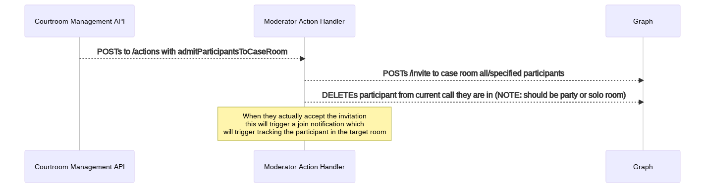

<details>
  <summary>Mermaid markup</summary>

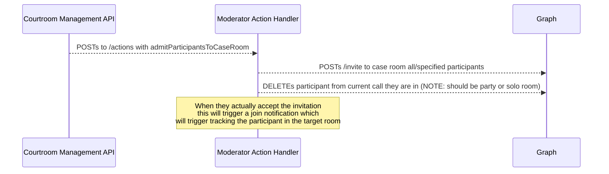

</details>
<!-- generated by mermaid compile action - END -->

### Move Participant(s) back to Respective Party Rooms/Solo Rooms

This action is used to move either all or a specified subset of participants back to their respective Party Rooms or, if
they are not with a party that has a dedicated room, a Solo Room instead.

_**Action Name**_: moveParticipantsBackToRooms

_**Data**_:

```TypeScript
{
  normalisedParticipantIds?: string[];
}
```

If `normalisedParticipantIds` is not specified or is empty it implies all currently tracked participants for the Hearing.

As this action performs the necessary steps to move participants between online meetings, the bot will fire the
respective `CaseRoomOnlineMeetingParticipantLeft`, `HearingRoomOnlineMeetingParticipantJoined` and
`SoloRoomParticipantJoined` events.

<!-- generated by mermaid compile action - START -->


<details>
  <summary>Mermaid markup</summary>

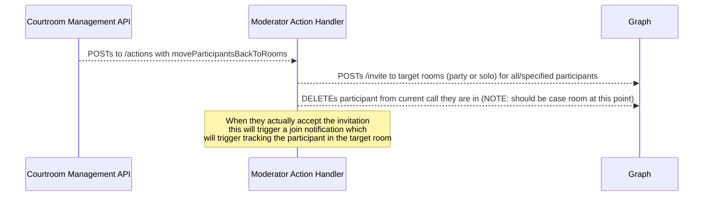

</details>
<!-- generated by mermaid compile action - END -->

### Mute Participants

This action is used to mute one or more participants in whatever room they are currently in.

_**Action Name**_: muteParticipants

_**Data**_:

```TypeScript
{
  normalisedParticipantIds: string[];
}
```

Once the status is toggled the bot will fire a `[Case|Hearing|Solo]RoomOnlineMeetingParticipantMuteToggled` event.

<!-- generated by mermaid compile action - START -->

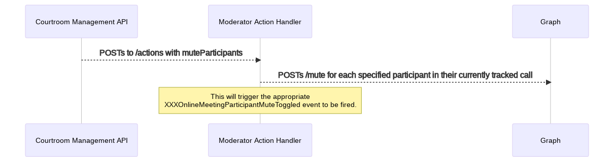

<details>
  <summary>Mermaid markup</summary>

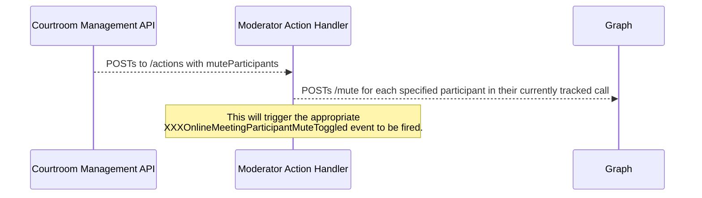

</details>
<!-- generated by mermaid compile action - END -->

### Send Message to Room(s)

This action is used to send a message to one or more rooms.

_**Action Name**_: sendMessageToRooms

_**Data**_:

```TypeScript
{
  message: string;
  targetParticipantParties?: string[]
}
```

To target people who are in not in any specific party an empty string should be specified in the
`targetParticipantParties` array. If `targetParticipantParties` is not specified at all, the message will be broadcast
to all rooms for the specified Hearing except for the Case room.

<!-- generated by mermaid compile action - START -->

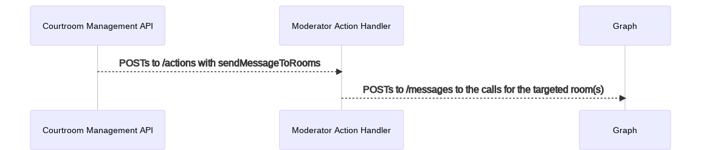

<details>
  <summary>Mermaid markup</summary>

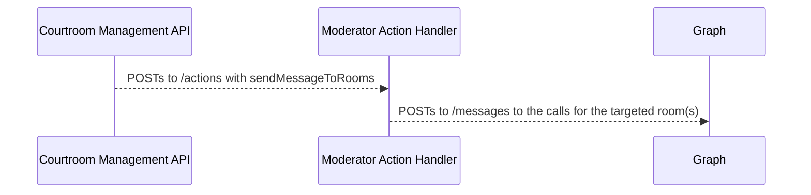

</details>
<!-- generated by mermaid compile action - END -->

### Send Message to Case Room

This action is used to send a message to the main Case room.

_**Action Name**_: sendMessageToCaseRoom

_**Data**_:

```TypeScript
{
  message: string;
}
```

<!-- generated by mermaid compile action - START -->

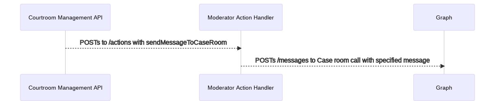

<details>
  <summary>Mermaid markup</summary>

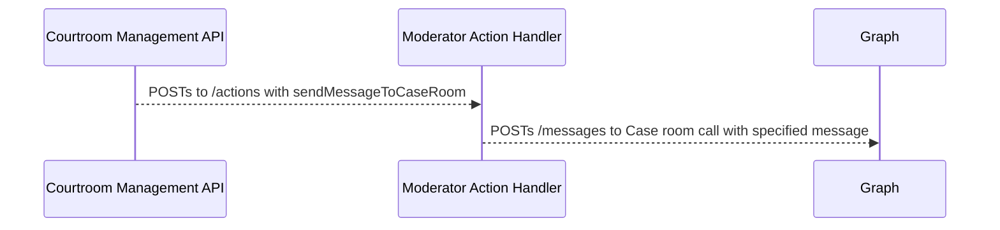

</details>
<!-- generated by mermaid compile action - END -->

### Reassign Participant Party

This action is used to reassign the party that a participant currently belongs to.

_**Action Name**_: reassignParticipantParties

_**Data**_:

```TypeScript
{
  normalizedParticipantIds: string[];
  targetParticipantParty?: string;
}
```

> NOTE: specifying no value for `targetParticipantParty` (targetParticipantParty = undefined) effectively removes them
> from any party they are currently in. This will reset the participant party of the participants to unknown/other.

<!-- generated by mermaid compile action - START -->

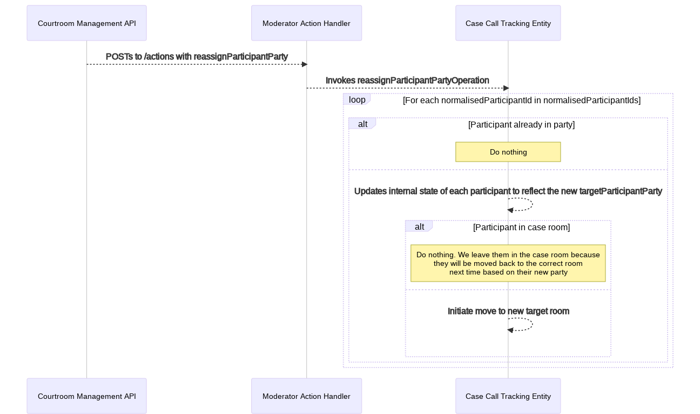

<details>
  <summary>Mermaid markup</summary>

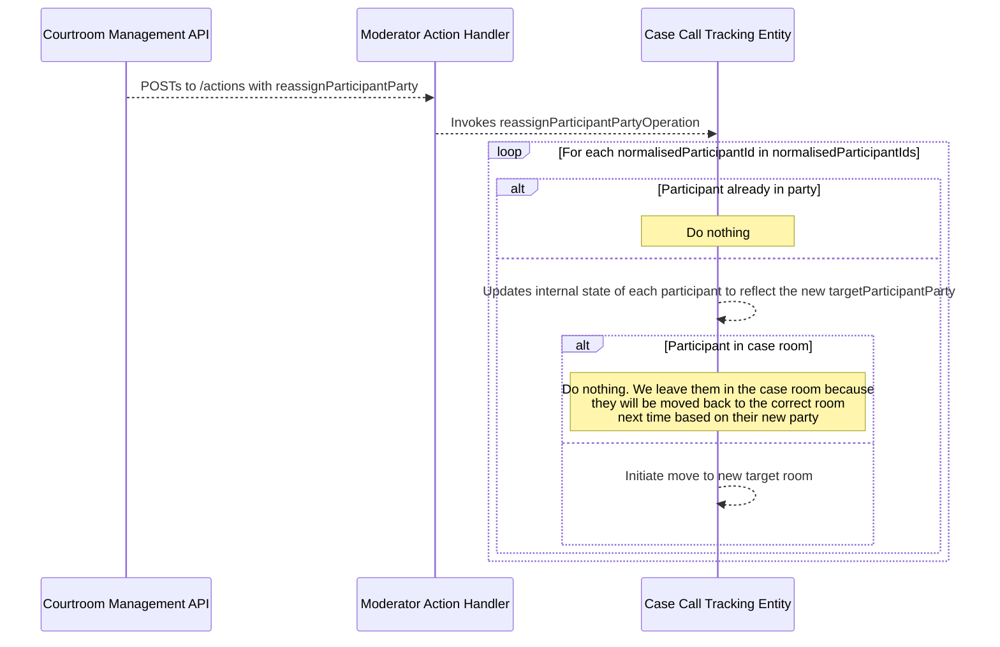

</details>
<!-- generated by mermaid compile action - END -->

## Future Improvements

Currently in the system there are several integration Events that likely could be changed to commands, the most notable
being `CaseCreated` and `HearingCreated`. In these cases, a command could be sent to the bot to create the online
meetings, and only after that has been completed will these events come out.

In addition, some existing commands could potentially move to Events as they signify state changes in the system, such
as `reassignParticipantParties`. In this case, reassigning may or may not result in an actual move by the bot, but
assigning a party is specific to the domain of the API. Rather than send out a command that this should occur, coupled
with DB changes, the DB changes can be made, an integration can be sent out (e.g. `ParticipantPartyChanged`) and the bot
could listen to that event and update its internal state and/or move if necessary. This breaks a bit of coupling
currently between the bot and the API where the API needs to be aware of the type of move and what the result would be
based on room ID.
