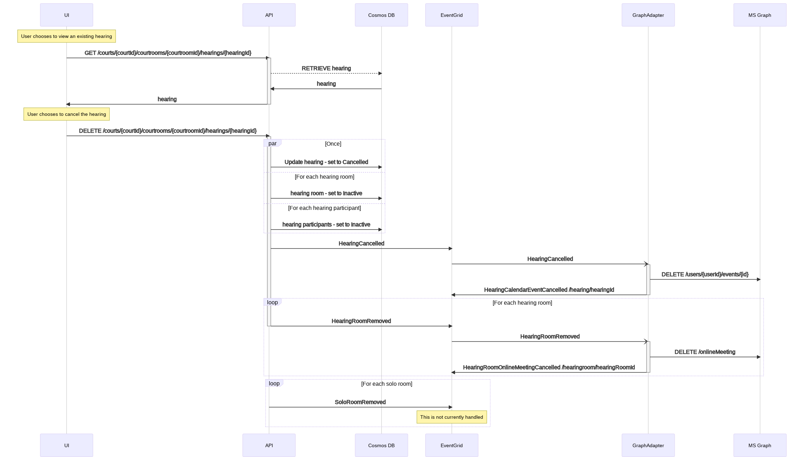
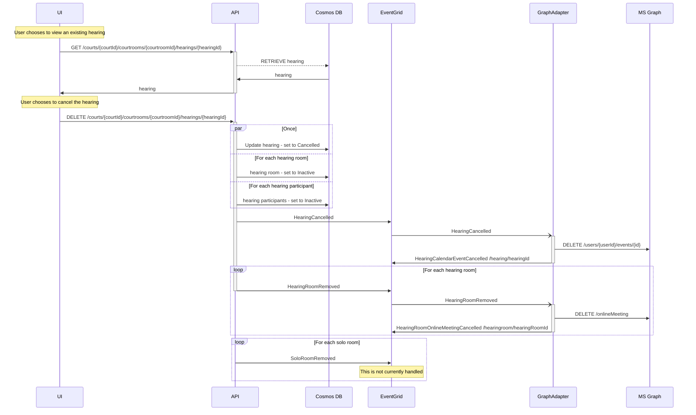

<!-- omit in toc -->

# Cancel a Hearing

- [Background](#background)
- [Research](#research)
- [Plan](#plan)
- [End-to-end Test](#end-to-end-test)
- [Release Notes](#release-notes)
- [Future Enhancements/Recommendation](#future-enhancementsrecommendation)
- [Outstanding questions/To Dos/Next Steps](#outstanding-questionsto-dosnext-steps)

## Background

As a Moderator, or Scheduling Coordinator, I can cancel an invitation for an existing scheduled hearing.

## Research

## Plan

### Cancel a Scheduled Hearing

Prerequisite: only hearings that are of status "Scheduled" can be cancelled.
Prerequisite: only hearings that have not "started" ie the start date time of the hearing must be in the future can be cancelled.

When the user cancels the hearing the updated status is saved to the database. A cancel event for the hearing and a
status change for each room is sent to the event grid.

<!-- generated by mermaid compile action - START -->

  
Mermaid markup

<!-- generated by mermaid compile action - END -->

## End-to-end Test

| Test Case                                                             | First case | Second Case |
| --------------------------------------------------------------------- | ---------- | ----------- |
| Error cases not saved - hearing started                               |            |             |
| Error cases not saved - hearing cancelled                             |            |             |
| Error cases not saved - court/courtroom doesn't match existing record |            |             |
| Database correctly updated Hearing - hearing status set to Cancelled  |            |             |
| Database correctly updated HearingParticipants Removed                |            |             |
| Database correctly updated HearingRooms Removed                       |            |             |
| Cancel email is sent                                                  |            |             |
| HearingCancelled event raised                                         |            |             |
| HearingRoomRemoved event raised for each hearing room                 |            |             |

## Outstanding questions/To Dos/Next Steps

### Out of Scope for CancelHearing

Cases are never removed/cancelled. The case level online meetings will be cleaned up by the bot when the case end date
passes or extended if a hearing is re-created.
