# Consistent Join <!-- omit in toc -->

- [Background](#background)
- [Research](#research)
- [Plan](#plan)
  - [Architecture](#architecture)
  - [Configurations](#configurations)
  - [Azure Functions](#azure-functions)
  - [Bot Application Registration in Azure Active Directory](#bot-application-registration-in-azure-active-directory)
  - [Azure Bot Service](#azure-bot-service)
  - [Deployment](#deployment)
- [Bot Features/Responsibilities](#bot-featuresresponsibilities)
  - [Room Online Meeting Lifecycle Management](#room-online-meeting-lifecycle-management)
    - [Initialization on Room Creation](#initialization-on-room-creation)
    - [Activates w/Room OnlineMeeting Info Available Events](#activates-wroom-onlinemeeting-info-available-events)
      - [Implementation details](#implementation-details)
  - [Producing Room Participant Joined/Left Integration Events](#producing-room-participant-joinedleft-integration-events)
  - [Producing Room Status Integration Events](#producing-room-status-integration-events)
    - [Supporting Functions](#supporting-functions)
  - [Reception Room Participant Routing](#reception-room-participant-routing)
    - [Notification of Case Rooms being created](#notification-of-case-rooms-being-created)
    - [Notifications about Party Rooms being created for a Case](#notifications-about-party-rooms-being-created-for-a-case)
    - [Notifications about each Room's Online Meeting Info becoming available](#notifications-about-each-rooms-online-meeting-info-becoming-available)
      - [Case Reception Room](#case-reception-room)
      - [Hearing Rooms](#hearing-rooms)
    - [Notifications about participants joining Case Reception Room](#notifications-about-participants-joining-case-reception-room)
      - [Resolving participants to Hearing Invitees by email](#resolving-participants-to-hearing-invitees-by-email)
    - ["Solo" Room Routing](#solo-room-routing)
  - [Handling of Change Events](#handling-of-change-events)
  - [Room Call Keep-Alive](#room-call-keep-alive)
- [Testing](#testing)

## Background

This documentation aims to provide deeper technical detail of the systems necessary to support the
[Consistent Join - Automatic Routing epic].

## Research

Research for this epic came from a spike on an existing C# implementation of a listener bot built for virtual courts
prototype. Since our project is in TypeScript, and there is no JavaScript/TS SDK for the Calling Service, additional
research was conducted into the raw API and structure of the Calling Notifications service. Assumptions: It was
initially discussed to not perform any Graph API calls within the Call Management Bot service, and instead to perform
them all through an abstracted Call Management Bot service. However, to maintain responsibility for bot related functions
within one place, we have decided the Call Management Bot will make a limited set of Graph API calls related to the
Azure Bot joining rooms. Examples of Graph API calls the Call Management Bot will make: joining the Azure Bot into a
call, cleaning up calls, etc. Examples of Graph API calls the Call Management
Bot will make through an abstracted Call Management Bot service: inviting(moving) a participant to their private party room
and removing them from the Reception Room.

## Plan

### Architecture

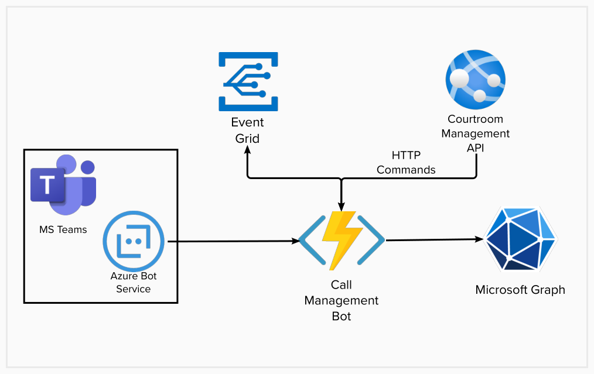

### Configurations

### Azure Functions

Azure Functions is the serverless solution used to host the Call Management Bot business logic. It provides us with the
endpoint used as the webhook for directing all Calls Notifications from Teams calls to our Call Management Bot. To learn
about getting started with creating and publishing Azure Functions, see [Quickstart: Create a function in Azure with
TypeScript using Visual Studio
Code](https://docs.microsoft.com/en-us/azure/azure-functions/create-first-function-vs-code-typescript). In addition to
HTTP calls, Azure Functions provides Event Grid bindings to receive and publish events. See [Azure Event Grid bindings
for Azure Functions](https://docs.microsoft.com/en-us/azure/azure-functions/functions-bindings-event-grid) for more.

### Bot Application Registration in Azure Active Directory

An Application Instance needs to be registered in the Azure Active Directory tenant which the bot will utilize when
making calls to the Microsoft Graph API. [For more details on creating this Application Instance please refer to the
Call Management Bot section of the Application Security documentation](../application-security.md#call-management-bot).

### Azure Bot Service

An Azure Bot participates in the Teams calls in order to receive the Calls Notifications for participant joins, updates,
removals, etc. When registering the bot, make sure to set the following:

1. Use existing app registration: In order to have control over management of our resources, we want to create the bot
   and the app registration separately. Choose "use an existing app registration" when configuring the bot using the
   AppID and Secret from [the App Registration step mentioned
   above](#bot-application-registration-in-azure-active-directory).
2. Calling webhook: We need to enable Calling capabilities in order for the Azure Bot to receive Calls Notifications.
   Enter the event grid endpoint from the call-management-bot Azure Function in the webhook field.
   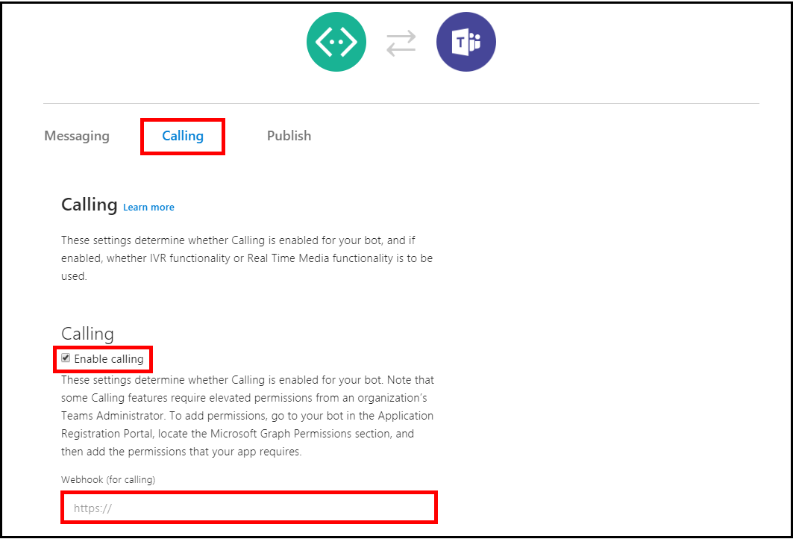 This can be updated at any time by navigating to the
   bot in Azure portal, clicking on the Channels blade, then clicking Edit next to the Microsoft Teams channel.
3. Messaging Endpoint: The bot does not require the messaging endpoint to be enabled at this time.

### Deployment

The bot's Application Identity is currently expected to be registered manually per the details in the in the
[Bot Application Registration in Azure Active Directory](#bot-application-registration-in-azure-active-directory)
section.

> NOTE: this _can_ be automated, it was decided to be lower priority for the first version because it only needed to be
> performed once per environment.

Registration with the Azure Bot Service is currently expected to be performed manually per the details in the
[Azure Bot Service](#azure-bot-service) section.

> NOTE: this _can_ be automated, it was decided to be lower priority for the first version because it only needed to be
> performed once per environment.

The bot's implementation is deployed as a set of Azure Functions using our standard Azure Functions automated deployment
CI/CD workflow in GitHub.

## Bot Features/Responsibilities

### Room Online Meeting Lifecycle Management

The bot is responsible for starting the meetings in advance so that no participant will ever join an empty meeting and
to ensure that the bot receives all notifications for the call from start to finish.

To do this the bot, upon learning about a new Online Meeting becoming available for a room (case or hearing), will
schedule itself to join the room well in advance of any other participants joining. The exact time is not documented
here as it may change, but it's reasonable to expect, for example, at least 24-48hrs in advance.

#### Initialization on Room Creation

When the bot hears that a new room is created via either `CaseRoomCreated` or `HearingRoomCrated`, it needs to prepare
itself by creating state based off the data provided by those events so that it can effectively prepare to manage the
meeting lifetimes once it receives the `CaseRoomOnlineMeetingInfoAvailable` and `HearingRoomOnlineMeetingInfoAvailable` events.

<!-- generated by mermaid compile action - START -->

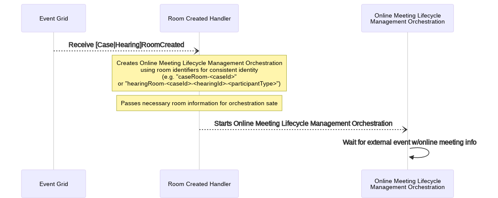

  
Mermaid markup

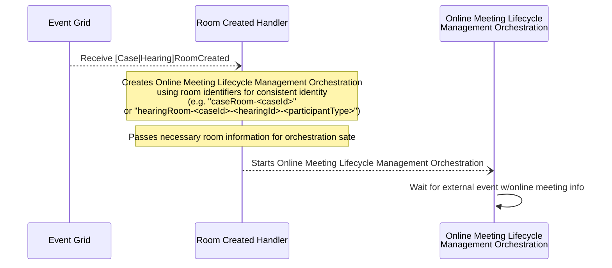
```mermaid
sequenceDiagram
  participant T4J as Event Grid
  participant RCEH as Room Created Handler
  participant OMLMO as Online Meeting Lifecycle<br/>Management Orchestration
  T4J--)RCEH: Receive [Case|Hearing]RoomCreated
  Note over RCEH: Creates Online Meeting Lifecycle Management Orchestration<br/>using room identifiers for consistent identity<br/>(e.g. "caseRoom-<caseId>"<br/> or "hearingRoom-<caseId>-<hearingId>-<participantType>")
  Note over RCEH: Passes necessary room information for orchestration sate
  RCEH--)OMLMO: Starts Online Meeting Lifecycle Management Orchestration
  activate OMLMO
  OMLMO->>OMLMO: Wait for external event w/online meeting info
```

<!-- generated by mermaid compile action - END -->

#### Activates w/Room OnlineMeeting Info Available Events

Once the bot is notified about the online meeting info being available, it should have all the information it needs
to schedule itself to joining call via the Graph API.

> NOTE: 🚧 This sequence diagram shows a "clean up" step, but we still need to determine if this is available and, if so,
> what that is exactly. 🚧

<!-- generated by mermaid compile action - START -->

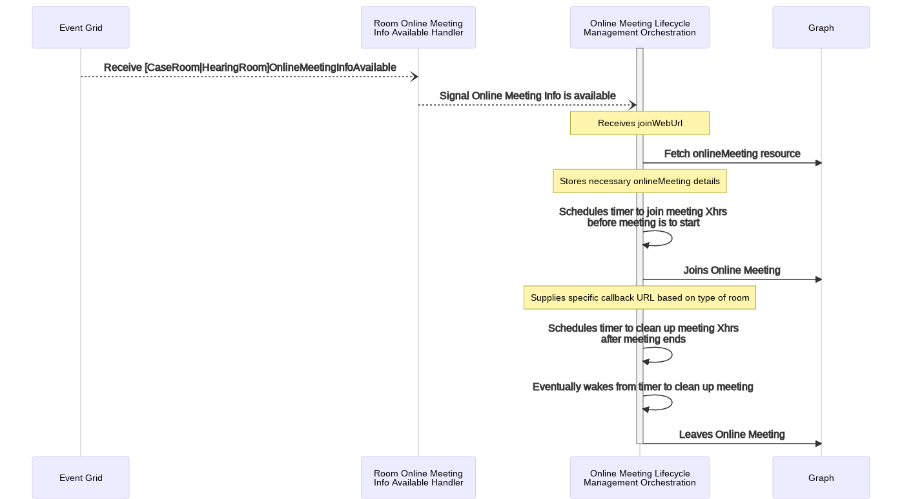

  
Mermaid markup

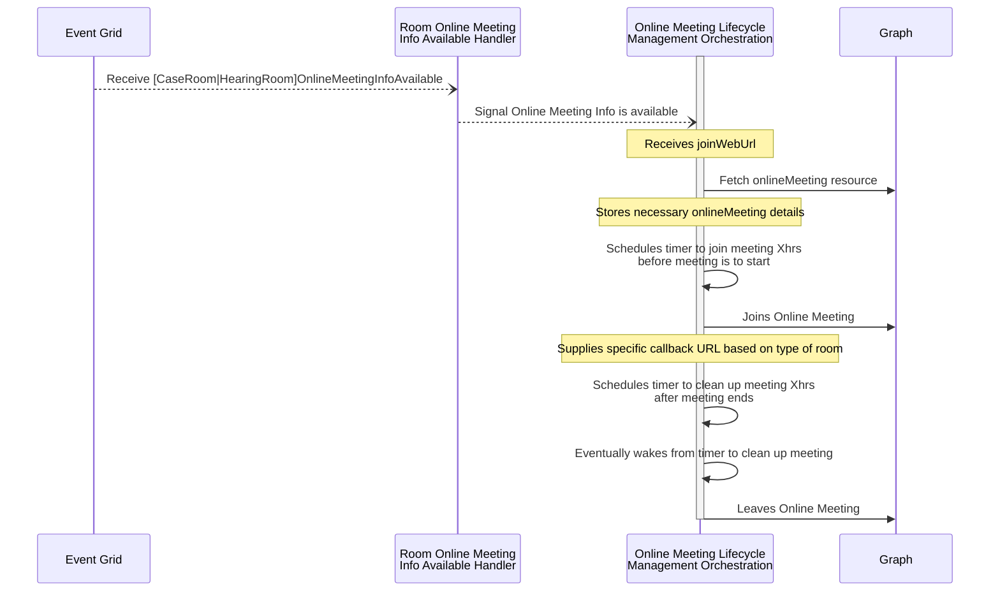
```mermaid
sequenceDiagram
  participant T4J as Event Grid
  participant OMIAEH as Room Online Meeting<br/>Info Available Handler
  participant OMLMO as Online Meeting Lifecycle<br/>Management Orchestration
  participant Graph
  activate OMLMO
  T4J--)OMIAEH: Receive [CaseRoom|HearingRoom]OnlineMeetingInfoAvailable
  OMIAEH--)OMLMO: Signal Online Meeting Info is available
  Note over OMLMO: Receives joinWebUrl
  OMLMO->>Graph: Fetch onlineMeeting resource
  Note over OMLMO: Stores necessary onlineMeeting details
  OMLMO->>OMLMO: Schedules timer to join meeting Xhrs<br/>before meeting is to start
  OMLMO->>Graph: Joins Online Meeting
  Note over OMLMO: Supplies specific callback URL based on type of room
  OMLMO->>OMLMO: Schedules timer to clean up meeting Xhrs<br/>after meeting ends
  OMLMO->>OMLMO: Eventually wakes from timer to clean up meeting
  OMLMO->>Graph: Leaves Online Meeting
  deactivate OMLMO
```

<!-- generated by mermaid compile action - END -->

##### Implementation details

When the bot joins the online meeting, it provides a `callbackUrl` which we will utilize to correlate domain specific
details in the Call Notification Processing logic. The callback URL should be set with the following structure:

| Room Type    | URL scheme                                                                                                                    |
| ------------ | ----------------------------------------------------------------------------------------------------------------------------- |
| Case Room    | `https://<notification-handler-function-baseUrl>/case/<caseId>/rooms/<caseRoomType>`                                          |
| Hearing Room | `https://<notification-handler-function-baseUrl>/case/<caseId>/hearings/<hearingId>/rooms/<hearingRoomId>/<participantParty>` |
| Solo Room    | `https://<notification-handler-function-baseUrl>/case/<caseId>/hearings/<hearingId>/rooms/solo/<soloRoomId>`                  |

### Producing Room Participant Joined/Left Integration Events

As participants join and leave the online meetings we need to calculate the deltas provided by the call notifications
and publish specific integration events for interested systems to consume.

<!-- generated by mermaid compile action - START -->

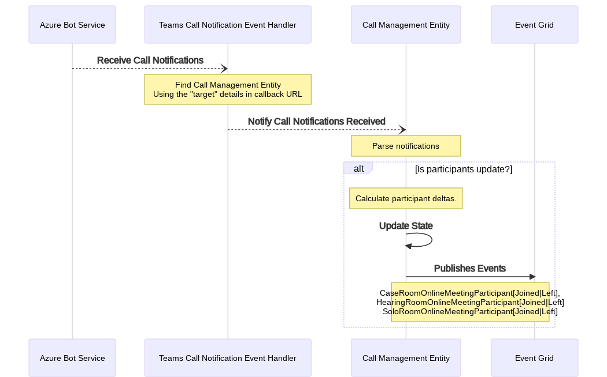

  
Mermaid markup

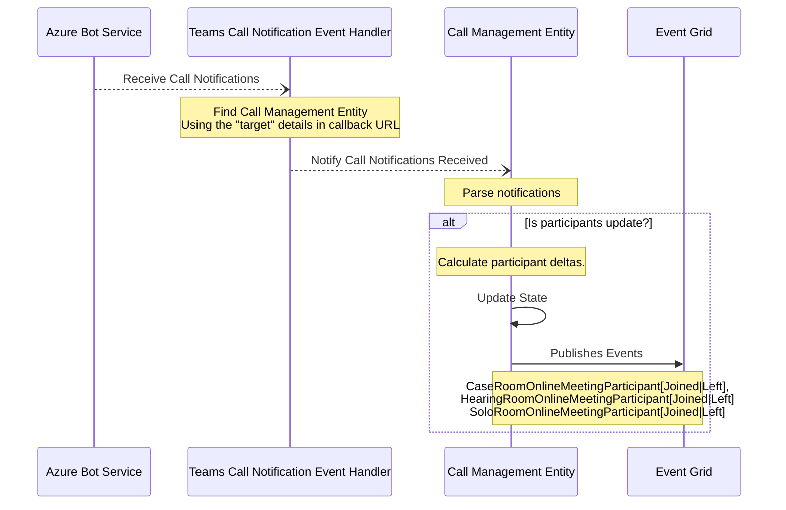
```mermaid
sequenceDiagram
  participant ABS as Azure Bot Service
  participant TCNEH as Teams Call Notification Event Handler
  participant CME as Call Management Entity
  participant T4J as Event Grid
  ABS--)TCNEH: Receive Call Notifications
  Note over TCNEH: Find Call Management Entity<br/>Using the "target" details in callback URL
  TCNEH--)CME: Notify Call Notifications Received
  Note over CME: Parse notifications
  alt Is participants update?
  Note over CME: Calculate participant deltas.
  CME->>CME: Update State
  CME->>T4J: Publishes Events
  Note over CME,T4J: CaseRoomOnlineMeetingParticipant[Joined|Left],<br/>HearingRoomOnlineMeetingParticipant[Joined|Left]<br/>SoloRoomOnlineMeetingParticipant[Joined|Left]
  end
```

<!-- generated by mermaid compile action - END -->

### Producing Room Status Integration Events

> NOTE: 🚧 Not sure we really need this yet. Publishing of this event has been disabled in latest version until
> we understand better. 🚧

When the bot joins a meeting it goes through a lifecycle of events that indicate when it is officially connected to the
meeting. These events can be treated as status events so that interested systems can track what state a particular room
is in with respect to the online meeting.

<!-- generated by mermaid compile action - START -->

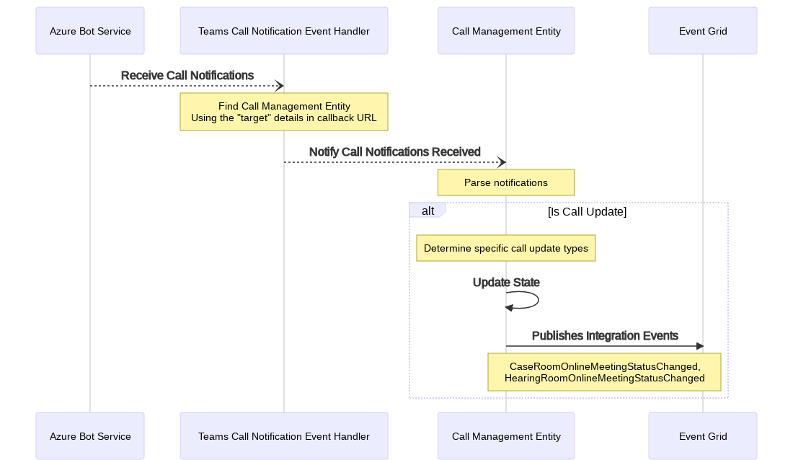

  
Mermaid markup

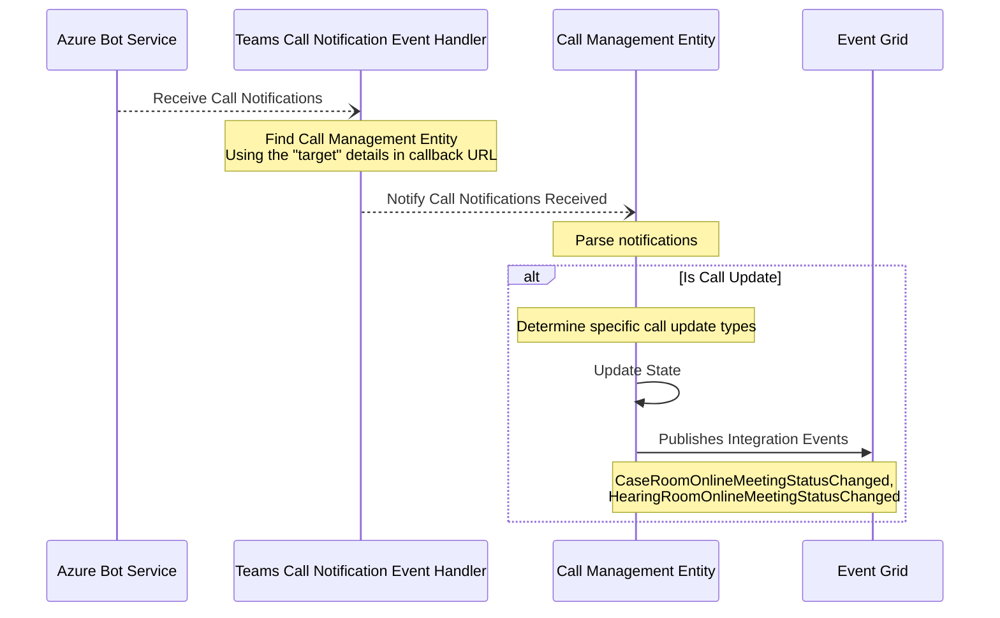
```mermaid
sequenceDiagram
  participant ABS as Azure Bot Service
  participant TCNEH as Teams Call Notification Event Handler
  participant CME as Call Management Entity
  participant T4J as Event Grid
  ABS--)TCNEH: Receive Call Notifications
  Note over TCNEH: Find Call Management Entity<br/>Using the "target" details in callback URL
  TCNEH--)CME: Notify Call Notifications Received
  Note over CME: Parse notifications
  alt Is Call Update
    Note over CME: Determine specific call update types
    CME->>CME: Update State
    CME->>T4J: Publishes Integration Events
    Note over CME,T4J: CaseRoomOnlineMeetingStatusChanged,<br/>HearingRoomOnlineMeetingStatusChanged
  end
```

<!-- generated by mermaid compile action - END -->

#### Supporting Functions

| Function name          | Description                                                                                                                                                                  |
| ---------------------- | ---------------------------------------------------------------------------------------------------------------------------------------------------------------------------- |
| `NotificationHandler`  | Acts as the HTTP endpoint for Calling Notifications for the Azure Bot. Will receive JSON notifications via HTTP and relay them to the `CallManagementEntity` for processing. |
| `CallManagementEntity` | This is a durable entity function which is responsible for tracking the state of the online meeting's call. It has the following responsibilities:                           |

- Providing participant list delta processing and publishing logical `XXXOnlineMeetingParticipantJoined/Left`
  and `XXXOnlineMeetingParticipantMuteToggled` integration events based on those deltas
- Detecting state changes to the online meeting's call itself such as the the status changing. Today this is only used
  to react internally to a call being terminated.

### Reception Room Participant Routing

In order to know exactly which Hearing Room a participant entering the Reception room should be moved into the bot
will need to maintain some understanding of the room types and the participant types via state so that when it receives
the notification about the participant joining the call it knows how to route them. The following diagrams show the flow
of integration events that will come in from other parts of the system, how those will be routed to an entity which will
track the necessary state and how that entity will interact with Graph to move the participants to the call.

#### Notification of Case Rooms being created

This routing process is initially "started" by receiving `CaseRoomCreated` events...

<!-- generated by mermaid compile action - START -->

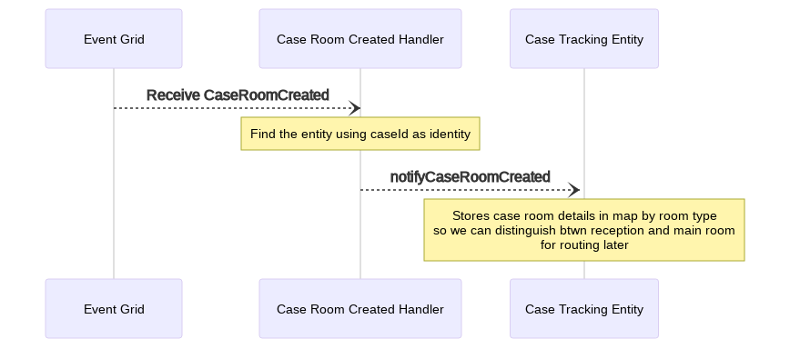

  
Mermaid markup

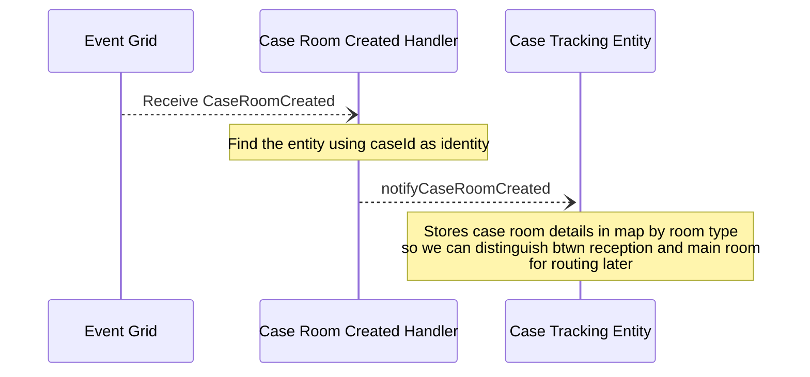
```mermaid
sequenceDiagram
  participant T4J as Event Grid
  participant EH as Case Room Created Handler
  participant CCTE as Case Tracking Entity
  T4J--)EH: Receive CaseRoomCreated
  Note over EH: Find the entity using caseId as identity
  activate CCTE
  EH--)CCTE: notifyCaseRoomCreated
  Note over CCTE: Stores case room details in map by room type<br/>so we can distinguish btwn reception and main room<br/>for routing later
```

<!-- generated by mermaid compile action - END -->

#### Notifications about Party Rooms being created for a Case

In order to route participants to the correct `HearingRoom` when they join the "reception" room we also need to watch
for `HearingRoomCreated` and associate more details with the same entity as the `CaseRoomCreated` event. Specifically we
need to build a mapping of which participants will be in which rooms so that when they come into the "reception" room we
know where to route them.

<!-- generated by mermaid compile action - START -->

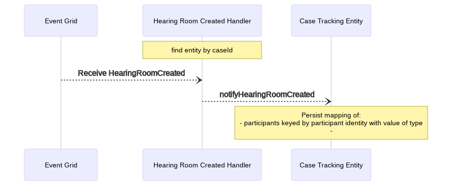

  
Mermaid markup

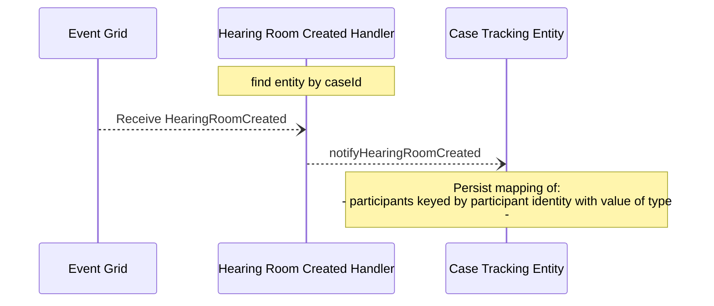
```mermaid
sequenceDiagram
  participant T4J as Event Grid
  participant EH as Hearing Room Created Handler
  Note over EH: find entity by caseId
  participant CCTE as Case Tracking Entity
  T4J--)EH: Receive HearingRoomCreated
  EH--)CCTE: notifyHearingRoomCreated
  Note over CCTE: Persist mapping of:<br/>- participants keyed by participant identity with value of type<br/>-
```

<!-- generated by mermaid compile action - END -->

> NOTE: Since there are potentially multiple `Hearing`s per `Case`, there can be, across time, multiple
> `HearingRoomCreated` events fired for the same participant type

#### Notifications about each Room's Online Meeting Info becoming available

As each room's online meeting is created we will receive a notification in the form of both `CaseRoomOnlineMeetingInfoAvailable`
for both the "case" and "reception" Case Rooms and `HearingRoomOnlineMeetingInfoAvailable` for each distinct Hearing Room.
We need to handle those and update our internal state with the details of those online meetings.

##### Case Reception Room

<!-- generated by mermaid compile action - START -->

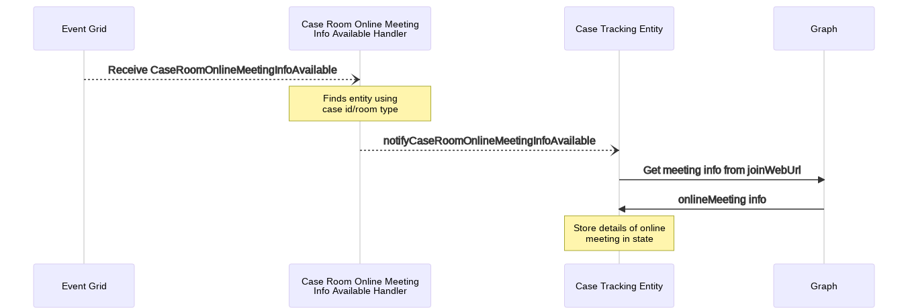

  
Mermaid markup

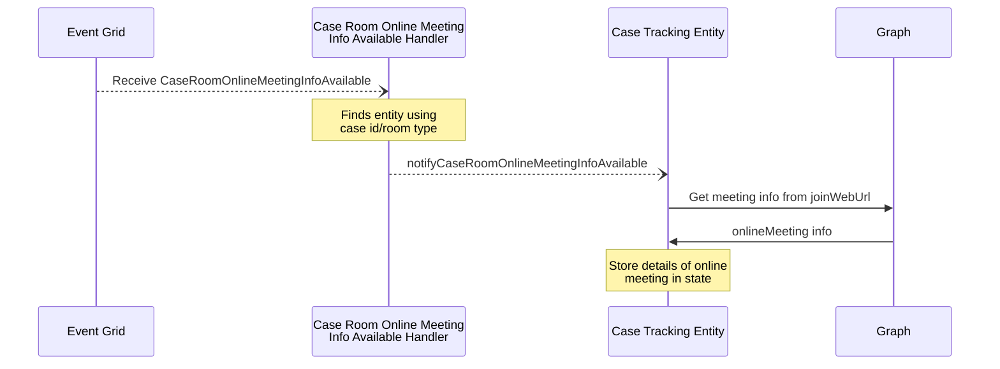
```mermaid
sequenceDiagram
  participant T4J as Event Grid
  participant EH as Case Room Online Meeting<br/>Info Available Handler
  participant CCTE as Case Tracking Entity
  T4J--)EH: Receive CaseRoomOnlineMeetingInfoAvailable
  Note over EH: Finds entity using<br/>case id/room type
  EH--)CCTE: notifyCaseRoomOnlineMeetingInfoAvailable
  CCTE->>Graph: Get meeting info from joinWebUrl
  Graph->>CCTE: onlineMeeting info
  Note over CCTE: Store details of online<br/>meeting in state
```

<!-- generated by mermaid compile action - END -->

##### Hearing Rooms

<!-- generated by mermaid compile action - START -->

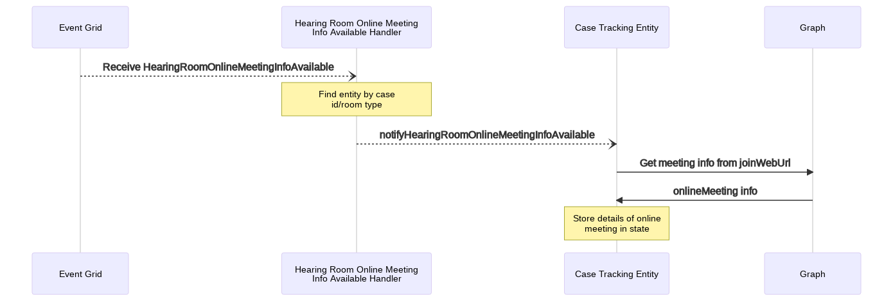

  
Mermaid markup

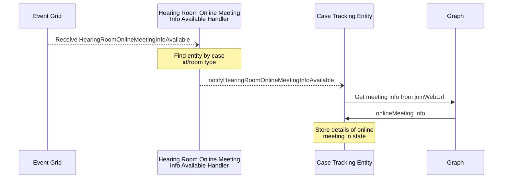
```mermaid
sequenceDiagram
  participant T4J as Event Grid
  participant EH as Hearing Room Online Meeting<br/>Info Available Handler
  participant CCTE as Case Tracking Entity
  T4J--)EH: Receive HearingRoomOnlineMeetingInfoAvailable
  Note over EH: Find entity by case<br/>id/room type
  EH--)CCTE: notifyHearingRoomOnlineMeetingInfoAvailable
  CCTE->>Graph: Get meeting info from joinWebUrl
  Graph->>CCTE: onlineMeeting info
  Note over CCTE: Store details of online<br/>meeting in state
```

<!-- generated by mermaid compile action - END -->

#### Notifications about participants joining Case Reception Room

Once a participant actually joins the reception room for the case, we want to move the participant from the
reception room directly into the target room for their party or, if no target room exists, a solo room.

<!-- generated by mermaid compile action - START -->

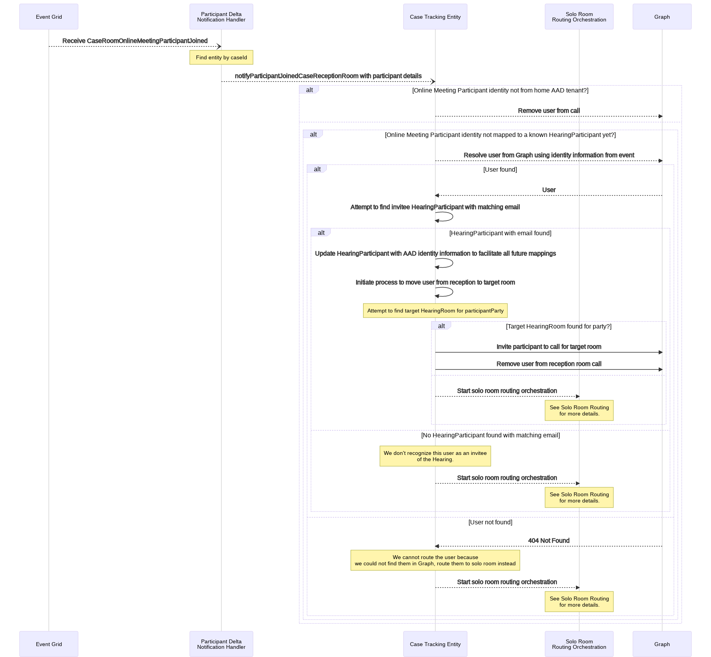

  
Mermaid markup

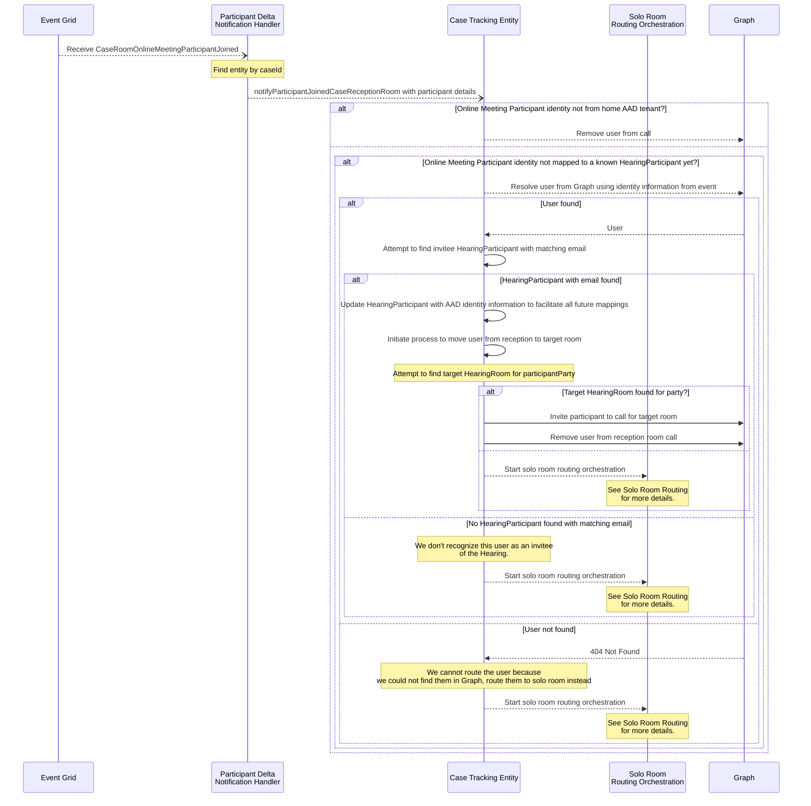
```mermaid
sequenceDiagram
  participant T4J as Event Grid
  participant EH as Participant Delta<br/>Notification Handler
  participant CCTE as Case Tracking Entity
  participant SRRO as Solo Room<br/>Routing Orchestration
  participant Graph
  T4J--)EH: Receive CaseRoomOnlineMeetingParticipantJoined
  Note over EH: Find entity by caseId
  EH--)CCTE: notifyParticipantJoinedCaseReceptionRoom with participant details
  alt Online Meeting Participant identity not from home AAD tenant?
    CCTE-->>Graph: Remove user from call
  else
    alt Online Meeting Participant identity not mapped to a known HearingParticipant yet?
      CCTE-->>Graph: Resolve user from Graph using identity information from event
      alt User found
        Graph-->>CCTE: User
        CCTE->>CCTE: Attempt to find invitee HearingParticipant with matching email
        alt HearingParticipant with email found
          CCTE->>CCTE: Update HearingParticipant with AAD identity information to facilitate all future mappings
          CCTE->>CCTE: Initiate process to move user from reception to target room
          Note over CCTE: Attempt to find target HearingRoom for participantParty
          alt Target HearingRoom found for party?
            CCTE->>Graph: Invite participant to call for target room
            CCTE->>Graph: Remove user from reception room call
          else
            CCTE-->>SRRO: Start solo room routing orchestration
            Note over SRRO: See Solo Room Routing<br/>for more details.
          end
        else No HearingParticipant found with matching email
          Note over CCTE: We don't recognize this user as an invitee<br/>of the Hearing.
          CCTE-->>SRRO: Start solo room routing orchestration
          Note over SRRO: See Solo Room Routing<br/>for more details.
        end
      else User not found
        Graph-->>CCTE: 404 Not Found
        Note over CCTE: We cannot route the user because<br/>we could not find them in Graph, route them to solo room instead
        CCTE-->>SRRO: Start solo room routing orchestration
        Note over SRRO: See Solo Room Routing<br/>for more details.
      end
    end
  end
```

<!-- generated by mermaid compile action - END -->

##### Resolving participants to Hearing Invitees by email

Invitees are matched by attempting to resolve the AAD User from the configured AAD "home" tenant. Assuming the User is
actually found, a case-insensitive comparison is done against the `mail` property _only_. This means that all Users of
the tenant need to be defined with the `mail` property set and not _just_ their `userPrincipalName`. External User's who
are invited to the tenant will always have their `mail` property set to whatever their external email address actually
is supplied as during hearing creation (i.e. `jane.doe@hotmail.com`).

A future enhancement to the resolution logic would be to use a fallback scheme of checking all three properties of the
AAD User in an attempt to match:`mail` -> `alternateMail` -> `userPrincipalName`.

#### "Solo" Room Routing

There are two scenarios which will result in a participant who joins the Case Reception Room will need to be routed into
a "solo" room.

- **Known Participants** - When a participant joins the Case Reception Room's online meeting and is successfully
  resolved to an invited `HearingParticipant`, but the participant party that they belong too does not have a dedicated
  `HearingRoom` then they should be moved into a solo room.
- **Unknown Participants** - When a participant joins the Case Reception Room's online meeting, but the system is unable
  to map the online meeting participant to a known `HearingParticipant`, either due to it being a phone dial in or not
  being able to resolve the online meeting participant's AAD identity against the originally invited set of
  `HearingParticipant`s, then the participant needs to be routed to a "solo" room where a moderator will eventually
  identify them and potentially move them out of later.

Both cases should be able to use the same following singular, data driven flow:

<!-- generated by mermaid compile action - START -->

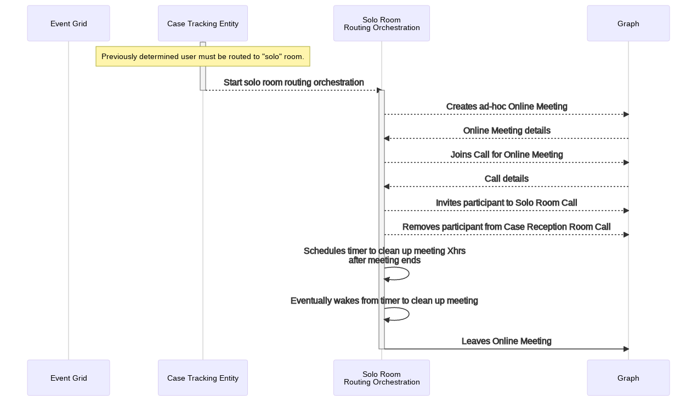

  
Mermaid markup

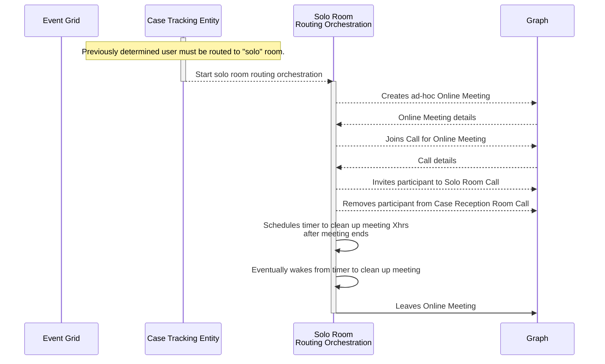
```mermaid
sequenceDiagram
  participant T4J as Event Grid
  participant CCTE as Case Tracking Entity
  participant SRRO as Solo Room<br/>Routing Orchestration
  participant Graph
  activate CCTE
  Note over CCTE: Previously determined user must be routed to "solo" room.
  CCTE-->>SRRO: Start solo room routing orchestration
  deactivate CCTE
  activate SRRO
  SRRO-->>Graph: Creates ad-hoc Online Meeting
  Graph-->>SRRO: Online Meeting details
  SRRO-->>Graph: Joins Call for Online Meeting
  Graph-->>SRRO: Call details
  SRRO-->>Graph: Invites participant to Solo Room Call
  SRRO-->>Graph: Removes participant from Case Reception Room Call
  SRRO->>SRRO: Schedules timer to clean up meeting Xhrs<br/>after meeting ends
  SRRO->>SRRO: Eventually wakes from timer to clean up meeting
  SRRO->>Graph: Leaves Online Meeting
  deactivate SRRO
```

<!-- generated by mermaid compile action - END -->

### Handling of Change Events

There are two change events which will result in a mutation of state in the Call Management Bot as well as updates to
timers in the Online Meeting Lifecycle Management Orchestrations.

- **HearingRescheduled** - When the schedule is changed for a hearing, a `HearingRescheduled` event is received by the
  Bot and updates are made to the hearing schedule in the Case Call Tracking Entity State. Concurrently, any existing
  timers in corresponding Online Meeting Lifecycle Management Orchestrations are updated as well.

<!-- generated by mermaid compile action - START -->

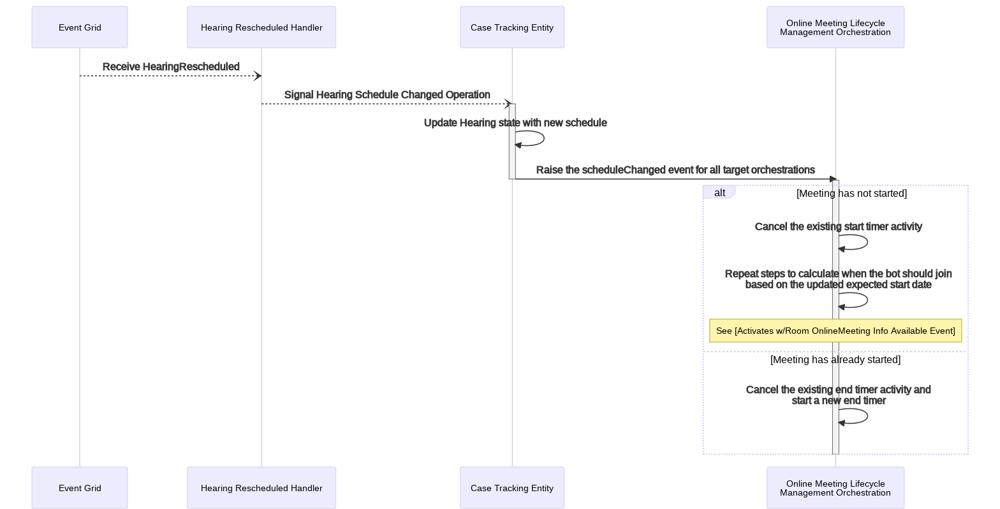

  
Mermaid markup

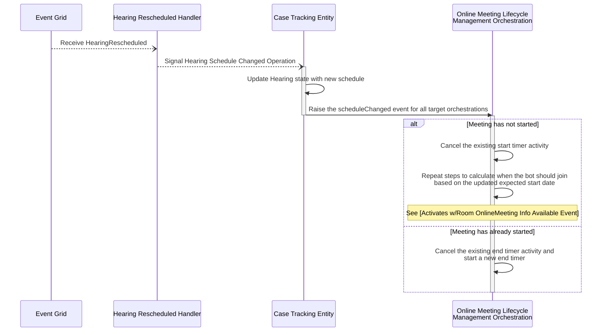
```mermaid
sequenceDiagram
  participant T4J as Event Grid
  participant HREH as Hearing Rescheduled Handler
  participant CCTE as Case Tracking Entity
  participant OMLMO as Online Meeting Lifecycle<br/>Management Orchestration
  T4J--)HREH: Receive HearingRescheduled
  HREH--)CCTE: Signal Hearing Schedule Changed Operation
  activate CCTE
  CCTE->>CCTE: Update Hearing state with new schedule
  CCTE->>OMLMO: Raise the scheduleChanged event for all target orchestrations
  deactivate CCTE
  activate OMLMO
  alt Meeting has not started
  OMLMO->>OMLMO: Cancel the existing start timer activity
  OMLMO->>OMLMO: Repeat steps to calculate when the bot should join<br/>based on the updated expected start date
  Note over OMLMO: See [Activates w/Room OnlineMeeting Info Available Event]
  else Meeting has already started
  OMLMO->>OMLMO: Cancel the existing end timer activity and<br/>start a new end timer
  end
  deactivate OMLMO
```

<!-- generated by mermaid compile action - END -->

- **HearingParticipantsChanged** - When the participants list is changed for a hearing, a `HearingParticipantsChanged`
  event is received by the Bot and updates are made to the participants list in the Case Call Tracking Entity State.

<!-- generated by mermaid compile action - START -->

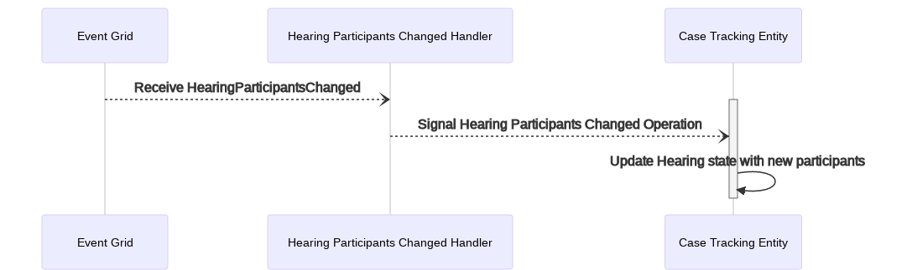

  
Mermaid markup

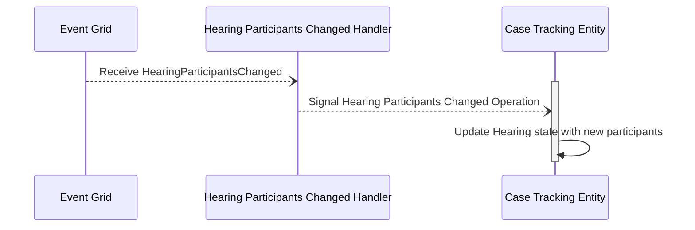
```mermaid
sequenceDiagram
  participant T4J as Event Grid
  participant HPCEH as Hearing Participants Changed Handler
  participant CCTE as Case Tracking Entity
  T4J--)HPCEH: Receive HearingParticipantsChanged
  activate CCTE
  HPCEH--)CCTE: Signal Hearing Participants Changed Operation
  CCTE->>CCTE: Update Hearing state with new participants
  deactivate CCTE
```

<!-- generated by mermaid compile action - END -->

### Room Call Keep-Alive

The bot has the responsibility of keeping the calls alive during the entirety of the scheduled hearing. Originally we
intended to do this with regular pings to [the Microsoft Graph `/keepAlive`
endpoint](https://docs.microsoft.com/en-us/graph/api/call-keepalive?view=graph-rest-1.0&tabs=http). However, when this
was implemented we noticed that the calls were still being terminated regardless of those pings. In speaking with the
Teams Product Group we learned that this endpoint was deprecated and does not work.

Instead logic was added to the Call Management Entity to detect the status of the call transitioning into the terminated
state. Upon this happening, the Call Management Entity will raise a `callTerminated` external event to the [Solo Room¹]
Online Meeting Lifecycle Orchestration instance that corresponds to the call. When the orchestration receives this event
it checks to see if the call should actually be terminated yet and, if not, will start the process of rejoining the call
immediately.

> ¹The Solo Room version of the orchestration does not do anything with this event today because if a Solo Room
> call is terminated it means the user was no longer there and we shouldn't bother keeping it alive any longer any way
> since we currently recreate new Online Meetings and Calls each time a Solo Room is needed any way. In the future, if
> we maintain these Solo Rooms longer, we will want to either augment the orchestration with support for this external
> event or, better yet, refactor it to use the same orchestration as the other room types so there is less duplication
> of logic.

## Testing

There are currently a small set of unit tests. Some of the functions are fully unit testable and others need a little
more work to abstract dependencies into parameters so that they can be invoked with fakes/mocks. For example, several
areas of the code still call the `getGraphClient()` factory method directly rather than receiving a `GraphClient` as a
parameter. More work should continue to refactor functions that are not yet fully unit testing friendly and then code
coverage can/should be expanded.

Additionally, several `.rest` files were created that allow for local integration testing of the functions that make up
the bot. These files either test a specific function on its own or drive a specific set of functions to test a specific
scenario. The former are usually co-located with the corresponding function source code while the latter can be found in
[the `e2e` folder at the root of the bot project](../../../src/call-management-bot/e2e).
