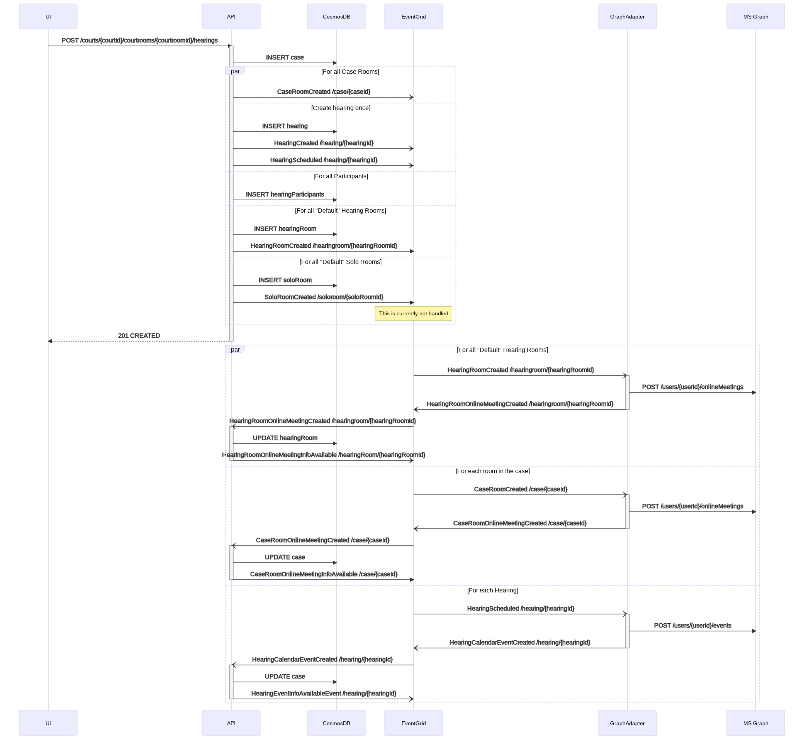
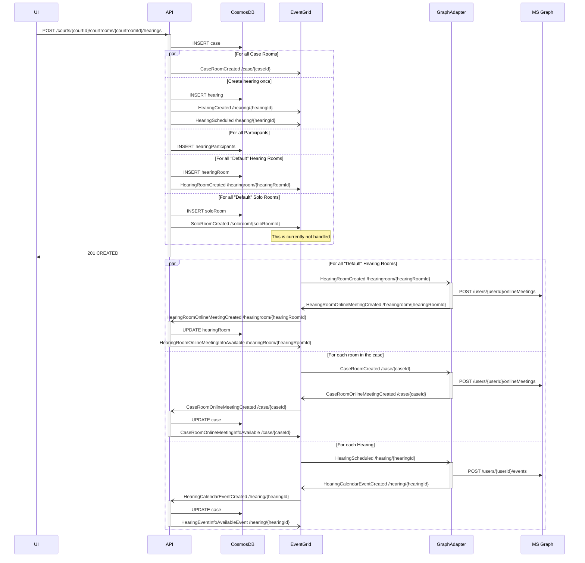
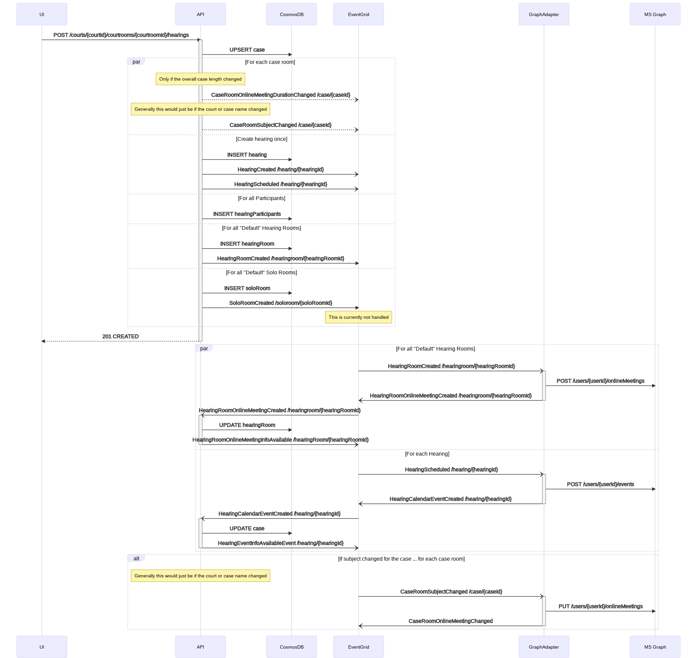
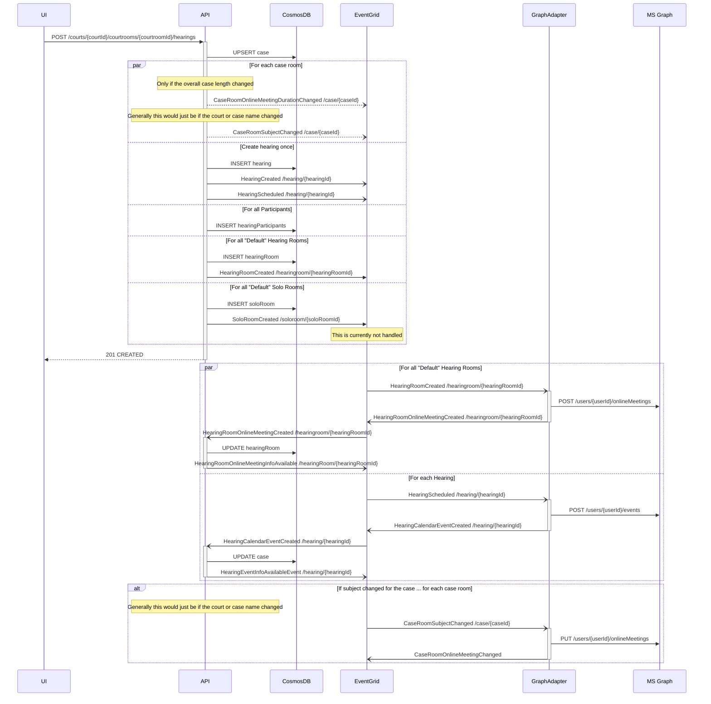

# Create New Hearing <!-- omit in toc -->

- [Background](#background)
- [Plan](#plan)
  - [First Hearing for a Case](#first-hearing-for-a-case)
  - [Subsequent Hearings for a Case](#subsequent-hearings-for-a-case)
  - [Sending emails](#sending-emails)
- [End-to-end Test](#end-to-end-test)
- [Future Enhancements/Recommendation](#future-enhancementsrecommendation)
- [Outstanding questions/To Dos/Next Steps](#outstanding-questionsto-dosnext-steps)

## Background

As a Moderator, or Scheduling Coordinator, I can create an invitation for a new online hearing(s). Access to creating a
new hearing is provided to all Members and Owners (not Guests) of the Teams channel that have added this application.

## Plan

### First Hearing for a Case

For the first hearing of a case (as in the first time we see a certain case number), we need to create all of the
associated database entries and send out events to the Event Grid. The Call Management Bot then picks up those events and
creates the online meetings and event. After the meetings and event are created, the database is updated with the call
and event information.

<!-- generated by mermaid compile action - START -->

  
Mermaid markup

<!-- generated by mermaid compile action - END -->

### Subsequent Hearings for a Case

For all subsequent hearing of a case where the case number already exists in our database, the same meeting from the
previous case needs to be reused so that history such as chat is maintained. To enable that, the same case meetings
from the first hearing will be reused, just extended to encompass the total duration of all hearing dates. Then all
of the hearing meetings are created the same as before, database entries created, and events to the Event Grid.

The Call Management Bot then picks up those events and creates the online meetings. After the meetings are created,
the database is updated with the call information.

<!-- generated by mermaid compile action - START -->

  
Mermaid markup

<!-- generated by mermaid compile action - END -->

### Sending emails

Sending emails responds to many of the events from the previous flows. Depending on the flag set at the organisation level:

1. Email with calendar invite sent to court staff only with a link to the reception room.
   or
2. Email sent to all participants with a link to the reception room.

The case and all other hearing rooms do not get emails generated for them.

## End-to-end Test

The following is an end-to-end testing matrix that will be used to validate the scenario.

| Test Case                                                                               | First case | Second Case                   |
| --------------------------------------------------------------------------------------- | ---------- | ----------------------------- |
| Supporting - Get Terminology Sets                                                       | Yes        |                               |
| Supporting - Get Terminology Set                                                        | Yes        |                               |
| Supporting - Get Presiding Judges                                                       | Yes        |                               |
| Database correctly updated with new entities - New Case and Hearing                     | Yes        |                               |
| Database correctly updated with new entities - Existing Case and Hearing                | Yes        |                               |
| Get Created Hearing Details match database                                              | Yes        |                               |
| New hearings appear on calendar (after refresh)                                         | Yes        |                               |
| Online Meeting are in Graph and sent to the event grid                                  | Yes        |                               |
| All Default Online Meetings for Hearing rooms created and call info updated in database | Yes        |                               |
| All Online Meetings for Case created and call info updated in database                  | Yes        | Multiple meetings future epic |
| Case Meeting updated with CaseDurationChanged in the database                           | Yes        |                               |
| CaseDurationChanged updated the length of the online meeting in Graph                   | Yes        |                               |
| Event for Hearing created and event and meeting info updated in database                | Yes        |                               |
| Emails sent to court staff with reception room                                          | Yes        |                               |
| Emails sent to participants with reception room                                         | Yes        |                               |

## Future Enhancements/Recommendation

<!--
Section Owner: Product Owner and Developer
-->

## Outstanding questions/To Dos/Next Steps

1. See current epic bug list for outstanding bugs
