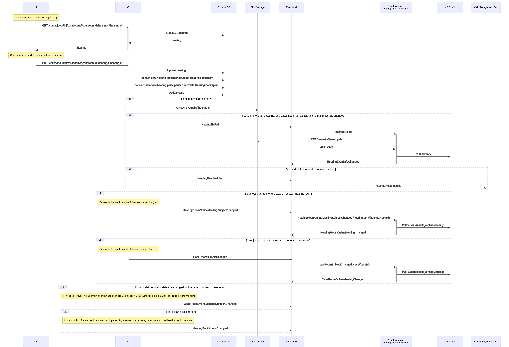
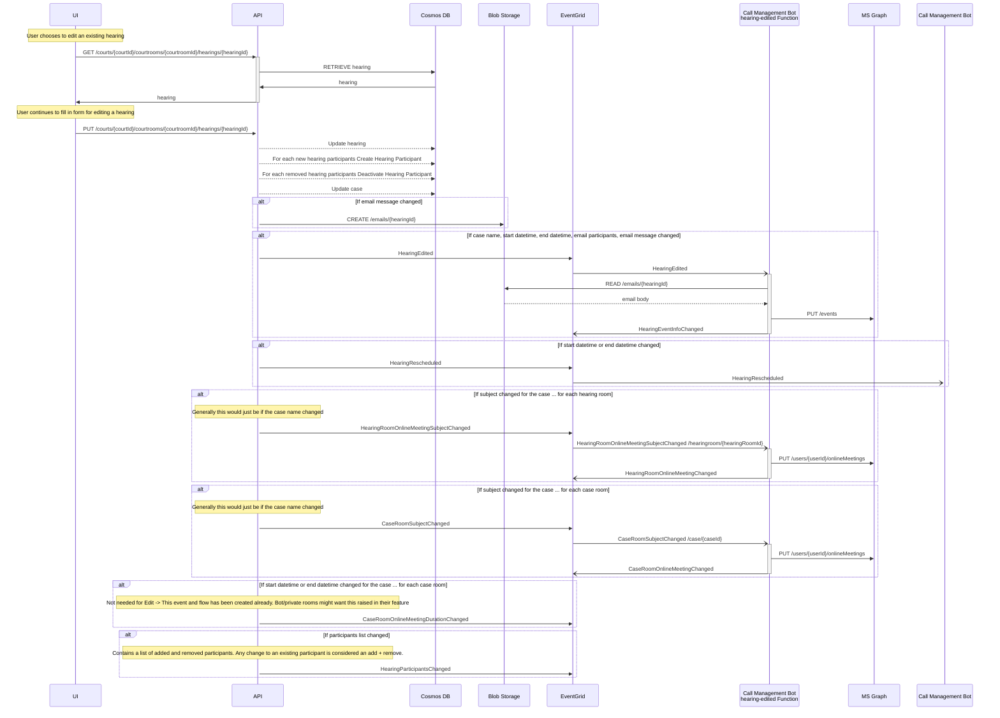

# Edit a Hearing <!-- omit in toc -->

- [Background](#background)
- [Research](#research)
  - [Limitations](#limitations)
    - [Courtroom context](#courtroom-context)
    - [Associating to a different case](#associating-to-a-different-case)
- [Plan](#plan)
  - [Edit a Scheduled Hearing](#edit-a-scheduled-hearing)
- [End-to-end Test](#end-to-end-test)
- [Outstanding questions/To Dos/Next Steps](#outstanding-questionsto-dosnext-steps)
  - [Out of Scope for EditHearing](#out-of-scope-for-edithearing)
    - [CaseRoomOnlineMeetingDurationChanged](#caseroomonlinemeetingdurationchanged)
    - [HearingParticipantsChanged](#hearingparticipantschanged)
    - [HearingRescheduled](#hearingrescheduled)

## Background

As a Moderator, or Scheduling Coordinator, I can edit an invitation for an existing scheduled hearing.

## Research

### Limitations

#### Courtroom context

Currently the application is installed at a courtroom context. As we only authenticate and then use the teams channels
to determine authorisation, the user must only operate in the context of that court / courtroom combination.

For the end user this means they cannot alter which court or courtroom an existing hearing belongs to.

The workaround for this is to cancel the hearing and create a new one in the appropriate court room.

#### Associating to a different case

A hearing can be 1 of many parts of an overall case. The user isn't provided a separate screen to manage case so it is
part of the create hearing screen.

If the user discovers the case number they entered is incorrect the complexities around how this is seprated can be
quite involved depending on whether there are multiple hearings, if the it's a new case number etc.

For simplicity to the user, the case number will NOT be able to be edited once a hearing is created.

To fix this type of error the user would Cancel the hearing and Create a new hearing with the correct case number.

## Plan

### Edit a Scheduled Hearing

Prerequisite: only hearings that are of status "Scheduled" can be edited. Prerequisite: only hearings that have not
"stared" ie the start date time of the hearing must be in the future can be edited.

When the user edits the hearing information the updated information is saved to the database. If the user changes
information pertinent to the event email, this is raised to the event grid and the Call Management Bot will issue an updated
invite.

Changes relevant to items such as the bot ie dates will be raised separately in the epics and features they are required.

<!-- generated by mermaid compile action - START -->

  
Mermaid markup

<!-- generated by mermaid compile action - END -->

## End-to-end Test

| Test Case                                                                                           | First case | Second Case |
| --------------------------------------------------------------------------------------------------- | ---------- | ----------- |
| Error cases not saved - hearing started                                                             |            |             |
| Error cases not saved - hearing cancelled                                                           |            |             |
| Error cases not saved - court/courtroom doesn't match existing record                               |            |             |
| Database correctly updated Hearing - case name, start/end, terminolgy, timezone, message            |            |             |
| Database correctly updated HearingParticipants Added                                                |            |             |
| Database correctly updated HearingParticipants Removed                                              |            |             |
| Generate a new email Body                                                                           |            |             |
| HearingEdited event raised                                                                          |            |             |
| Event with updated participants sent                                                                |            |             |
| Event with updated dates sent                                                                       |            |             |
| Event with updated subject sent                                                                     |            |             |
| Event with updated body sent                                                                        |            |             |
| Event is not sent if no relevant information updated ie external participants, terminolgy, timezone |            |             |

## Outstanding questions/To Dos/Next Steps

### Out of Scope for EditHearing

#### CaseRoomOnlineMeetingDurationChanged

This event indicates the overaching start date and time for the case has changed. This flow was created for Create
Hearing. If other stories need this data then then they can consume this event as part of the relevant feature work.

#### HearingParticipantsChanged

This event would indicate the invited hearing participant list has changed. This event and flow has been created for
Edit Hearing. If other stories need this data then they can consume this event as part of the relevant feature work.

#### HearingRescheduled

This event would indicate the hearing start or end date and time has changed. This event and flow has been created for
Edit Hearing. If other stories need this data then they can consume this event as part of the relevant feature work.
