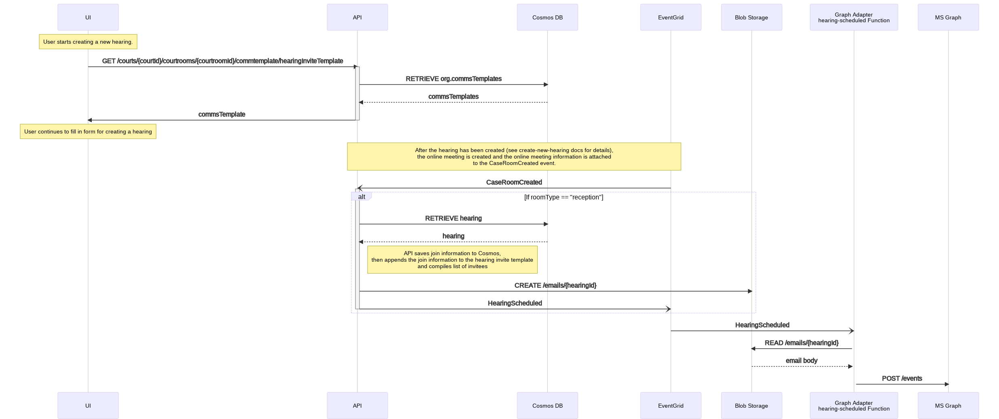
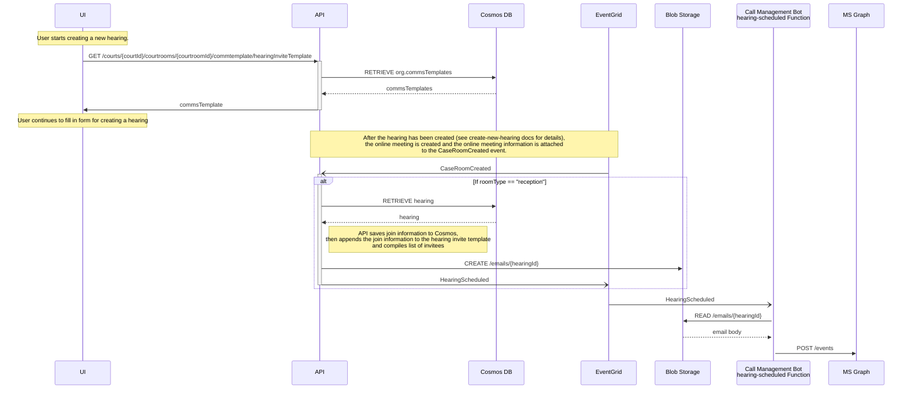

<!-- omit in toc -->

# Technical Design Template

- [Technical Design Template](#technical-design-template)
  - [Background](#background)
  - [Plan](#plan)
    - [Email Invitees](#email-invitees)
    - [Data Considerations](#data-considerations)
      - [Events vs Storage](#events-vs-storage)
      - [CosmosDB vs Azure Storage](#cosmosdb-vs-azure-storage)
    - [DevOps changes](#devops-changes)
    - [Model changes](#model-changes)
    - [Error Cases](#error-cases)
    - [Sequence Diagram](#sequence-diagram)
  - [End-to-end Test](#end-to-end-test)
  - [Future Enhancements/Recommendation](#future-enhancementsrecommendation)

## Background

[Epic: Email Notification]

As a part of creating a new hearing, an email notification should be sent to all participants. The email body is
specified when the hearing is created, but with the teams meeting info appended at the end.

## Plan

### Email Invitees

There is a flag on the organization level (`sendEmailToExternalParticipants`) that dictates whether or not the emails
get sent to external participants or just a combination of the Judge and Court Staff. The API will read this field from
the organization, and craft the invitee list based on that value.

There is also an environment variable available on the Call Management Bot (`HEARING_ATTENDEE_EMAIL_ADDRESS_OVERRIDE`) to
override the invitee list so that in test environments, all emails get sent to known email addresses and do not send
emails to the actual participants lists. This is to prevent accidental emails from leaking out in our test environments.

### Data Considerations

The email bodies will contain a long HTML string and could affect the throughput of our events. Event Grid allows for
event sizes of up to 1MB, and while its likely the email body won't be that large, embedding HTML into a JSON string is
not ideal.

The alternative is that we can store the email bodies in a data store, the event then just needs to contain a reference
to the location of the data instead of the full body.

#### Events vs Storage

Passing the HTML body in the event would be the fastest and simplest form of getting the body to the service that sends
the email. However, it increases the size of our events and is limited by the 1MB event size. Larger events could
potentially also affect throughput.

Storing the email body temporarily in storage would mean slightly higher storage costs, but more reliability in
delivering the event since only a path needs to be added to it. It can also store much larger files and support future
scenarios such as email attachments or embedded images. It also allows for the opportunity to audit emails by browsing
the storage location. This does require more work but should be more future proofed.

**Decision: Store email bodies in a data store.**

#### CosmosDB vs Azure Storage

CosmosDB could be used as this data store since it is already in use in the API.

Azure Blob Storage can be used instead where a blob can be created with the full HTML and a path to the blob can be
passed as a property in the event grid event. Blob storage also has lower read/write costs. It is also very easy to
write policies to delete blobs after a certain number of days, keeping storage costs low. Another reason to go with blob
storage is that it keeps the separation of concerns with regards to Cosmos in that only the API has access to the cosmos
DB. The downside to Blob storage is that code needs to be written for the API to write to a storage account.

**Decision: Using blob storage.**

### DevOps changes

A storage account is already being used with all our Azure Functions, so there
is minimal impact to deployment there. A new storage container should be created
for email storage, and a managed identity should be configured with `Storage Blob Data Contributor` role to the container,
allowing it to write to the blob container.

The Call Management Bot Azure Function should already have access to the
storage account, but managed identity access to the blob container as a `Storage Blob Data Reader` should be added.

### Model changes

Model changes have already been done and were mostly around storing the email body in a base64 encoded string in the
Cosmos database.

### Error Cases

If an email fails to send or if the blob with the email body is not found by the
Call Management Bot, the function should exit with an HTTP status code
indicating a failure. The Event Grid retry logic should manage future attempts
to get the email out, but any errors here unrelated to intermittency would
likely be permissions issues. The dead-letter queue should be monitored for any
errors indicating that the emails were not sent out to users.

If the issue was that the blob was not created and the event has not been entered into the dead-letter queue yet, one
form of healing from this error is that the email can be manually crafted and placed in the `emails` collection in the
storage account; the next retry of the Call Management Bot should then be able to pick it up and send it off. One way to
facilitate this is an error should be logged to app insights and an alert set up for this error so that it can be
resolved within the TTL of the event (default 24 hours).

If the event is added to the dead-letter queue, it would need to be re-issued to the event grid after the blob was
manually created.

### Sequence Diagram

<!-- generated by mermaid compile action - START -->

  
Mermaid markup

<!-- generated by mermaid compile action - END -->

## End-to-end Test

The following is an end-to-end testing matrix that will be used to validate the scenario.

| Test Case                                                                                          | New Hearing | Edited Hearing |
| -------------------------------------------------------------------------------------------------- | ----------- | -------------- |
| Courtroom setting for external participants set to false sends email only to court staff and judge |             |                |
| Courtroom setting for external participants set to true sends email to all participants            |             |                |
| If safety net setting is set on Call Management Bot, email is only sent to provided emails         |             |                |
| Email contains link to the reception room only                                                     |             |                |
| Email is properly formatted and saved in blob storage                                              |             |                |
| Email does not include all participants in To/CC line                                              |             |                |

## Future Enhancements/Recommendation

This document currently only contains the logic as it pertains to creating a new hearing. It will be updated when Edit
Hearing is being worked on.
