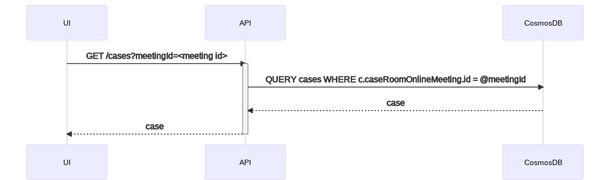
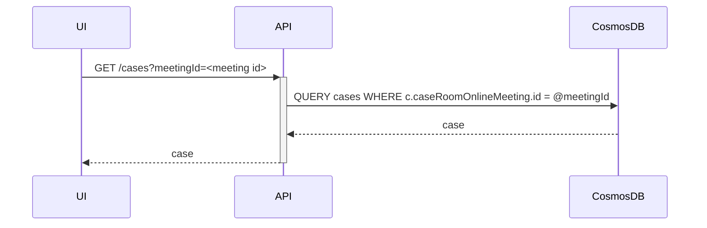
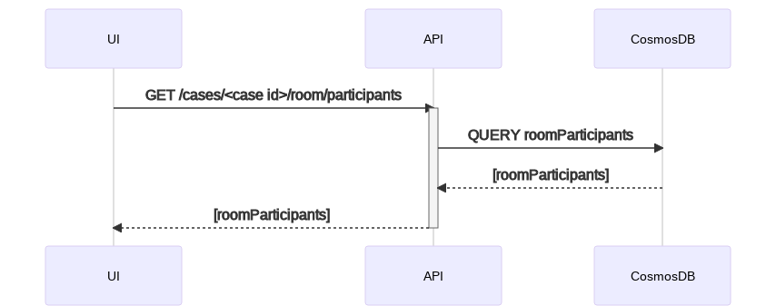
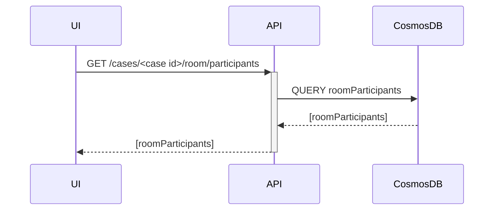
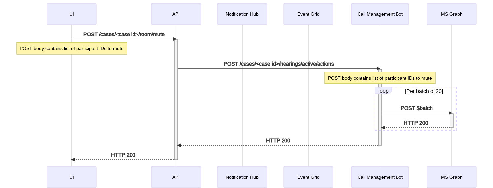
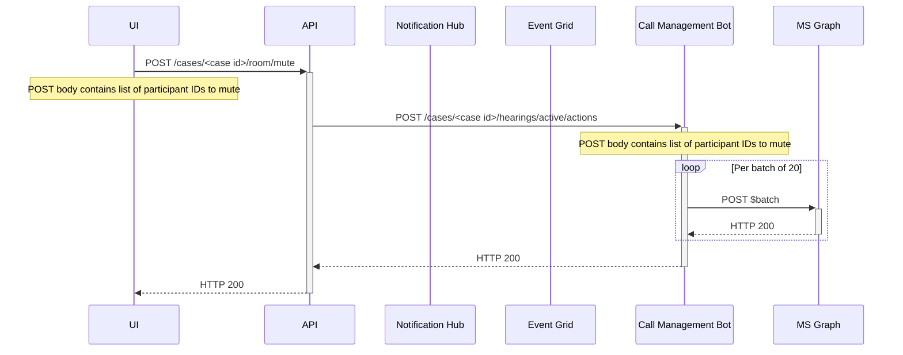
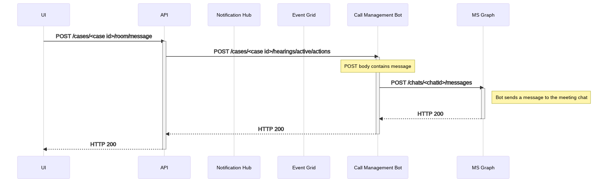
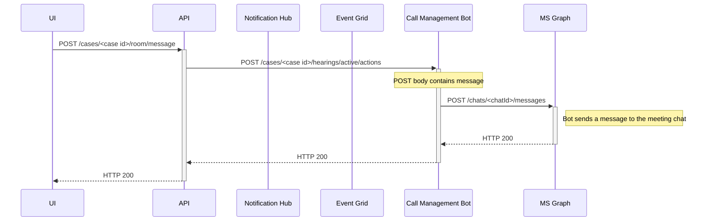

<!-- omit in toc -->

# Hearing Control

- [Background](#background)
- [Plan](#plan)
  - [Teams application registration](#teams-application-registration)
  - [Meeting ID Mapping](#meeting-id-mapping)
  - [Joining a Meeting](#joining-a-meeting)
  - [Mute](#mute)
  - [Broadcast a message](#broadcast-a-message)
  - [Error handling](#error-handling)
  - [Security](#security)
- [Local Development](#local-development)
- [End-to-end Test](#end-to-end-test)
- [Future Enhancements/Recommendation](#future-enhancementsrecommendation)

## Background

Hearing Control refers to the in-meeting sidebar that contains the list of all the participants organized by their
associated parties. A moderator sitting in the hearing can do the following actions:

- Mute a party
- Mute an individual
- Broadcast a message

Future work can be done to support additional scenarios that are not covered by this document:

- Removing a hearing participant
- Reassigning participant to a different party
- Return and Recess parties
- Broadcast messages to parties
- Renaming participants

Epic link: <EPIC_LINK>

## Plan

### Teams application registration

The current teams manifest does not include the necessary settings for enabling the meeting sidepanel. The manifest
needs to be [updated to include a new configurable
tab](https://docs.microsoft.com/en-us/microsoftteams/platform/apps-in-teams-meetings/enable-and-configure-your-app-for-teams-meetings#update-your-app-manifest)
for the sidebar with the URL pointed to the URL of the sidebar page.

Stretch Goal: Automate creation of manifests per environment

### Meeting ID Mapping

When the side panel loads, we do not have access to the courtroom context variables such as `courtId` or `courtroomId`,
the only thing that Teams provides to us is the `meetingId`. The first thing that the UI will need to do is make an API
call to get the case details based on the given `meetingId`, which we store in the `case` entity.

<!-- generated by mermaid compile action - START -->

  
Mermaid markup

<!-- generated by mermaid compile action - END -->

### Joining a Meeting

When joining a call, the database is the source of truth of the current participants and their status and parties.

<!-- generated by mermaid compile action - START -->

  
Mermaid markup

<!-- generated by mermaid compile action - END -->

### Mute

The act of muting is facilitated by the bot making the appropriate graph calls. The API will communicate
with the bot via an HTTP trigger.

> Note: Currently Teams/Graph do not support an "unmute" operation

The Graph call takes advantage of
being able to [batch calls to Graph](https://docs.microsoft.com/en-us/graph/json-batching) to prevent throttling

<!-- generated by mermaid compile action - START -->

  
Mermaid markup

<!-- generated by mermaid compile action - END -->

### Broadcast a message

Broadcasting a message is for the official hearing messaging; the message looks like it came from the bot that is in the
meeting.

<!-- generated by mermaid compile action - START -->

  
Mermaid markup

<!-- generated by mermaid compile action - END -->

### Error handling

Any errors returned from the API for mute/message will be ignored by the UI - showing an error message in the
case when the API fails is out of scope for MVP, but would be a great future improvement.

If the original GET call to get the roster fails, the UI should should an error message with a "Retry" button.

### Security

Teams apps in meetings are only available to tenant domain users and not guests, so there will be no special
considerations taken to prevent actions in the side panel. This is in contrast to the normal "Schedule" tab which is
accessible to any member of the Teams channel, which has nothing to do with tenant domain users. For the court's
use-case, it is expected that any member of the tenant domain will be able to do the actions within the hearing control
panel, but only members of the Teams channel mapped to the courtroom will be able to view the Private Rooms Arena view
with the majority of the controls.

Customer confirmed this behavior is acceptable.

## Local Development

Unlike the "Schedule" tab, Hearing Control requires a bit of setup to run locally. For detailed instructions on how to
run is locally, see the [README](../../../src/ui/README.md#run-hearing-control-locally)

## End-to-end Test

| Test Case                                                            | As Moderator |
| -------------------------------------------------------------------- | ------------ |
| Joining a hearing shows the app side panel                           |              |
| Joining a hearing shows all participants in their respective parties |              |
| Muting a party mutes all users in that party                         |              |
| Muting an individual mutes just that user                            |              |
| Broadcasting a message reveals the message in the chat from the bot  |              |

## Future Enhancements/Recommendation

1. Since calls to the bot are synchronous, showing an error message and instructing them to retry if an API call to
   mute fails.
2. Mute state is not maintained in the system. In the future, to get that state the client can make a direct call to
   graph to get the initial state and SignalR can be used to send the delta's over time.
