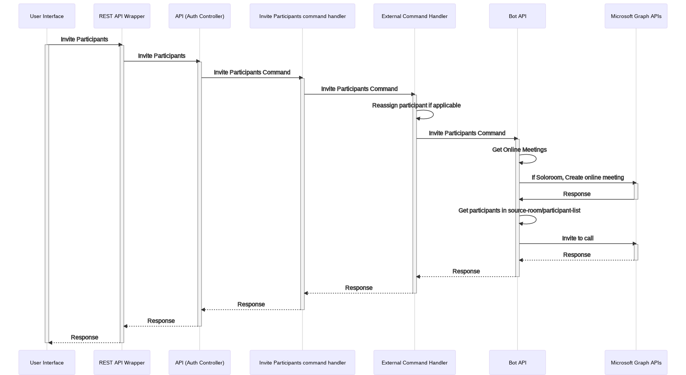
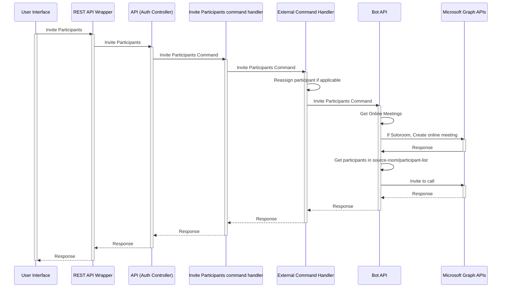

# Inviting participants

Inviting participants occurs for external participants to transfer from and to Party Rooms, Solo Rooms,
and the Case/Hearing Room.

## Contents

- [Inviting participants to Party_Room/Solo_Room/Case](#inviting-participants)
  - [Background](#background)
  - [Scenarios](#scenarios)
  - [Technical Design](#technical-design)
  - [Implementation](#implementation)
    - [APIs](#apis)
      - [invite-room-participants-to-case](#invite-room-participants-to-case)
        - [Use case](#use-case)
        - [URL](#url)
        - [Body](#body)
      - [invite-participants-to-room](#invite-participants-to-room)
        - [Use case](#use-case-1)
        - [URL](#url-1)
        - [Body](#body-1)
      - [recall-participants-from-case](#recall-participants-from-case)
        - [Use case](#use-case-2)
        - [URL](#url-2)
        - [Body (Optional)](#body-optional)

## Background

This is the high-level design for inviting participants to online meetings.

## Scenarios

Following are [Private Room](.\private-rooms.md) scenarios in which participants are invited,
by a moderator, to an online meeting:

1. Inviting external participants in a party room to join the case room meeting
2. Inviting external participants in the party/solo room to join the case room meeting
3. Inviting external participants in the party/solo room to join another party/solo room
4. Recalling external participants in a case/hearing room to their respective assigned party/solo rooms.

**Note**:

- A solo room will only have a single external participant
- Invitations to move rooms only apply to external participants

## Technical design

- The Bot API URL will be in the following format
  `POST <bot-base-url>/cases/<caseId>/hearings/[active|<hearingId>]/actions`
- The Bot API URL (BOT_API_URL) will be read from the application configuration of the Web App
- The API key (BOT_API_KEY) for the Bot API will be read from the KeyVault
- The body of the API post request will following the following structure:

```json
  {
    actionName: string;
    actionData?: any;
  }
```

- The APIs to invite participants to a meeting will be hosted inside the [room controller](../../../src/api/controllers/room.controller.ts))

## Implementation

The following diagram illustrates the control flow sequence:

<!-- generated by mermaid compile action - START -->



<details>
  <summary>Mermaid markup</summary>



</details>
<!-- generated by mermaid compile action - END -->

### APIs

#### invite-room-participants-to-case

##### Use case

- Moderator inviting everyone in a party room to join the case room meeting

##### URL

```html
POST < Base API URL >/courts/< Court Id >/courtrooms/< Courtroom Id >/hearings/<
Hearing Id >/rooms/ < Target case Id >/invite-room-participants-to-case
```

##### Body

```json
{
  "roomId": "<source party_room/solo_room/case Id"
}
```

#### invite-participants-to-room

##### Use case

- Moderator inviting individual members in the party/solo room to join the case room meeting
- Moderator inviting individual members in the party/solo room to join another party/solo room

> NOTE: the `targetParticipantParty` is passed as undefined(targetParticipantParty = undefined) to move a participant to
> the Lobby as per the [Bot contract](./bot-moderator-actions.md)

##### URL

```html
PUT < Base API URL >/courts/< Court Id >/courtrooms/< Courtroom Id >/hearings/<
Hearing Id >/rooms/ < Target party_room/solo_room/case Id
>/invite-participants-to-room
```

##### Body

```json
{
  "participantIds": ["Participant Id"]
}
```

#### recall-participants-from-case

##### Use case

- Moderator recalling all non staff members in a case room to their respective assigned rooms
- Moderator recalling individual non staff members in a case room to their respective assigned room.

##### URL

```html
POST < Base API URL >/courts/< Court Id >/courtrooms/< Courtroom Id >/hearings/<
Hearing Id >/rooms/ < Source case Id >/recall-participants-from-case
```

##### Body (Optional)

```json
{
  "participantIds": ["Participant Id"]
}
```
