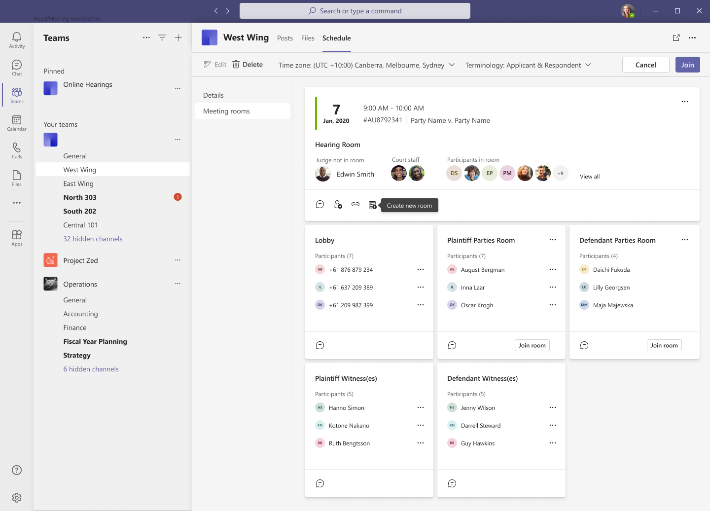

# Private Rooms

## Background

As a Moderator, or Scheduling Coordinator, I can can organise and communicate with participants prior to an online hearing.

## Overview

Private rooms are a group of Microsoft Teams meetings that are arranged as a group for a hearing following a hearing create
or edit. Rooms are viewed by a moderator by selecting a hearing and choosing the 'Meeting Rooms' menu option.

### Arena

All meeting rooms are viewable in a pre-hearing defined layout or arena. The arena is a view of the specific upcoming hearing.
An arena is a combination of the hearing room and its related private rooms. It displays who is physically
in what room so the hearing can begin in an orderly fashion.

- The hearing room can contain any court staff (invited or not), judges (as indicated by the hearing details), and external
  participants. External participants can only attend hearing by admission from a moderator from within a private room.

- The private rooms are for external participants who are invited into the room when they join the call, initially
  according to what was created in the hearing details. An invitation may lead the external participant to a party room
  (indicated by the word room) which hosts related participants, or to a solo room for individuals who will not confer
  with others pre-hearing.

The arena view is Laid out with the hearing on top and the private rooms in a set card layouts underneath.

The private rooms layout order is intended to help the moderator work with participants in a fashion that is consistent
with most courts.

The following is the Private Rooms layout order, each grouping displayed as a unique card (note: in progress):

> The lobby is first, since this is where unknown (e.g. telephony) users may be first directed to.
> This is closely followed by the two primary parties (plaintiff and defendant) and any custom rooms that have been created
> for that hearing. Finally the witnesses are displayed.

The lobby and witnesses are displayed as a room but in practice they are a group of [online meetings](https://docs.microsoft.com/en-us/graph/api/resources/onlinemeeting?view=graph-rest-1.0)
with a maximum of 1 single external participant.

**Note:** Terminology such as Plaintiff, Defendant (as pertains to Private Rooms), the Judge and the Court Staff will
change, for the moderator, according to the chosen terminology set for this hearing.

## Accessibility

Features have been built for quick keyboard and tab access. Exact details of what features will be added here -
currently not all features are accessible by keyboard

## Related Moderator Actions

The following are three groups of moderator actions that can be performed (links to technical design for each where appropriate):

Hearing room:

- [Send message](./send-message.md)
- [Move back to rooms (all)](./invite-to-meeting-api.md)
- Copy link
- View all (show participants by group)
- View all (menu action: move back individual to room)
- Join hearing

Private room:

- Rename room
- [Send message](./send-message.md)
- [Admit room to hearing (party only)](./invite-to-meeting-api.md)
- Join room

Private room participants:

- Rename participant
- [Reassign participant](./invite-to-meeting-api.md)
- Admit participant (solo only)

**Note**: All internal participants, specifically moderators, may join a private room but will not be visible in the arena.

## Test Cases

The following is an end-to-end testing matrix, related to the manual demonstration script that was used to validate the scenario.

| Test Case            | Test case                                           | Test confirmed |
| -------------------- | --------------------------------------------------- | -------------- |
| Rename room          | Plaintiff Witness to Special Witness                |                |
| Send message (solo)  | Special Witness send 'Moving meeting room'          |                |
| Rename participant   | Change participant Robert Fox to Bob Fox            |                |
| Reassign participant | Special Witness to Plaintiff Party                  |                |
| Join room            | Moderator to join plaintiff Party room              |                |
| View all in room     | Confirm scroll bar for 4 members in Plaintiff Party |                |
| Send message (party) | Send message "Hearing admission pending"            |                |
| Admit                | Admit Plaintiff Party Room                          |                |
| View all in hearing  | View Plaintiff Party in Hearing room                |                |
| Send message (case)  | Send message "Hearing is not ready"                 |                |
| Move back            | Move back external participant from hearing room    |                |
| Copy Link            | Copy hearing link                                   |                |
| Join Hearing         | Moderator to joins hearing room                     |                |

## Future Enhancements/Recommendations

- SignalR has been not implemented and currently UI is refreshed on a timer basis. However a working SignalR has been
  made available and this pattern is being using in Hearing Control. Further work is needed to respond to individual,
  rather than coarse messages and process a smaller set of data.

- Use of a hearing colour to indicate if participants are in hearing (green) or not (grey).

- Display of errors - currenly exceptions are not displayed for most cases

## Further Reading

- [Terminology and expected behavior](../Expected-Functionalities-and-Business-Terminology.md) - how Private Rooms
  fits within the overall solution
- [Entities and Terminology](../entities-and-terminologies.md) - data entities Private Rooms relies on
- [Technical design for SignalR](./signalr.md) - how the Private Rooms are updated with new information
- Technical decisions (Trade Studies)
  - [Meeting room broadcast - sending messages](../../trade-studies/meeting-room-broadcast-technical-design.md)
  - [Solo room entity design](../../trade-studies/solo-room-entity-design.md)
  - [Realtime view of private rooms](../../trade-studies/realtime-view-of-rooms-and-participants.md)
  - [Participant photo technical design](../../trade-studies/participant-photo-technical-design.md)
  - [Get user details](../../trade-studies/get-user-details.md)
