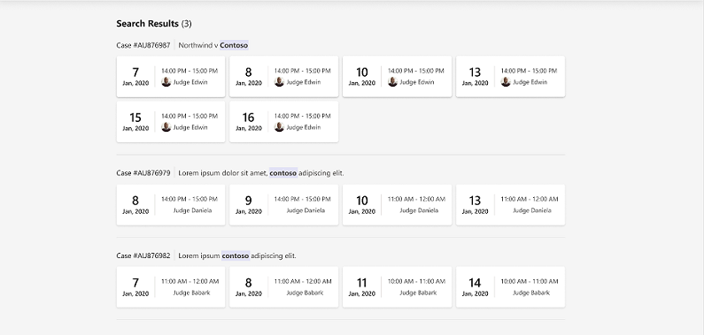

<!-- omit in toc -->

# Hearing Search

- [Background](#background)
- [Plan](#plan)
  - [Data Considerations](#data-considerations)
  - [UI](#ui)
- [End-to-end Test](#end-to-end-test)
- [Future Enhancements/Recommendation](#future-enhancementsrecommendation)

## Background

[Epic: Search Hearing]

Court Staff need to be able to find scheduled hearings. They can search for a hearing by case number or case name.

## Plan

### Data Considerations

Potentially a case "could" be multiple hearings, in varying courtrooms, courts, and organisations.

At this time the following limitations will be put in place:

1. Backend search will be limited to the organisation and court of the courtroom the search is initiated from.
1. Search will return the result grouped by case number, case name, courtroom, timezone
1. UI will show the results but only allow the user to link via the application to hearings that are in the same courtroom.
   Others are shown but the user will have to manually navigate to the correct teams channel.

### UI

Searching for a hearing requires the following components and functionality (names are subject to change):

| Component                                        | Functionality                                                                                                                                                                                                                                                                                                                                                                                                                                                                                                                   |
| ------------------------------------------------ | ------------------------------------------------------------------------------------------------------------------------------------------------------------------------------------------------------------------------------------------------------------------------------------------------------------------------------------------------------------------------------------------------------------------------------------------------------------------------------------------------------------------------------- |
| `Input` with placeholder text "Find" in `Navbar` | Case insensitive. 1 character search query returns an error. Valid searches of case name or number navigate to `${path}/search/` and display the `SearchResultsPage` component. The search input should not clear after the user presses "Enter" and navigates to `SearchResultsPage`.                                                                                                                                    |
| `SearchResultsPage`                              | Displays heading with the number of search results. Displays up to the 50 latest hearings that match the search. Hearings are grouped by case with one or more `SearchResultCaseGroup` components.  Displays a message to the user if there are 0 search results.  |
| `SearchResultCaseGroup`                          | Displays heading with the case number and name. Hearings are sorted by date and rendered with one or more `SearchResultHearingCard` components.  **Out of scope for now:** Displays warning to user if the hearing is in another court room and not accessible.                                                                                                                                                 |
| `SearchResultHearingCard`                        | Displays date, time, judge's name, and judge's profile picture for that hearing. On click, navigates to the `HearingDetails` component for that hearing.                                                                                                                                                                                                                                               |
| `CourtroomPage`                                  | Contains a shared `Navbar`component and displays either the `SearchResultsPage` component:  Or it displays the `HearingCalendar` component:                                                               |

Error handling for the search input should match the validation patterns used in `HearingDetails`.

The `SearchResultsPage` will include the same `Navbar` as `HearingCalendar`, so `SearchResultsPage` and `HearingCalendar`
should share a parent component so that `Navbar` is re-used. The parent component, `CourtroomPage`, should follow
patterns used in `HearingPage`.

## End-to-end Test

The following is an end-to-end testing matrix that will be used to validate the scenario.

| Test Case                                                                              |
| -------------------------------------------------------------------------------------- |
| Search with a 1 character search query should return an error                          |
| Search with more than 50 hearings should return the 50 with the latest start date time |
| Search should be case insensitive                                                      |
| Search should work on both case number and case name of the hearing                    |
| Search should only return results within the court the courtroom belongs to            |
| Search should not return cancelled hearings                                            |
| Search should not return cancelled hearings                                            |
| Search results are grouped accordingly                                                 |
| Search results are sorted accordingly                                                  |

## Future Enhancements/Recommendation

1. Determine if a user has access to the hearings in other courtrooms and allow them to link to these.
1. Cross courtroom navigation to move user to the correct channel.
1. Return more than 50 results
