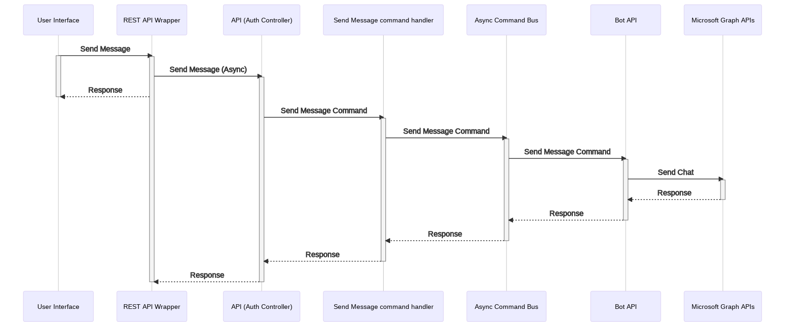
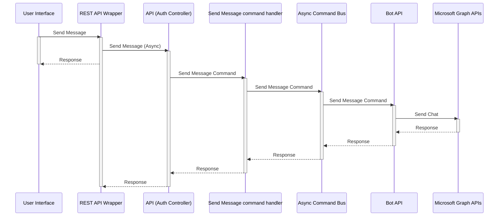

<!-- omit in toc -->

# Send Message to a Party/Solo room

- [Send Message to a Party/Solo room](#send-message-to-a-partysolo-room)
  - [Background](#background)
  - [Research](#research)
  - [Plan](#plan)
  - [Implementation details](#implementation-details)
    - [APIs](#apis)
      - [send-message](#send-message)
        - [Use case](#use-case)
        - [URL](#url)
        - [Body](#body)
    - [Known issues](#known-issues)

## Background

The objective of this feature is to enable a moderator to send a message to a
room. The room in this context can either be a party or a solo room. The message
will be posted in the chat thread of the meeting participants are part of.

Note: This is not a broadcast or a one-on-one messaging use case. The message will
only appear in the chat thread of the online meeting.

## Research

<!-- Link to be updated after the PR for the trade study is merged -->

The technical research behind the design used for the implementation is captured [here](../../trade-studies)

Following are scenarios of interest:

- Moderator sending a message to a solo room
- Moderator sending a message to a party room
- Moderator sending a message to the case room

## Plan

The following sequence diagram illustrates the design for the implementation.

<!-- generated by mermaid compile action - START -->



<details>
  <summary>Mermaid markup</summary>



</details>
<!-- generated by mermaid compile action - END -->

## Implementation details

Following are the key aspects of the implementation

- The send message API will be hosted inside the [Room controller](../../../src/api/controllers/room.controller.ts)
- The API can be used to send messages to Solo rooms, Party rooms or Case
- The validations for the API are implemented inside the [command handler for send message](../../../src/api/handlers/commands/send-message.commandhandler.ts).
- [Bot service](../../../src/api/botservice/botservice.interface.ts) abstracts
  the HTTP POST invocation.
- The configurations required for the command API is read from the ENV file.
  - This relies on the backend API where the API key will be overwritten by a secret from the
    key vault for production environments.

### APIs

#### send-message

##### Use case

- Send a message to a party room, solo room or the case.

##### URL

```html
POST < Base API URL >/courts/< Court Id >/courtrooms/< Courtroom Id >/hearings/<
Hearing Id >/rooms/< Target party/solo room Id or a case Id >/send-message
```

##### Body

```json
{
  "message": "text message to be sent"
}
```

Note: Send Message API only accepts plain text content as message. Any marked up text will be treated as plain text.

### Known issues

- BUG - [Message appears in every room which a participant has been since he appeared in the lobby](https://t4j.atlassian.net/browse/T4J-1444)
- BUG - [Message appears in every room which a participant has been since he appeared in a solo room](https://t4j.atlassian.net/browse/T4J-1480)
