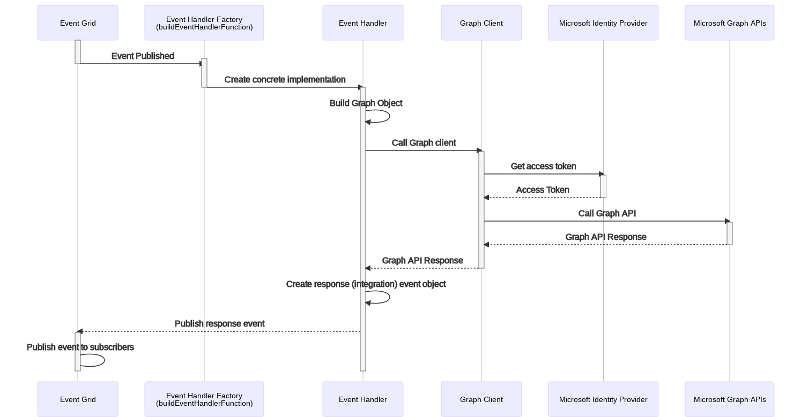
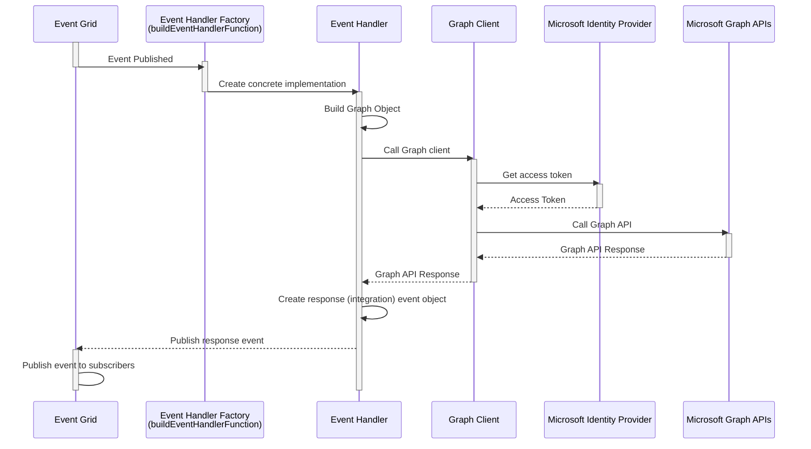

# Execution sequence for graph flow

The following sequence diagram illustrates the control flow for the Call Management Bot component which is responsible
for interacting with the Microsoft Graph APIs.

---

**NOTE:** This sequence only captures the existing asynchronous control flow
initiated from the APIs to the Call Management Bot via the event grid.

---

<!-- generated by mermaid compile action - START -->

  
Mermaid markup

<!-- generated by mermaid compile action - END -->
