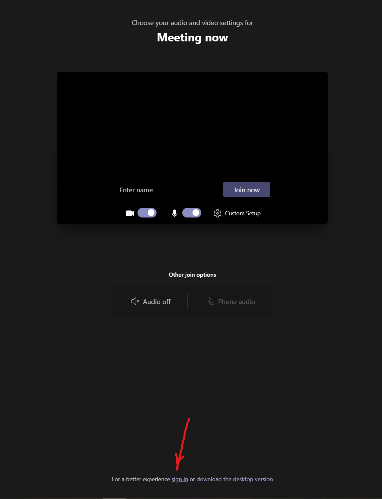

# External Guests in the Microsoft Teams Meeting

|               |              |
| ------------: | ------------ |
|     _Author:_ | Danny Garber |
| _User Story:_ | <USER_STORY> |
|       _Date:_ | June 2021    |

- [External Guests in the Microsoft Teams Meeting](#external-guests-in-the-microsoft-teams-meeting)

  - [Terminology Used in this Document](#terminology-used-in-this-document)
  - [Business Requirement and Challenges](#business-requirement-and-challenges)
  - [Prerequisites](#prerequisites)
  - [Add Microsoft Graph permissions](#add-microsoft-graph-permissions)
  - [Preventing an anonymous guest to join Teams meeting](#preventing-an-anonymous-guest-to-join-teams-meeting)
  - [Assign a phone number to your bot](#assign-a-phone-number-to-your-bot)
    - [Create an application instance](#create-an-application-instance)
  - [Assign Microsoft 365 licenses to your application instance](#assign-microsoft-365-licenses-to-your-application-instance)
  - [Assign a phone number to the application instance (only tenant admin)](#assign-a-phone-number-to-the-application-instance-only-tenant-admin)
  - [Inviting External Guests to the Teams Tenant](#inviting-external-guests-to-the-teams-tenant)
  - [Joining the meeting with the phone enabled Application Instance](#joining-the-meeting-with-the-phone-enabled-application-instance)
    - [Proposed Workaround](#proposed-workaround)
  - [Inviting guests to the Teams meeting](#inviting-guests-to-the-teams-meeting)
    - [Bots invites an external guest whose phone number registered with another Teams tenant](#bots-invites-an-external-guest-whose-phone-number-registered-with-another-teams-tenant)
    - [Bots invites an external guest whose phone number is not registered with any Teams tenants](#bots-invites-an-external-guest-whose-phone-number-is-not-registered-with-any-teams-tenants)
  - [Allow Bot to remove participants from the meetings](#allow-bot-to-remove-participants-from-the-meetings)
  - [Conclusion](#conclusion)
  - [Additional Resources](#additional-resources)

## Terminology Used in this Document

- **External Guest** - a user that is not a member of Teams Active Directory tenant
- **PSTN** - the public switched telephone network (PSTN) required to be
  acquired and setup in order to receive and make phone calls from Microsoft
  Teams
- **Application Instance** - A disabled-user object that can be assigned to a
  phone number that can be used by a bot. This is also known as a resource
  account. This is the only way a phone number can be assigned to a bot.

## Business Requirement and Challenges

When external guests join the Teams meetings either using their Teams client or
dialing via phone, their identity must be determined in order to be transferred
or placed in the right designated meeting prior to the hearing session start.
There are several challenges associated with the current Microsoft Teams
platform limitations (some are by design and some are not) which could present
significance blockers in implementing the external guests use case scenarios for
Teams for Justice. These are the identified challenges for which the workaround
solution will be presented in this document:

- **Inviting Guests With Their External Email Addresses** - For Bot to invite
  external participants into Teams meetings the Bot must have cross-tenant
  enterprise permissions, which is currently only enabled for Microsoft Teams
  native (first party) applications.
- **Inviting Guests With Their Phone Numbers** - When an external guest joins
  the Teams Meeting, the Bot can only see the guest's phone numbers, while other
  vital info (e.g. name, email) is not accessible. Moreover, if the default policy
  in Microsoft Teams tenant set to hide the guest's phone number, that number
  won't be available for Bot to retrieve when this guest joins the meeting.

To help with finding the approachable and acceptable workaround solution for
these challenges, this document presents the technical approach that should help
remedy both challenges in the Teams for Justice project.

## Prerequisites

To allow Bot to receive calls from external guests and also to make calls to
invite guests to join the meeting, as well as to identify the identity of the
guests (when they are dialing into the meeting) the following prerequisites must
be in place:

1. Add Microsoft Graph App Permissions
2. Prevent anonymous guests from joining the Teams Meeting
3. Assign the phone number to the Bot
4. Create the application middleware to map the guests phone numbers to their
   unique user identifiers (e.g. email address) associated with the participant
   list in the given hearing

## Add Microsoft Graph permissions

The following Microsoft Graph Application permissions must be added to your bot.
A tenant admin needs to consent to these permissions as well:

- Calls.AccessMedia.All
- Calls.Initiate.All
- Calls.JoinGroupCall.All
- Calls.JoinGroupCallAsGuest.All

## Preventing an anonymous guest to join Teams meeting

The Microsoft Teams PowerShell `CsTeamsMeetingPolicy` cmdlets enable
administrators to control the type of meetings that users can create or the
features that they can access while in a meeting. It also helps determine how
meetings deal with anonymous or external users. For more details, see: [Skype
for Business PowerShell
Documentation](https://docs.microsoft.com/en-us/powershell/module/skype/set-csteamsmeetingpolicy?view=skype-ps)

The `-AllowAnonymousUsersToStartMeeting` parameter can be used to determine
whether anonymous users can initiate a meeting. Set this to `TRUE` to allow
anonymous users to initiate a meeting. Set this to `FALSE` to prohibit them from
initiating a meeting.
The following cmdlet will prevent anonymous users from joining the meeting:

```powershell
PS C:\> Set-CsTeamsMeetingPolicy -Identity Global -AllowAnonymousUsersToStartMeeting $False
```

## Assign a phone number to your bot

Assigning a phone number to your bot involves three steps:

1. Create an application instance.
2. Assign Microsoft 365 licenses to your application instance.
3. Assign a phone number to the application instance (only tenant admin).

### Create an application instance

If it hasn't been installed already, a tenant admin needs to install the
Microsoft Teams Module for PowerShell. The tenant admin must sign in using their
credentials before running the cmdlet.

To create a new application instance, the tenant admin runs the following cmdlet.

```powershell
PS C:\> New-CsOnlineApplicationInstance -UserPrincipalName <bot@contoso.com> -ApplicationId <bot_app_id> -DisplayName <bot_display_name>
```

When the application instance is created, use the sync cmdlet.

```powershell
PS C:\> Sync-CsOnlineApplicationInstance -ObjectId <application_instance_id>
```

For example, for a bot I have created in my test tenant, I've run the following PowerShell cmdlet:

```powershell
New-CsOnlineApplicationInstance -UserPrincipalName vcourtbot@msftdevtest.onmicrosoft.com -ApplicationId 37d2e64a-4192-4a56-99de-9150e50b8a5c -DisplayName "Online Hearing Bot (Danny)"
```

The result of this command has output the following info:

```cmd
RunspaceId        : 2c665e40-a0d7-40a9-bfc3-676cd2aad1b5
ObjectId          : 94605119-f06c-4fa2-94f8-bfd251bdb140
TenantId          : 0331e69a-a6c3-4b2a-bcc8-da211c1990d4
UserPrincipalName : vcourtbot@msftdevtest.onmicrosoft.com
ApplicationId     : 37d2e64a-4192-4a56-99de-9150e50b8a5c
DisplayName       : Online Hearing Bot (Danny)
PhoneNumber       :
```

Then I synchronized the app instance by running this cmdlet and using the `ObjectId` was generated from the previous cmdlet:

```powershell
Sync-CsOnlineApplicationInstance -ObjectId 94605119-f06c-4fa2-94f8-bfd251bdb140
```

## Assign Microsoft 365 licenses to your application instance

Assign a virtual user license to your application instance. For details, see [Phone system virtual user license](https://docs.microsoft.com/en-us/microsoftteams/teams-add-on-licensing/virtual-user).

Assign a calling plan to your application instance. For details, see [Calling plans for Microsoft 365](https://docs.microsoft.com/en-us/microsoftteams/calling-plans-for-office-365).

## Assign a phone number to the application instance (only tenant admin)

Before you can set up the bot's application instance to make and receive phone
calls, you must get phone number for it.

To assign the phone number to the application instance, the tenant admin:

1. Signs in to the Teams admin center as a tenant admin.
2. Goes to Teams Admin center > Voice > Phone Numbers.
3. Assigns a service phone number (+11D format) using the following cmdlet.

```powershell
PS C:\> Set-CsOnlineVoiceApplicationInstance -Identity <bot@contoso.com> -TelephoneNumber <phone_number>
```

When the service phone number is assigned, use the sync cmdlet.

```powershell
PS C:\> Sync-CsOnlineApplicationInstance -ObjectId <application_instance_id>
```

To verify, you can run the following cmdlet, which should list all application
instances registered with your tenant. Look for the one that describes your bot
app instance:

```powershell
Get-CsOnlineApplicationInstance
```

Here's the output for my bot:

```cmd
RunspaceId        : 25a4157d-8e88-42ea-89b4-7986aea27f73
ObjectId          : 94605119-f06c-4fa2-94f8-bfd251bdb140
TenantId          : 0331e69a-a6c3-4b2a-bcc8-da211c1990d4
UserPrincipalName : vcourtbot@msftdevtest.onmicrosoft.com
ApplicationId     : 37d2e64a-4192-4a56-99de-9150e50b8a5c
DisplayName       : Online Hearing Bot (Danny)
PhoneNumber       : tel:+16892069255
```

> Note: the presense of the `PhoneNumber` assigned to my Bot App instance.

## Inviting External Guests to the Teams Tenant

In order to be able to invite an external guest into a Teams meeting without
"whitelistening" the Bot so it can be made the first party app in Microsoft
Teams - and such, be able to cross boundaries of enterprise tenants so those
users can be invited to the original Teams tenant meeting - the following
workaround is suggested.

### Proposed Workaround

1. The external guest is invited to the "home" tenant AAD using their email address
2. When this guest then joins the Teams meeting (by using the JoinMeeting Url),
   that guest will be required to **sign in** into the "home" Tenant using their
   own email credentials at the **Meeting now** Teams Dialog (Note: there is a
   small hyperlink at the bottom of the screen suggesting that for a better
   experience you should sign in)

 3. Upon joining the meeting, that guest's identity will be that of the guest
user object entity was created in the first step the Bot receives in the Teams Calling Notification payload. It
can then use this identity as if the external guest was a member of the Home
tenant.

As you may notice, the first step of this proposed approach is to invite an
external guest to the Home tenant first. It can be done programmatically using
the Microsoft Graph API. Below is the sample code excrept showing how it is done
using C#:

```csharp
  var invitation = new Invitation
  {
      InvitedUserEmailAddress = userInvite.Email,
      InviteRedirectUrl = userInvite.InviteRedeemUrl
  };

  return await this.graphClient.Invitations
      .Request()
      .AddAsync(invitation);
```

Here is an example of the response.

> Note: The response object shown here is shortened for readability.

```http
HTTP/1.1 201 OK
Content-type: application/json
Content-length: 551

{
  "id": "7b92124c-9fa9-406f-8b8e-225df8376ba9",
  "inviteRedeemUrl": "https://invitations.microsoft.com/redeem/?tenant=04dcc6ab-388a-4559-b527-fbec656300ea&user=7b92124c-9fa9-406f-8b8e-225df8376ba9&ticket=VV9dmiExBsfRIVNFjb9ITj9VXAd07Ypv4gTg%2f8PiuJs%3d&lc=1033&ver=2.0",
  "invitedUserDisplayName": "yyy",
  "invitedUserEmailAddress": "yyy@test.com",
  "sendInvitationMessage": false,
  "invitedUserMessageInfo": {
     "messageLanguage": null,
     "ccRecipients": [
          {
             "emailAddress": {
                 "name": null,
                 "address": null
              }
          }
     ],
     "customizedMessageBody": null
  },
  "inviteRedirectUrl": "https://myapp.contoso.com",
  "status": "Completed",
  "invitedUser": { "id": "243b1de4-ad9f-421c-a933-d55305fb165d" }
}
```

> **Note:** On invitation creation, Microsoft Graph can automatically send an
> invitation email directly to the invited user, or your app can use the
> inviteRedeemUrl returned in the creation response to craft your own invitation
> (through your communication mechanism of choice) to the invited user. If you
> decide to have Microsoft Graph send an invitation email automatically, you can
> control the content and language of the email using `invitedUserMessageInfo`.

## Joining the meeting with the phone enabled Application Instance

In order for the Bot to make and receive phone calls, it must join the existing
Teams Online Meeting with the pre-registered Application Instance. This
Application Instance is the same as the one was created during the phone number
assignment to the Bot.

To join the meeting with the Application Instance, this instance must be
provided to the `Identity` of the `ParticipantInfo` property in the `Call`
object before making the Microsoft Graph API call. Here's the sample code for
how to join the meeting with the Application Instance:

```csharp
Microsoft.Graph.MeetingInfo meetingInfo;
ChatInfo chatInfo;

// The chat and media information
(chatInfo, meetingInfo) = JoinInfo.ParseJoinURL(joinUrl);

// for brevity the code for ParseJoinURL is not shown here, but can be found in the source repo of this sample project


// Define the source of the meeting join
var source = new ParticipantInfo
{
    Identity = new IdentitySet(),
};

// Set the Bot App Instance that is assigned to a phone number that is used by a bot.
source.Identity.SetApplicationInstance(new Identity
{
    Id = this.pstnBotAppInstance,
    DisplayName = nameof(this.pstnBotAppInstance),
});

var resource = new Call
{
    Source = source,
    MediaConfig = new ServiceHostedMediaConfig(),
    RequestedModalities = new List<Modality> { Modality.Audio },
    TenantId = tenantId,
    MeetingInfo = meetingInfo,
    ChatInfo = chatInfo,
};
var call = await this.GraphCommClient.Calls().AddAsync(resource, mediaSession: mediaSession, scenarioId: scenarioId).ConfigureAwait(false);

```

> Note the inclusion of the `pstnBotAppInstance` in the `SetApplicationInstance`
> method, which refers to the same Bot's Application Instance we set up earlier
> using the PowerShell cmdlets.

## Extracting the guest's phone number from the participant info

Here's a sample business logic, described in the pseudo commands, for how to
determine the hearing's role (identity) of an external guest that has called
into a Reception Room:

1. Bots joins the meeting providing its application instance to allow receiving and making phone calls
2. Bots receives the notification when a new participant joins the meeting
3. Bots inspects the participant's identity set to determine if the participant is one of the following entities:
   1. The **Application** - typically the Bot itself
   2. The **User** - the `User` property will hold the tenant's User object, display name and the user's email address
   3. The **Guest** - both `Application` and `User` properties will be null, but
      the `Additional Info` property will hold the dialer's phone number.
4. If the new participant is the **Guest** (we won't review other scenarios here
   as they are out of scope of this document), the Bot extracts the guest's
   phone number that can be used to determine the guest's real identity within the hearing object.
5. Bot calls the guest's phone number from the meeting room this guest was assigned to for this hearing.
6. Bot ends the current call with the guest.

## Inviting guests to the Teams meeting

Alternatively to receiving the call from external guests, the Bot can invite
external users to their designated meeting rooms. In this scenario, Bot doesn't
need to wait for external user to call into a Lobby room before it can determine
the guest's identity and their role in the given hearing.

The process of making call to external guests can be described in the following two scenarios:

1. The guest's phone number is registered with their own Teams tenant. For
   details, see [Getting phone numbers for your
   users](https://docs.microsoft.com/en-us/microsoftteams/getting-phone-numbers-for-your-users#get-new-phone-numbers-for-your-users).

   > To check what phone # is associated with your Teams account, open the
   > `Calls` tab in the Microsoft Teams client app and look for the `Work number`
   > below the phone keys dial control.

2. The guest's phone number is not registered with any Teams client apps.

Let's review both cases.

### Bots invites an external guest whose phone number registered with another Teams tenant

In this scenario, an external user whose phone number has been registered within
the Guest entity for a given hearing might have already used the same phone
number in another external Microsoft Teams tenant, for example, when using a
work office phone number. A good example could be used here if one of the
Microsoft employees has given their work office phone number to one of the
court "A"'s Teams for Justice system. That number is now "registered"
in both tenants, within the court "A", and within the Microsoft IT
Tenant. Now, when the Bot calls these guests using the Graph API cmdlets below,
the guest will receive the ring in both places: their phone and their device
where the Microsoft Teams is installed and their are also signed into their
"other" Microsoft Teams client app.

To invite (call) the guest using their phone number, the Bot is using that
number when setting up the participant invitation's phone like it is shown in
the provided sample code below:

```csharp
var invitationParticipantInfo = new InvitationParticipantInfo
{
    Identity = new IdentitySet()
};

// Add PSTN user's phone
invitationParticipantInfo.Identity.SetPhone(new Identity
{
    Id = participantInviteRequestData.InviteePhone,
    DisplayName = participantInviteRequestData.InviteeDisplayName
}
);

await call.Participants.InviteAsync(new[] { invitationParticipantInfo }).ConfigureAwait(false);
```

> It's interesting that the same code is used regardless of whether the guest has
> their phone number registered with another Microsoft Teams tenant or not.

When this method (above) is called, the guest will receive the notifications on
both the device where the Teams is installed and running and their phone. If
they answer using their Teams client, their identity in the meeting will be
presented with the same name their have registered with their other "parent"
Teams tenant. The phone number used to invite this guest won't be shown in the
meeting.

### Bots invites an external guest whose phone number is not registered with any Teams tenants

In this scenario, the Bot will invite an external guest who doesn't have Teams
client and will always use their phone to receive calls from the Court.

As it was shown in the preceeding section, the implementation logic for inviting
guests without Teams client is exactly the same. The only difference is that
when the call is answered by an external guest, their identity (their full name)
in the meeting will be replaced with their phone number. For Bot to be able to
recognize the guest's identity using their phone number, the phone number
masking must be disabled in the Microsoft Teams tenant. This can be achieved by
running the following PowerShell cmdlet:

```powershell
Set-CsOnlineDialInConferencingTenantSettings -MaskPstnNumbersType "NoMasking"
```

## Allow Bot to remove participants from the meetings

It is important to remember to allow Bot to remove participants from the
meetings when their no longer need to be present in those meetings. By default,
the org-wide policy in the Microsoft Teams doesn't allow removing participants
from the meeting by Bot. To add a Bot to the policy allowing removal of
participant(s) from the Online Meeting, you must first be logged into the
Microsoft Teams M365 Tenant.

1. Add Bot Application to the Remove Participants Teams Meetings Policy:

   ```powershell
   Set-CsApplicationMeetingConfiguration -AllowRemoveParticipantAppIds @{Add="bot_app_id"}
   ```

2. To check whether the Bot was added to the list of permissions to remove
   participants from the meeting, run the following command:

   ```powershell
   Get-CsApplicationMeetingConfiguration
   ```

## Cleaning up the AAD resources after inviting an external guest

Once the external guest is no longer associated with either the hearing or the
hearing case, its guest entry in the Home tenant AAD can be removed. To do so,
the Bot must have the Microsoft Graph Application User.ReadWrite.All permissions
and using the following Microsoft Graph API call:

```http
DELETE /users/{id | userPrincipalName}
```

## Conclusion

By inviting the external user into the Home tenant AAD, and then using that
guest account to invite the external guests into Teams meetings we essentially
are able to go around the restrictions the Microsoft Teams enforce on the 3rd
party Teams application. For the external guests who can only dial using
their phones, the approach provided in the document should provide an adequate
solution to manage the remote guests. The downside of this workaround can be
summarized as follows:

1. The Teams admin must purchase the Phone System add-on to their Microsoft 365
   plan with the calling plan (domestic and/or international) to enable making
   and receiving phone calls.
2. There is additional cost of development and operational overhead added to
   the solution in order to maintain the list of Guests to be called into the
   hearings.
3. Because of the usage of PSTN and local calling plan features, there will be
   cost associated with every phone call made to an external guest. The Teams
   Admin would want to track the usage of PSTN to understand the associated
   costs. The `getPstnCalls` and `getDirectRoutingCalls` functions can return a
   projection of call record data in a tabular format.

## Additional Resources

For more detailed implementation of the described scenarios in this guide, please contact
[**Danny Garber**](mailto:dannyg@microsoft.com) to get access to a private repo
with the sample project implementation
