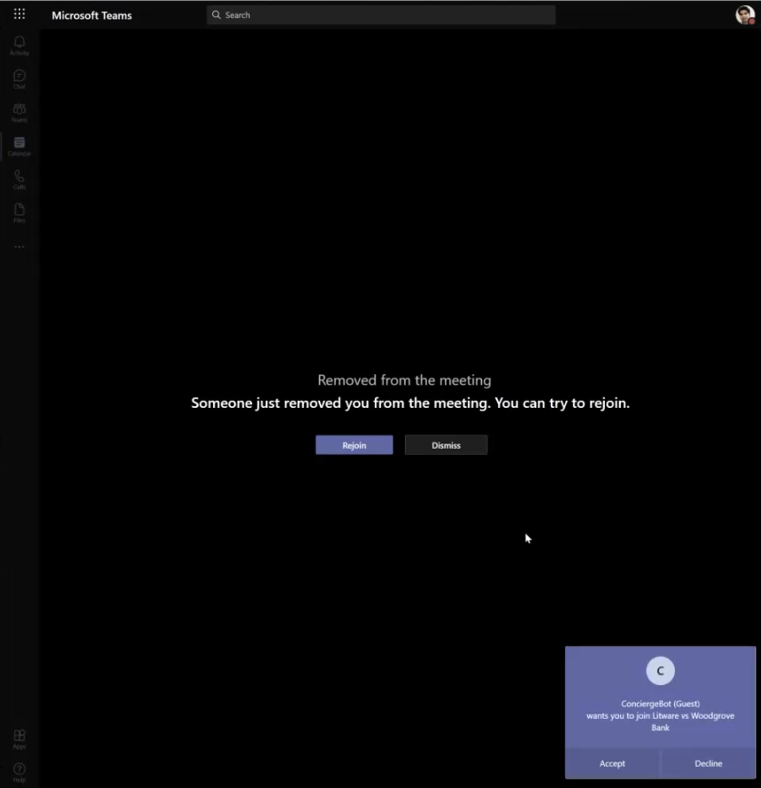
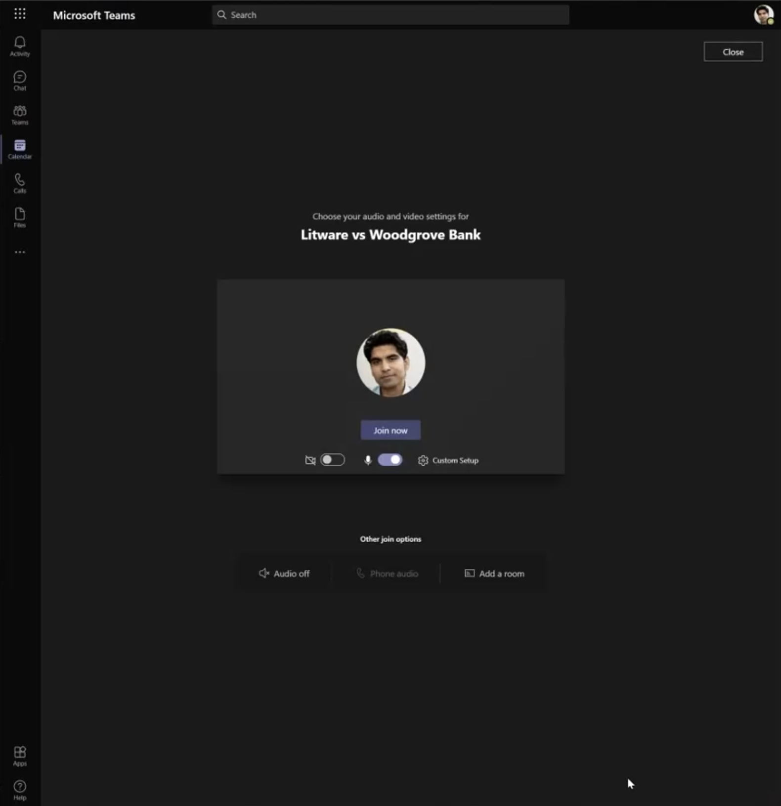
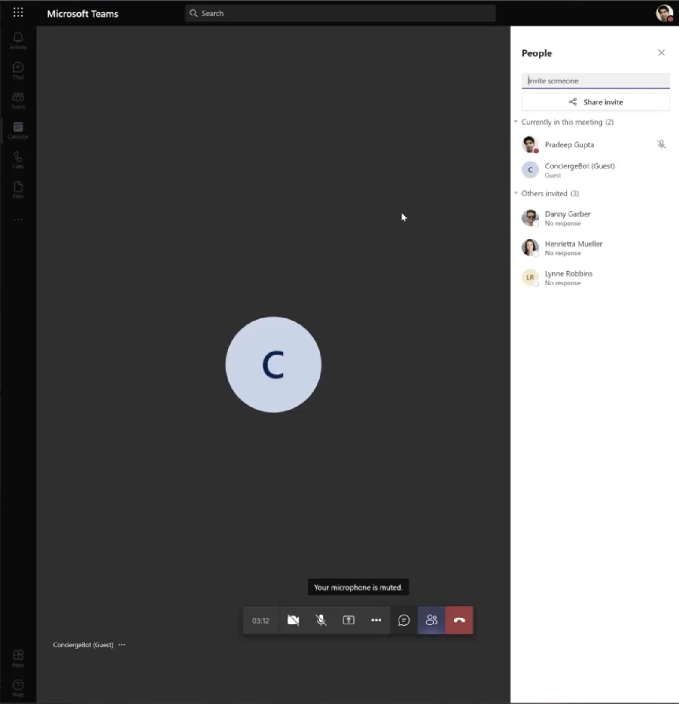
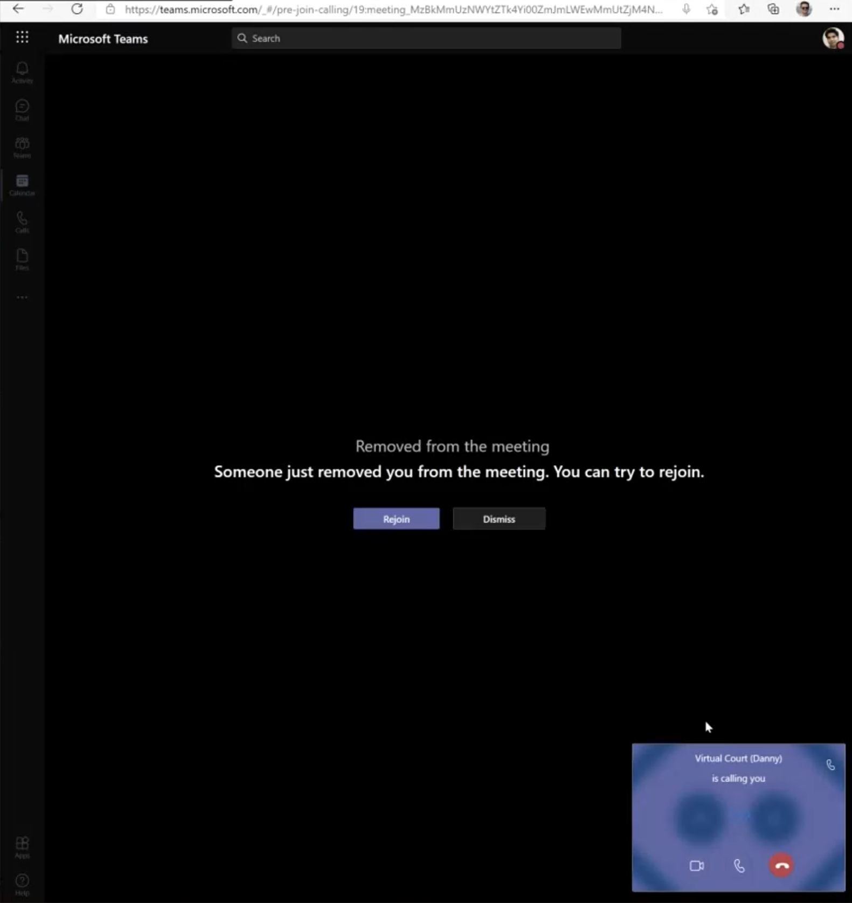
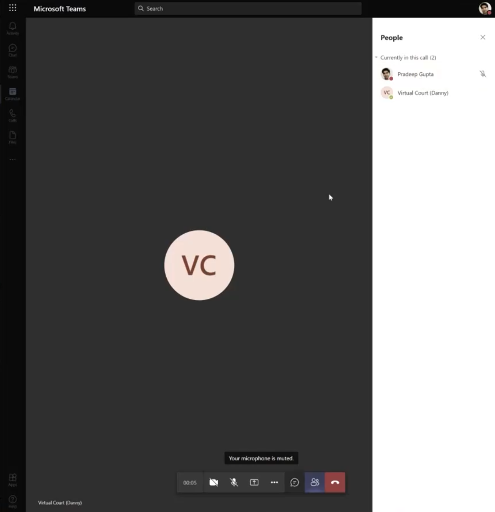

# Microsoft Teams Meeting Participant Transfer

|               |              |
| ------------: | ------------ |
|     _Author:_ | Danny Garber |
| _User Story:_ | <USER_STORY> |
|       _Date:_ | May 2021     |

- [Microsoft Teams Meeting Participant
  Transfer](#microsoft-teams-meeting-participant-transfer)
  - [Business Requirement](#business-requirement)
  - [Types of Microsoft Teams Online Meetings](#types-of-microsoft-teams-online-meetings)
    - [Online Meetings](#online-meetings)
    - [Calls](#calls)
  - [Participant Transfer Flow](#participant-transfer-flow)
    - [Transfering a participant from the Meeting to another Meeting](#transfering-a-participant-from-the-meeting-to-another-meeting)
    - [Transfering a participant from the Meeting to a Group Call](#transfering-a-participant-from-the-meeting-to-a-group-call)
  - [Conclusion](#conclusion)
  - [Additional Resources](#additional-resources)

## Business Requirement

When hearing participants join the General Room (lobby) meeting, they need to be
moved to their designated "rooms" until the hearing proceeding is started. This
move, or in technical terms, "transfer" must be as transparent to the
participant as possible. The ideal experience is when a caller after joining the
General Room meeting invite, is being silently transferred to their designated
meeting room without any additional actions on their part. If this desired
behavior is not possible, the least intrusive flow must be implemented.

## Types of Microsoft Teams Online Meetings

There are two types of Microsoft Teams Online meetings exist on Microsoft Teams platform:

- Online Meetings
- Calls

### Online Meetings

Meetings in Teams include audio, video, and screen sharing. Anyone can join a
Teams meeting - you don't need to be a member of an organization, or even have a
Teams account, to join a Teams meeting.

The Meetings have the following functionality that is absent or not yet available in Teams Calls:

- Can have up to 1000 people in a meeting; in comparison, Calls can only have up to 20 people in a video or audio call
- Can record the meeting and then review it later; the meeting recordings are
  stored on the organization's tenant Teams' One Drive storage
- Can share the meeting content with other participants
- Can use Live Transcript functionality
- Can use 3-rd party sidepanel apps
- Can have Meeting Notes
- Stores the meeting chat messages history in the Meeting's channel
- Can use the meeting lobby (wait until admitted)
- Can be scheduled and appeared on the participants calendar

### Calls

Out of the box, Teams supports the ability for users to make voice over IP
(VoIP) calls from Teams client to Teams client. In Teams, there are two options
to enable users to make, receive, and transfer calls to and from landlines and
mobile phones on the public switched telephone network (PSTN):

- With Phone System with Calling Plans Microsoft provides the phone number to
  your users and all PSTN services.
- With Direct Connect you can connect your existing PSTN connectivity via an SBC
  (Session Boarder Controller) to Microsoft Teams.

When the call is established between two people, it's called `Teams Call`. When
there are more than 2 participants in the video or audio call, it's called
`Group Call`.
Calling in Teams supports basic Phone System features, such as call answering
and initiating (by name and number) with integrated dial pad, call holding and
retrieving, call forwarding and simultaneous ringing, call history, voicemail,
and emergency calling.

The following is the list of features of Microsoft Teams Calls that are not yet available in Teams Online Meetings:

- Make a call from a call history, speed dial, voicemail, or contacts
- Hover over someone's profile picture
- Place a call on hold
- Transfer a call
- Add a delegate - to receive and make calls on your behalf
- Share a line with a delegate
- Access your voicemail

## Participant Transfer Flow

Teams Meetings and Calls have slightly different flow when it comes to transfer
a participant to another meeting or call. In this document, we'll assume that
the initial entry point for a new participant will always be a Teams Meeting, as
one of the requirements for General Room is to be able to get it scheduled and
shared with participants calendars (calls can't be scheduled). Therefore, first,
we will depict the flow of transfering participant from one Meeting (General
Room) to another meeting (e.g. Defendant Room). And then, we will depict the
flow of transfering a participant from a Meeting (General Room) to a Group Call
(e.g. Defendant Room).

### Transfering a participant from the Meeting to another Meeting

For a participant to be moved (transferred) from one Teams Meeting to another meeting (e.g. Defendant Room),
the moderator, Calling Bot, must obtain the following info about the participant
and the meeting that participant is moved to:

1. `Microsoft.Graph.InvitationParticipantInfo` - this resource is used to
   represent the participant entity is being invited to a new meeting. Here's an
   example of initializing this resource in the code:

   ```csharp
    var inviteRequest = new ParticipantInviteRequestData()
    {
        InviteeId = userIdentity.Id,
        InviteeDisplayName = userIdentity.DisplayName,
        CallId = destRoom.MeetingData.CallId,
        TenantId = this.appSettings.AzureAD.TenantId,
        ClientContext = destRoom.Id.ToString(),
        ReplacesCallId = null,
    };
   ```

   > Note: Note how the `ReplacesCallId` is set to `null`, because we don't really
   > transfer this participant in this scenario (if we were to, this call would have
   > failed), but rather invite this participant to a new Teams meeting.

2. Destination Room's `Call Id` - the destination room's meeting must pre-exist
   before this transfer can happen. And that meeting must also be already
   started (with the Calling Bot joining it during the previous phase) so that
   the meeting `Call Id` can be retrieved and used in this API call.

After the `inviteRequest` info is initialized, the MS Graph API call could be
made by the Calling Bot. Here is the sample of how this call is made using C#:

```csharp
var callRequest = this.RequestBuilder.Communications.Calls;

await callRequest[$"{participantInviteRequestData.CallId}"]
   .Participants
   .Invite(participants, participantInviteRequestData.ClientContext)
   .Request()
   .PostAsync();
```

The HTTP request for this MS Graph API call can be described using this line:

```http
POST /communications/calls/{id}/participants/invite
```

When this API is called, the participant will be presented with the toast prompt
message asking to accept the incoming meeting request.



> Note that the participant in the given example has already been removed from
> the previous meeting, so if they decide to decline the invitation, they would
> have to re-join the original meeting in order to have another option to be
> transferred into a designated meeting.

When the participant accepts the new invite, they will be presented with yet
another prompt, now asking to join the new meeting.



This is one of the major points of why the choice between meeting-to-meeting vs
meeting-to-call could be difficult to make given the meetings generally have
much richer functionality than group calls.

Only after clicking and joining the new meeting, the participant finally will find themselves in the new meeting (room):



The removal of the participant from the existing meeting can be achieved by calling this MS Graph API:

```csharp
  var callRequest = this.RequestBuilder.Communications.Calls;
  var request = new GraphRequest<string>(
      new Uri($"{callRequest.RequestUrl}/{callId}/participants/{participantId}"),
      callId,
      RequestType.Delete);
  var response = await this.GraphApiClient.SendAsync<string, CommsNotifications>(
      request,
      tenantId,
      Guid.NewGuid()).ConfigureAwait(false);
```

or, in HTTP language, it would like like this:

```http
DELETE /communications/calls/{id}/participants/{id}
```

### Transfering a participant from the Meeting to a Group Call

For a participant to be moved (transferred) from one Teams Meeting to a new or already in progress, group call,
the moderator, Calling Bot, must initialize and fill out the `Microsoft.Graph.Call` entity - this resource is used to
represent the participant entity is being invited to a new or existing group call. Here's an
example of initializing this resource in the code:

```csharp
var call = new Call
{
   Direction = CallDirection.Outgoing,
   Subject = callRequestData.Subject,
   CallbackUri = new Uri(this.botBaseUri, HttpRouteConstants.CallSignalingRoutePrefix).ToString(),
   Source = new ParticipantInfo
   {
       Identity = new IdentitySet
       {
           Application = new Identity
           {
               DisplayName = this.DisplayName,
               Id = this.BotId,
           }
       }
   },
   Targets = (from string userId in callRequestData.ObjectIds
               let target = new InvitationParticipantInfo
               {
                   Identity = new IdentitySet
                   {
                       User = new Identity
                       {
                           Id = userId,
                       },
                   },
               }
               select target).ToList(),
   RequestedModalities = new List<Modality> {
       Modality.Audio
   },
   MediaConfig = new ServiceHostedMediaConfig {
       PreFetchMedia = callRequestData.PrefetchMedia
   },
   TenantId = callRequestData.TenantId,
};
```

> Note: Note how the Calling Bot's info is presented in the `Source` property of
> the `Call` entity as it is the Calling Bot that initiates this group call to
> the participant. Additionally, the `Targets` property can contain the list of
> participants to be grouped together in one Teams call.

After the `Call` info is filled out, the MS Graph API call is
made by the Calling Bot to initiate the call transfer. Here is the sample code using C#:

```csharp
  var graphClient = this.RequestBuilder.Communications.Calls;

  var responseCall = await graphClient
                              .Request()
                              .AddAsync(call);
```

The HTTP request for this MS Graph API call can be described using this line:

```http
POST https://graph.microsoft.com/v1.0/communications/calls
Content-Type: application/json

{
  "@odata.type": "#microsoft.graph.call",
  "direction": "outgoing",
  "subject": "Create a group call with application hosted media",
  "callbackUri": "https://bot.contoso.com/callback",
  "source": {
    "@odata.type": "#microsoft.graph.participantInfo",
    "identity": {
      "@odata.type": "#microsoft.graph.identitySet",
      "application": {
        "@odata.type": "#microsoft.graph.identity",
        "displayName": "TestBot",
        "id": "dd3885da-f9ab-486b-bfae-85de3d445555"
      }
    }
  },
  "targets": [
    {
      "@odata.type": "#microsoft.graph.invitationParticipantInfo",
      "identity": {
        "@odata.type": "#microsoft.graph.identitySet",
        "user": {
          "@odata.type": "#microsoft.graph.identity",
          "displayName": "user1",
          "id": "98da8a1a-1b87-452c-a713-65d3f10b5555"
        }
      }
    },
    {
      "@odata.type": "#microsoft.graph.invitationParticipantInfo",
      "identity": {
        "@odata.type": "#microsoft.graph.identitySet",
        "user": {
          "@odata.type": "#microsoft.graph.identity",
          "displayName": "user2",
          "id": "bf5aae9a-d11d-47a8-93b1-782504c95555"
        }
      }
    }
  ],
  "requestedModalities": [
    "audio"
  ],
  "mediaConfig": {
    "@odata.type": "#microsoft.graph.appHostedMediaConfig",
    "removeFromDefaultAudioGroup": false
  }
}
```

When this API is called, the participant will be presented with the toast prompt
message asking to accept the incoming call.



When the participant accepts the new invite, they are placed immediately into a
new or on-going group call without any additional prompts (in contrary to the
previous meeting-to-meeting scenario).



The removal of the participant from the existing meeting can be achieved the same way as it is shown for the first scenario.

## Conclusion

While the ideal scenario of silently transfering a participant from one Teams
meeting to another meeting is currently not supported, either one of the flows
of moving participant from one virtual room to another demonstrated in this
guide can still be considered as valuable alternative solution to the original
scenario.
Microsoft CSE Team will continue to work internally with the Microsoft Teams
product team to see that the original scenario request can be made available in
a near future.

## Additional Resources

For more detailed implementation of the described scenarios in this guide, please contact
[**Danny Garber**](mailto:dannyg@microsoft.com) to get access to a private repo
with the sample project implementation
