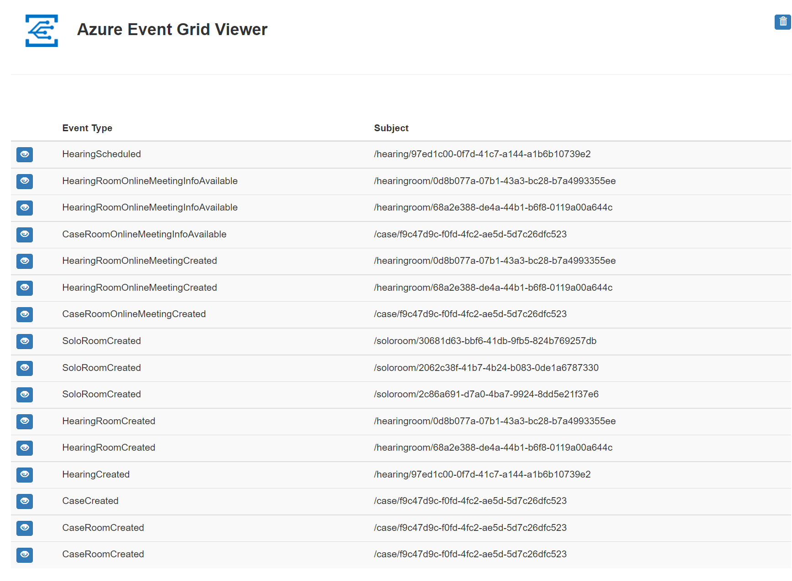

# Setting up a new environment <!-- omit in toc -->

- [1. Prerequisites](#1-prerequisites)
- [2. Add environment to GitHub Actions Workflow](#2-add-environment-to-github-actions-workflow)
  - [Terraform](#terraform)
  - [Microservices Deployment Application Settings](#microservices-deployment-application-settings)
  - [Application Deployment](#application-deployment)
- [3. App Registrations](#3-app-registrations)
- [4. Create app settings files](#4-create-app-settings-files)
  - [API Settings](#api-settings)
  - [Call Management Bot Settings](#call-management-bot-settings)
  - [Notification Settings](#notification-settings)
  - [UI Settings](#ui-settings)
- [5. Create GitHub Project Build Manager Personal Access Token (PAT)](#5-create-github-project-build-manager-personal-access-token-pat)
  - [Creating a Personal Access Token](#creating-a-personal-access-token)
  - [Saving Personal Access Token in GitHub Secrets](#saving-personal-access-token-in-github-secrets)
  - [Authorizing a personal access token for use with SAML single sign-on](#authorizing-a-personal-access-token-for-use-with-saml-single-sign-on)
- [6. Create Repository Variables](#6-create-repository-variables)
- [7. Grant access permissions to GitHub workflows](#7-grant-access-permissions-to-github-workflows)
- [8. Create KeyVault Secrets](#8-create-keyvault-secrets)
  - [Adding additional App Registration secrets to KeyVault](#adding-additional-app-registration-secrets-to-keyvault)
- [9. Update App Settings](#9-update-app-settings)
  - [API App settings](#api-app-settings)
    - [`AZURE_COSMOS_DB_KEY`](#azure_cosmos_db_key)
    - [`EVENT_GRID_COURTROOM_EVENTS_TOPIC_API_KEY`](#event_grid_courtroom_events_topic_api_key)
  - [Call Management Bot App Settings](#call-management-bot-app-settings)
    - [`EventGridTopicKey`](#eventgridtopickey)
    - [`TEAMS_APP_ID`](#teams_app_id)
- [10. Ready... Set... Go](#10-ready-set-go)
- [11. Post-Deployment Settings \& Troubleshooting](#11-post-deployment-settings--troubleshooting)
  - [Infrastructure Deployment Troubleshooting](#infrastructure-deployment-troubleshooting)
- [12. Seed Database](#12-seed-database)
- [13. Prepare Teams Tenant](#13-prepare-teams-tenant)
- [14. Teams APP](#14-teams-app)
- [15. Update TEAMS_APP_ID](#15-update-teams_app_id)
- [16. Validate Events Flow](#16-validate-events-flow)
- [Troubleshooting](#troubleshooting)

## 1. Prerequisites

The CI/CD Process handles most of the deployment steps, but there are some
manual steps to stand up a new environment. These steps only need to be run once
per new environment created.

In some cases, some of these manual steps are workarounds for features missing
in GitHub Actions, in those cases they will be called out so future work can be
done to replace it with the production feature.

> Note: This document assumes that the pre-steps of configuring the terraform
> backend are already complete. If that work has not been done yet, [please do
> those steps first](../../terraform/README.md).

## 2. Add environment to GitHub Actions Workflow

All environments are defined in the `deploy/environments.yml` file. Deployment
is done for each service individually, usually as a two step process: the first
is running terraform to provision the infrastructure and the second is using
deployment scripts to deploy the applications.

The `environments.yml` file defines the various terraform variables that need to be passed in for
each environment. A full list of can be found in
[`terraform/shared/variables.tf`](../../terraform/shared/variables.tf)).

### Terraform

To add a new environment to the terraform list, add a new array element in the
matrix that includes all the required variables for that environment. For
example:

```yaml
include:
  -  # existing environment...
include:
  - location: westus3
    orgName: ms
    projectName: t4j
    resourceGroup: rg
    storageAccount: sa
    environmentName: dev
    UIServiceName: teamsapp
    APIServiceName: api
    GraphAdapterServiceName: graph
    NotificationServiceName: notifyhub
    CallManagementServiceName: callbot
    isTestEnvironment: true
    pinnedRef: refs/heads/main
    terraformBackendStorageAccountName: contosot4jdevsa
    terraformResourceGroupName: contoso-t4j-dev-rg
    terraformBackendStorageContainerName: terraform
    keyVaultSasTokenId: https://contosot4jdevkv.vault.azure.net/storage/contosot4jdevsa/sas/BackendStateSASDefinition
    secretArmClientId: T4J_CLIENT_ID
    secretArmClientSecret: T4J_CLIENT_SECRET
    secretSubscriptionId: T4J_SUBSCRIPTION_ID
    secretTenantId: T4J_TENANT_ID
    secretStorageSAS: T4J_STORAGE_SAS
```

Adding this entry into the matrix will create a new job for this environment
automatically and run the terraform steps against the given values for each
microservice.

Here are the detailed descriptions of each of the environment keys:

| Key Name                             | Description                                                                                                                                              |
| ------------------------------------ | -------------------------------------------------------------------------------------------------------------------------------------------------------- |
| location                             | Location that all resources should be deployed to.                                                                                                       |
| orgName                              | Organization/Company name.                                                                                                                               |
| projectName                          | Project Name for this deployment environment.                                                                                                            |
| resourceGroup                        | Resource group name to create and deploy all resources to.                                                                                               |
| storageAccount                       | Storage account name used by the Azure functions in this deployment. Must be globally unique (the environment name will be appended for uniqueness).     |
| environmentName                      | Name of the environment we are creating. Should be a short alphanumeric value.                                                                           |
| UIServiceName                        | True if this environment is used for testing.                                                                                                            |
| APIServiceName                       | True if this environment is used for testing.                                                                                                            |
| GraphAdapterServiceName              | True if this environment is used for testing.                                                                                                            |
| NotificationServiceName              | True if this environment is used for testing.                                                                                                            |
| CallManagementServiceName            | True if this environment is used for testing.                                                                                                            |
| isTestEnvironment                    | True if this environment is used for testing.                                                                                                            |
| pinnedRef                            | Git reference to a branch that this environment deploys from. Allows environments that are locked to a specific branch such as main or release branches. |
| terraformBackendStorageAccountName   | Name of the storage account that will be used as the terraform backend (See [README.md](../../terraform/README.md)).                                     |
| terraformResourceGroupName           | Resource group name to create and deploy all resources to.                                                                                               |
| terraformBackendStorageContainerName | Name of the container in the storage account used to store terraform state (See [README.md](../../terraform/README.md)).                                 |
| keyVaultSasTokenId                   | URL to the KeyVault secret that contains a SAS Token to access the terraform backend storage account (See [README.md](../../terraform/README.md)).       |
| secretArmClientId                    | The name of the Github Secret that contains the service principal client ID                                                                              |
| secretArmClientSecret                | The name of the Github Secret that contains the service principal client secret                                                                          |
| secretSubscriptionId                 | The name of the Github Secret that contains the service principal subscription ID                                                                        |
| secretTenantId                       | The name of the Github Secret that contains the service principal tenant ID                                                                              |
| secretStorageSAS                     | The SAS Token for the Azure storage account where the terraform states are stored                                                                        |

### Microservices Deployment Application Settings

> Before continuing with this section, make sure you have completed the
> Microsoft Teams Tenant setup steps, which are described in the [Setting Up
> Teams Tenant](./setting-up-teams-tenant.md) document.

For each microservice (e.g. API, Call Management Bot,
Notification Hub and UI) you should update the `appsettings.[environment].json`
with that environment specific parameters. Each microservice has the
`appsettings.template.json` template file that contains the common settings for
each microservice deployment, but you can add for each environment special
additional parameters pertaining to that environment.

### Application Deployment

After the infrastructure is created using Terraform, the deployment scripts (found in the
[`deploy`](../../deploy/) folder) will be executed by CI/CD pipeline. These scripts use the outputs from
terraform to deploy micro-services to Azure.

No changes need to be made to the application deployment scripts to onboard a new environment.

## 3. App Registrations

Complete the Azure App Registration and permission assignments for API, Teams
Tab App and Calling Management Bot as outlined in the
[Application Security Doc](../wiki/application-security.md)

## 4. Create app settings files

All deployable services found within the `src` folder should contain a `deploy`
folder with multiple `appsettings.json` files: `appsettings.template.json`,
`appsettings.common.json`, and an `appsettings.<ENV_NAME>.json` file for each
environment.

For each service, copy the `appsettings.template.json` file, rename it to match
the `environmentName` set in the Terraform code (e.g. `appsettings.env.json`)
and save the file. Certain known values for the environment can be updated at
this time but other values may not be known yet (because the infrastructure has
not been created). These will need to be fixed later (e.g. KeyVault references).

`appsettings.common.json` contains any app settings that span across all
environments, and the environment specific `appsettings.ENV.json` files can
override any of those settings or add additional settings.

### API Settings

The following table describes the settings you should update in the `appsettings.<env>.json` file for your environment:

|               Setting Value               | Description                                                                                                                           |
| :---------------------------------------: | :------------------------------------------------------------------------------------------------------------------------------------ |
|        AZURE_AD_REST_API_CLIENT_ID        | AD App Client Id from the T4J Courtroom Management API App Registration                                                               |
|      AZURE_AD_REST_API_CLIENT_SECRET      | `@Microsoft.KeyVault(SecretUri=https://<KeyVault Name>.vault.azure.net/secrets/CourtroomManagementApiAzureAdApplicationClientSecret)` |
|       AZURE_AD_TEAMS_APP_CLIENT_ID        | AD App Client Id from the T4J UI App Registration                                                                                     |
|     AZURE_AD_TEAMS_APP_CLIENT_SECRET      | `@Microsoft.KeyVault(SecretUri=https://<KeyVault Name>.vault.azure.net/secrets/TeamsAppAzureAdApplicationClientSecret)`               |
|          AZURE_AD_TENANT_BASEURL          | `https://login.microsoftonline.com/<TenantId>/`                                                                                       |
|            AZURE_COSMOS_DB_KEY            | `@Microsoft.KeyVault(SecretUri=https://<KeyVault Name>.vault.azure.net/secrets/CosmosDBKey)`                                          |
| EVENT_GRID_COURTROOM_EVENTS_TOPIC_API_KEY | `@Microsoft.KeyVault(SecretUri=https://<KeyVault Name>.vault.azure.net/secrets/EventGridKey)`                                         |
|                BOT_API_KEY                | `@Microsoft.KeyVault(SecretUri=https://<KeyVault Name>.vault.azure.net/secrets/BotAPIKey)`                                            |
|     EVENT_GRID_WEBHOOK_CLIENT_SECRET      | `@Microsoft.KeyVault(SecretUri=https://<KeyVault Name>.vault.azure.net/secrets/EventGridClientSecret)`                                |

### Call Management Bot Settings

The following table describes the settings you should update in the `appsettings.<env>.json` file for your environment:

|             Setting Value              | Description                                                                                                       |
| :------------------------------------: | :---------------------------------------------------------------------------------------------------------------- |
|           AZURE_AD_TENANT_ID           | `Tenant Id` for your Teams application                                                                            |
|         AZURE_AD_BOT_CLIENT_ID         | App Client Id from the T4J Call Management Bot App Registration                                                   |
| AZURE_AD_BOT_SERVICE_ACCOUNT_OBJECT_ID | `ObjectId` of the Call Management Bot User account in the Tenant AD                                               |
|    AZURE_AD_BOT_SERVICE_ACCOUNT_UPN    | UPN property of the Call Management Bot User account in the Tenant AD                                             |
|          AZURE_AD_DOMAIN_NAME          | Microsoft Tenant Domain Name, for example: `contoso.onmicrosoft.com`                                              |
|       AZURE_AD_BOT_CLIENT_SECRET       | `@Microsoft.KeyVault(SecretUri=https://<KeyVault Name>.vault.azure.net/secrets/AzureAdBotClientSecret)`           |
| AZURE_AD_BOT_SERVICE_ACCOUNT_PASSWORD  | `@Microsoft.KeyVault(SecretUri=https://<KeyVault Name>.vault.azure.net/secrets/AzureAdBotServiceAccountPassword)` |
|           EventGridTopicKey            | `@Microsoft.KeyVault(SecretUri=https://<KeyVault Name>.vault.azure.net/secrets/EventGridKey)`                     |
|              TEAMS_APP_ID              | A new `GUID` value from the `manifest.json's id` property                                                         |

### Notification Settings

The following table describes the settings you should update in the `appsettings.<env>.json` file for your environment:

|        Setting Value        | Description                                                                                   |
| :-------------------------: | :-------------------------------------------------------------------------------------------- |
| AZURE_AD_REST_API_CLIENT_ID | AD App Client Id from the T4J Courtroom Management API App Registration                       |
|     AZURE_AD_ISSUER_URL     | `https://login.microsoftonline.com/<Tenant Id>/v2.0`                                          |
|      AZURE_AD_JWKS_URL      | `https://login.microsoftonline.com/<Tenant Id>/discovery/v2.0/keys`                           |
|      EventGridTopicKey      | `@Microsoft.KeyVault(SecretUri=https://<KeyVault Name>.vault.azure.net/secrets/EventGridKey)` |

### UI Settings

The UI service does not follow the same rules as the other services because the
react build process creates a static website which embeds all environment
variable values from the build machine and will not work with app settings.
Instead, the `ui/deploy` folder contains `.env` files that correlate to the
different environments instead of `appsettings.json`. These values in `.env` may
only be known after deployment, but the files must exist, and a new rule must be
added to the `package.json` file:

|        Setting Value        | Description                                                                                      |
| :-------------------------: | :----------------------------------------------------------------------------------------------- |
|      REACT_APP_API_URL      | `https://<org>-<proj>-<env>-api.azurewebsites.net`                                               |
| REACT_APP_NOTIFICATION_HUB  | `https://<org>-<proj>-<env>-notifyhub.azurewebsites.net/api`                                     |
| REACT_APP_TIME_ZONE_OPTIONS | The list of your Country Time Zones delimitered with coma, for example: HST,AKST,PST,MST,CST,EST |
| REACT_APP_DEFAULT_TIME_ZONE | The default Time Zone for the main app deployment location                                       |
|      DEFAULT_TIME_ZONE      | The default Time Zone for the main app deployment location                                       |

## 5. Create GitHub Project Build Manager Personal Access Token (PAT)

You should create a personal access token to use as a service account for all
GitHub project build operations.

> As a security precaution, GitHub automatically removes personal access tokens
> that haven't been used in a year. To provide additional security, we highly
> recommend adding an expiration to your personal access tokens.

### Creating a Personal Access Token

1. Verify your email address, if it hasn't been verified yet.
2. In the upper-right corner of any page, click your profile photo, then click
   `Settings`.
3. In the left sidebar, click `Developer settings`.
4. In the left sidebar, click `Personal access tokens/Tokens(classic)`.
5. Click `Generate new token`.
6. Give your token a descriptive name.
7. To give your token an expiration, select the Expiration drop-down menu, then
   click a default or use the calendar picker.
8. Select the `repo` scopes from the list.
9. Click `Generate` token.
10. Copy the generated token to the Clipboard.

### Saving Personal Access Token in GitHub Secrets

When working with the GitHub Actions, you will use the previously created token
in the Actions Workflows. This token then is retrieved from the GitHub Secrets
during the Actions Workfow run.

1. Go to `Settings` in the GitHub repository main menu.
2. In the left sidebar, click `Secrets and variables`.
3. Select `Actions`.
4. Click `New repository secret`.
5. Give it the name: `BUILD_MGR_PAT`.
6. Paste the previously generated token to this secret's value.

### Authorizing a personal access token for use with SAML single sign-on

To use a personal access token with an organization that uses SAML single
sign-on (SSO), you must first authorize the token. Before you can authorize a
personal access token or SSH key, you must have a linked SAML identity. If
you're a member of an organization where SAML SSO is enabled, you can create a
linked identity by authenticating to your organization with your IdP at least
once.

After you authorize a personal access token or SSH key, the authorization does
not expire. The token or key will stay authorized until revoked in one of these
ways.

- An organization owner revokes the authorization.
- You are removed from the organization.
- The scopes in a personal access token are edited, or the token is regenerated.

1. In the upper-right corner of any page, click your profile photo, then click
   `Settings`.
2. In the left sidebar, click `Developer settings`.
3. In the left sidebar, click `Personal access tokens`.
4. Next to the token you'd like to authorize, click `Configure SSO` and then
   select the organization for which you want to enable SSO.
5. Click `Authorize` for the selected organization.

## 6. Create Repository Variables

CI/CD pipeline uses the GitHub repository variables for each GitHub Action workflow run.
You must be the repository owner.

1. On `GitHub.com`, navigate to the main page of the repository.

2. Under your repository name, click `Settings`. If you cannot see the "Settings"
   tab, select the dropdown menu, then click `Settings`.

3. In the "Security" section of the sidebar, select `Secrets and variables`, then click `Actions`.

4. Click the `Variables` tab.

5. Click `New repository variable`.

6. In the `Name` field, enter a name for your variable.

7. In the `Value` field, enter the value for your variable.

8. Click `Add variable`.

The following environment variables must be pre-created in the GitHub Settings before running workflows:

| Repository Variables        | Description                                                                                                                                                                                                                                                                                                                |
| --------------------------- | -------------------------------------------------------------------------------------------------------------------------------------------------------------------------------------------------------------------------------------------------------------------------------------------------------------------------- |
| APP_PLATFORM                | Specifies the based programming platform the application is running on. Valid values are `ios` for iOS, `java` for Java web, `Node.JS` for Node.js, `other` for General, `phone` for Windows Phone and `web` for ASP.NET. Please note these values are case sensitive; unmatched values are treated as `ASP.NET` by Azure. |
| TIME_ZONE_OPTIONS           | The list of all time zone options in the `Country/City` format. For example: `America/New_York,America/Chicago,America/Denver,America/Los_Angeles,America/Juneau,Pacific/Honolulu`                                                                                                                                         |
| DEFAULT_TIME_ZONE           | The default time zone from the list of time zone options. For example: `America/New_York`                                                                                                                                                                                                                                  |
| REACT_APP_TIME_ZONE_OPTIONS | The list of all time zone options in the `Country/City` format. For example: `America/New_York,America/Chicago,America/Denver,America/Los_Angeles,America/Juneau,Pacific/Honolulu`                                                                                                                                         |
| REACT_APP_DEFAULT_TIME_ZONE | The default time zone from the list of time zone options. For example: `America/New_York`                                                                                                                                                                                                                                  |
| API_REGISTRATION_APP_ID     | The application Id of the Azure AD App registration for Courtroom Management API created in [3. App Registrations](#3-app-registrations)                                                                                                                                                                                   |
| UI_REGISTRATION_APP_ID      | The application Id of the Azure AD App registration for Teams Application UI created in [3. App Registrations](#3-app-registrations)                                                                                                                                                                                       |
| CALLBOT_REGISTRATION_APP_ID | The application Id of the Azure AD App registration for Call Management Bot created in [3. App Registrations](#3-app-registrations)                                                                                                                                                                                        |
| TF_LOG                      | [Optional] If you need to get the trace message from running Terraform workflow in your GitHub Actions, set this value to `TRACE`                                                                                                                                                                                          |
| LOCK_RESOURCE_GROUP         | [True/False] The flag that sets the conditional locking of the deployed resource group                                                                                                                                                                                                                                     |

## 7. Grant access permissions to GitHub workflows

To enable Github workflow to run Bash deployment scripts, you must execute this
command once for every deployment script located in the `deploy` folder:

```bash
git update-index --chmod=+x path/to/file
```

for example: `git update-index --chmod=+x ./deploy/deploy_app_service.sh`

Make sure to run this command for every Bash deployment script. Then commit and
merge your changes to the main branch.

## 8. Create KeyVault Secrets

KeyVault secrets should not be managed by terraform or hard-coded in app
settings files because then the secrets get stored in plaintext. This script:
[set_keyvault_secrets.sh](../../deploy/set_keyvault_secrets.sh) will pull the
appropriate secrets from the resources that have secrets and stores them in
KeyVault.

### Adding additional App Registration secrets to KeyVault

When executing the `set_keyvault_secrets.sh` script above, you will be prompted
to provide the AD Application Client Secrets for each of the application shown
in this table.

| Application | APP_VAULT_KEY                                        |
| ----------- | ---------------------------------------------------- |
| API         | CourtroomManagementApiAzureAdApplicationClientSecret |
| UI          | TeamsAppAzureAdApplicationClientSecret               |
| Calling Bot | AzureAdBotClientSecret                               |
|             |                                                      |

If the App Registration secret is not known, you can reset it by following the commands below:

```shell
RESOURCE_GROUP_NAME=<resource group name>
KEY_VAULT_NAME=$(az resource list -g $RESOURCE_GROUP_NAME --query "[?type=='Microsoft.KeyVault/vaults'].name" --output tsv)
APP_ID=<app-id>
APP_VAULT_KEY=<app-vault-key>
SECRET=$(az ad app credential reset --id $APP_ID --query password --output tsv)
az keyvault secret set --vault-name $KEY_VAULT_NAME -n $APP_VAULT_KEY --value $SECRET --query id --output tsv
```

If the App Registration secret is known, then simply continue with the script
while providing the Application Client Secrets for each of the App.

## 9. Update App Settings

Certain app settings will need to be updated because they depended on
infrastructure resources that did not exist at the time that the previous commit
was being made.

> Note: This two-step process is necessary as a security precaution for secrets.
> If Terraform was to manage the KeyVault secrets, it would store those secrets
> in plaintext in the state file. To avoid that, after the infrastructure has
> been created, it is necessary to manually create the secrets in the KeyVault,
> then point the KeyVault references to the newly created Secret.

### API App settings

The following app settings need to be set in the [`api`](../../src/api/)
project.

#### `AZURE_COSMOS_DB_KEY`

The value for `AZURE_COSMOS_DB_KEY` should have been output as the `CosmosDBKey`
in the previous step and will output the full KeyVault Secret ID. In the app
settings file, replace the `<SECRET URI>` portion of the `AZURE_COSMOS_DB_KEY`
to set the KeyVault reference correctly.

> Note: The ID includes the version at the end of the URL. It is recommended to
> remove the version number for the app setting so the service always pulls the
> latest. The ID should look like
> `https://mykeyvault.vault.azure.net/secrets/CosmosDBKey/`

#### `EVENT_GRID_COURTROOM_EVENTS_TOPIC_API_KEY`

The value for `EVENT_GRID_COURTROOM_EVENTS_TOPIC_API_KEY` should have been
output as the `EventGridKey` in the previous step and will output the full
KeyVault Secret ID. In the app settings file, replace the `<SECRET URI>` portion
of the `EVENT_GRID_COURTROOM_EVENTS_TOPIC_API_KEY` to set the KeyVault reference
correctly.

> Note: The ID includes the version at the end of the URL. It is recommended to
> remove the version number for the app setting so the service always pulls the
> latest. The ID should look like
> `https://mykeyvault.vault.azure.net/secrets/EventGridKey/`

### Call Management Bot App Settings

The following app settings need to be set in the
[`call-management-bot`](../../src/call-management-bot/) project.

#### `EventGridTopicKey`

The value for `EventGridTopicKey` should have been output as the `EventGridKey`
in the previous step (and is the same as
`EVENT_GRID_COURTROOM_EVENTS_TOPIC_API_KEY`) and will output the full KeyVault
Secret ID. In the app settings file, replace the `<SECRET URI>` portion of the
`EventGridTopicKey` to set the KeyVault reference correctly.

> Note: The ID includes the version at the end of the URL. It is recommended to
> remove the version number for the app setting so the service always pulls the
> latest. The ID should look like
> `https://mykeyvault.vault.azure.net/secrets/EventGridKey/`

#### `TEAMS_APP_ID`

The value for this is an internal ID when a teams app is uploaded. After
uploading the teams package (which contains the `manifest.json` file) to the
Teams app catalog, first, you'd want to find out the Id of the Team to which you
have added your instance of Teams for Justice application. To do so, you can run
the following Graph call in a tool like _Graph Explorer_.

```http
GET https://graph.microsoft.com/v1.0/me/joinedTeams?$filter=startswith(displayName,'<APP NAME>')
```

In the returned values, the `Team ID` you were looking for is the `id` property
that matched the Team you have installed your T4J application.

Next, the internal Team App ID can be retrieved via the following Graph call:

```http
GET https://graph.microsoft.com/v1.0/teams/<team ID>/installedApps?$expand=teamsAppDefinition
```

Using a tool like [Graph
Explorer](https://developer.microsoft.com/en-us/graph/graph-explorer) makes this
process easier. Search through the returned apps and look for the app that was
created and look for the field named `teamsAppId`.

## 10. Ready... Set... Go

Once all the app settings are updated, commit the changes and create a PR to
merge to main. When the GitHub Actions are run on main branch, the new environment infrastructure will be created and
application deployments will continue.

## 11. Post-Deployment Settings & Troubleshooting

After all deployment tasks are completed, there are a few manual steps that you
must perform to ensure all settings are correct and all knobs are turned on. One
of such "knobs" is the **Application Insights** settings for `API` service. By
default, it is not turned on when the terraform script deploys the Azure app
service. Therefore, in order to enable Application Insights on `API`
microservice, you should navigate to Azure Portal, and find the API application
service that was just deployed. Go to the `Settings` blade on the left, find
`Application Insights` and then click on the **Turn on Application Insights**
button.

### Infrastructure Deployment Troubleshooting

During the `API Build & Deploy` workflow run, you may encounter the **Error**
with a message similiar to this one: **Webhook validation handshake failed for
[https://your_api_domain.azurewebsites.net/webhooks/event-grid](./). Http POST
request failed with response code Unknown. For troublehooting, visit
<https://aka.ms/esvalidation>.**

One of the possible reasons why this error occurs, is the incompatability of the
NodeJS version by default assigned to the `WEBSITE_NODE_DEFAULT_VERSION`
variable in the `API` application configuration settings. To correct this, you
can either change the value directly in the Azure Portal, or run the following
Azure CLI command:

```bash
az webapp config appsettings set --name contoso-t4j-dev-api --resource-group contoso-t4j-dev-api-rg --settings WEBSITE_NODE_DEFAULT_VERSION="~16"
```

Then, restart the `API` application service and re-run the failed `API Build & Deploy` GitHub workflow again.

## 12. Seed Database

Once the GitHub Actions have run the database can be seeded. The following are
the entities to be added to the virtual-court/courts container.

- Organization: [json](../../src/json/db-seed/organisation.json) template
- Court: [json](../../src/json/db-seed/court.json) template
  - See [Setup Court](./setup-court.md) for additional documentation
- Courtroom: [json](../../src/json/db-seed/courtroom.json) template

Additional documentation can be found in [Entity and
Terminologies](./entities-and-terminologies.md)

## 13. Prepare Teams Tenant

To enable the Call Management Bot to use MS Graph on behalf of
a user complete the steps in the [Prepare Teams
Tenant](./setting-up-teams-tenant.md)

## 14. Teams APP

Prepare the solution's Teams App `manifest.json` file based on the
[manifest.sample.json](../../src/ui/manifest/manifest-sample.json)

Pay particular attention to the manifest `webApplicationInfo` values which must
match those defined in the App Registration for the Teams app.

```json
  "webApplicationInfo": {
    "id": "<Teams App Azure AD Application ID>",
    "resource": "api://<domain of deployed teams app>/teams-app"
  }
```

With the Manifest complete, create the expected Teams App Package and deploy
into the teams.

[Microsoft
documentation](https://docs.microsoft.com/en-us/microsoftteams/platform/concepts/deploy-and-publish/apps-upload)
on uploading Teams Apps.

## 15. Update TEAMS_APP_ID

After the app is sideloaded into Microsoft Teams, make sure to update
`TEAMS_APP_ID` in the Call Management Bot Environment Settings in Azure Portal
as per the guidance in this [document](#teams_app_id).

## 16. Validate Events Flow

The primary goal of using [Azure Event Grid
Viewer](https://github.com/Azure-Samples/azure-event-grid-viewer) is to display
notifications from Event Grid in near-real time. After deploying the **Azure
Event Grid Viewer** into your Azure subscription (please choose the different
from your CI/CD deployed resource groups), and navigating to its website, you
can monitor all the Events in real-time when you begin working with the Teams
for Justice application.
For example, after scheduling a new Hearing in the Scheduling Calendar in Teams,
you should see the output from the **Azure Event Grid Viewer** similar to this
one:



## Troubleshooting

If, when you run the GitHub Action Workflow you get the error message for access
being denied (403) when trying to get access to one of your repositories, most
likely your organization enforces the SAML SSO, which wasn't authorized for your
Personal Access Token. Please see the [Authorizing a personal access token for
use with SAML Single Sign
on](#authorizing-a-personal-access-token-for-use-with-saml-single-sign-on)
section in this document.
