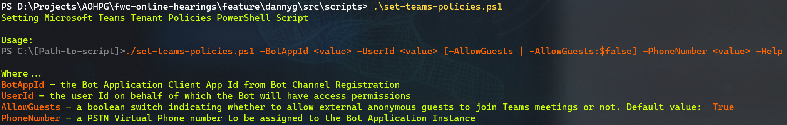

# Setting Up a new Teams Tenant

|               |              |
| ------------: | ------------ |
|     _Author:_ | Danny Garber |
| _User Story:_ | <USER_STORY> |
|       _Date:_ | August 2021  |

- [Setting Up a new Teams Tenant](#setting-up-a-new-teams-tenant)
  - [Overview](#overview)
  - [Prerequisites](#prerequisites)
    - [Install Microsoft PowerShell](#install-microsoft-powershell)
    - [Install PowerShellGet module](#install-powershellget-module)
    - [Install and Import MicrosoftTeams PowerShell Module](#install-and-import-microsoftteams-powershell-module)
    - [Install and Import Azure Active Directory PowerShell for Graph](#install-and-import-azure-active-directory-powershell-for-graph)
  - [Create an Azure Active Directory User that represents a Bot Service Account](#create-an-azure-active-directory-user-that-represents-a-bot-service-account)
    - [Create a Bot Service Account in Azure AD](#create-a-bot-service-account-in-azure-ad)
      - [Assign AD Role and Microsoft 365 E3/E5 license](#assign-ad-role-and-microsoft-365-e3e5-license)
    - [\[Optional\] Assign Microsoft 365 Phone number to your Bot application instance](#optional-assign-microsoft-365-phone-number-to-your-bot-application-instance)
  - [Setting up Microsoft Teams Policies with PowerShell Script](#setting-up-microsoft-teams-policies-with-powershell-script)
    - [Administrative permissions](#administrative-permissions)
    - [Usage](#usage)
    - [Examples](#examples)
      - [Configure Teams for Justice policies for the tenant where Phone Calling Plan Licenses have been configured](#configure-teams-for-justice-policies-for-the-tenant-where-phone-calling-plan-licenses-have-been-configured)
      - [Configure Teams for Justice policies for the tenant where Phone dialers are not allowed, but external guests are allowed](#configure-teams-for-justice-policies-for-the-tenant-where-phone-dialers-are-not-allowed-but-external-guests-are-allowed)
      - [Prevent anonymous users from joining the meetings](#prevent-anonymous-users-from-joining-the-meetings)
      - [Assigning a new phone number](#assigning-a-new-phone-number)

## Overview

Microsoft Teams are backed by Office 365 Groups, so when you created a team, you
created an Office 365 Group. These groups, and now teams, were managed by Skype
for Business Online Connector that has been consolidated into Microsoft Teams
PowerShell. Microsoft Teams PowerShell module contains cmdlets for managing core
team and its settings, managing team users, channels of the team and the
policies.

A policy is a group of settings that can be applied granularly to individual
users. Each policy type has its own set of cmdlets for creating, viewing,
deleting, and updating the policies themselves, and then assigning
those policies to users. All of these cmdlets can be run as end users, but
they'll work only on the teams that you own or are a member of. If you are a
Global Admin or Teams Administrator, you'll be able to act on all teams in your
organization.

As an admin, you use policies to control the Teams features that are available
to users in your organization. For example, there are calling policies, meeting
policies, and messaging policies, to name just a few.

Organizations have different types of users with unique needs. Custom policies
that you create and assign let you tailor policy settings to different sets of
users based on those needs.

To easily manage policies in your organization, Teams offers several ways to
assign policies to users. Assign a policy directly to users, either individually
or at scale through a batch assignment, or to a group that the users are members
of. You can also use policy packages to assign a preset collection of policies
to users in your organization who have similar roles. The option that you choose
depends on the number of policies that you're managing and the number of users
you're assigning policies to. Global (Org-wide default) policies apply to the
largest number of users in your organization. You only have to assign policies
to those users that require specialized policies.

This document provides the prescriptive guidance for how to configure only those
Microsoft Teams policies that are at minimum required by the scenarios
implemented in this project.

For details on how to manage and assign other Teams policies, see [Manage Teams with policies](https://docs.microsoft.com/en-us/microsoftteams/manage-teams-with-policies)

## Prerequisites

### Install Microsoft PowerShell

Microsoft Teams PowerShell module requires PowerShell 5.1 or higher on all
platforms. Install the [latest version of PowerShell](https://docs.microsoft.com/en-us/powershell/scripting/install/installing-powershell)
available for your operating system.

To check your PowerShell version, run the following command from within a PowerShell session:

```PowerShell
$PSVersionTable.PSVersion
```

Microsoft Teams PowerShell module is currently supported for use with PowerShell
5.1 on Windows. Follow these steps to install the module:

- Update to Windows PowerShell 5.1. If you're on Windows 10 version 1607 or higher, you already have PowerShell 5.1 installed.
- Install .NET Framework 4.7.2 or later.

### Install PowerShellGet module

Microsoft recommends using PowerShellGet when working with MicrosoftTeams module.
Run the following command to install the latest PowerShellGet:

```PowerShell
Install-Module -Name PowerShellGet -Force -AllowClobber
```

If PowerShell Gallery (PSGallery) isn't configured as a trusted repository for
PowerShellGet, the first time you use the PSGallery you'll see the following
message:

```Console

Untrusted repository

You are installing the modules from an untrusted repository. If you trust this repository, change
its InstallationPolicy value by running the `Set-PSRepository` cmdlet.

Are you sure you want to install the modules from 'PSGallery'?
[Y] Yes [A] Yes to All [N] No [L] No to All [S] Suspend [?] Help (default is "N"):
```

Answer **Yes** or **Yes to All** to continue with the installation.

### Install and Import MicrosoftTeams PowerShell Module

MicrosoftTeams PowerShell Module is getting installed on the first time running the script described in this document.

### Install and Import Azure Active Directory PowerShell for Graph

The Azure AD PowerShell for Graph module has two versions: a Public Preview
version and a General Availability (GA) version. It is not recommended to use
the Public Preview version for production scenarios.

The generic version of the Azure AD PowerShell for Graph is getting installed on
the first time running the script described in this document.

## Create an Azure Active Directory User that represents a Bot Service Account

To assign the Microsoft Teams policy to the Call Management Bot that would allow
that Bot service to create online meetings, add and remove participants from the
meetings and to answer the dial-in phone calls, you'd need the Azure AD User
account for this bot. Then later, when you run PowerShell script to create that
Microsoft Teams policy, you'll use this Bot User Id in your script argument
parameters. This account needs to be created and configured as part of this
setup process. It can be either created using the script below, or with manual
process in Azure Portal.

```shell
az ad user create --display-name "<display-name>" \
  --password "<password>"  \
  --user-principal-name "<name>@<tenant-domain>" \
  --query '{ObjectId:objectId, displayName:displayName}'
```

### Create a Bot Service Account in Azure AD

Go to the Azure Portal and open Azure AD Users section, then add a new tenant
User like you'd do it for any other users. See this document for the detailed
steps: [Add a new
user](https://learn.microsoft.com/en-us/azure/active-directory/fundamentals/add-users-azure-active-directory#add-a-new-user)

> Note: Save the Bot User email address and the Object Id. You will use it later in the following steps.
> Note down the `objectId` as it will be used in configuring the Application Settings of both applications. The `password`
> needs to be stored as well as it will be later placed in the Azure KeyVault instance.

#### Assign AD Role and Microsoft 365 E3/E5 license

You'd need to assign the `Teams Administrator` role to the newly created Bot
service account. You can do it in the Azure AD portal.

Then, go to [Admin Center ->
Users](https://portal.office.com/adminportal/home?#/users) of your Teams tenant
and assign either Microsoft 365 E3 or E5 license to this new Bot Service
account.

### [Optional] Assign Microsoft 365 Phone number to your Bot application instance

If use of the dial-in phone calls is in the scope for this deployment, you will
need to assign a virtual user license to your Bot application instance. For
details, see [Phone system virtual user
license](https://docs.microsoft.com/en-us/microsoftteams/teams-add-on-licensing/virtual-user).

Also, you'd be required to assign a calling plan to your Bot application
instance. For details, see [Calling plans for Microsoft
365](https://docs.microsoft.com/en-us/microsoftteams/calling-plans-for-office-365).

## Setting up Microsoft Teams Policies with PowerShell Script

When setting up a new Microsoft Teams tenant for the Teams for Justice
environment, the number of Teams policies must be set. These policies can be
configured in the scripting fashion by running the [PowerShell
script](../scr/../../src/scripts/set-teams-policies.ps1).

This script enables the following policies:

- Configure application access policy to allow an application to access online meeting resources on behalf of a user
- Allow or Prevent anonymous users from joining the meetings
- Assign a new phone number to the Bot application instance
- Unmask the external dial-in phone numbers, so it can be accessed by the Bot instance
- Add Bot Application to the Remove Participants Teams Meetings Policy

### Administrative permissions

To run the script in the Microsoft Teams tenant environment, make sure you have elevated your PowerShell console
permissions to Administrator and you have the tenant's Global Admin credentials handy.

Run the script with the Bot AppId.

> IMPORTANT! The `AppUpn` parameter and the corresponding `DisplayName` passed to
> the script must refer to non-existent user in tenant's Active Directory!

### Usage

```powershell
.\set-teams-policies.ps1 -TenantId <tenant id> -AppId <call management bot client app id> -UserUpn <bot email address> -PolicyName <"policy name"> -AppUpn <app instance email address> -DisplayName <app instance display name>
```

The following table provides definition and description of all parameters:

| Variable    | Description                                                                                                                                                                                                        |
| ----------- | ------------------------------------------------------------------------------------------------------------------------------------------------------------------------------------------------------------------ |
| TenantId    | Microsoft Teams tenant Id                                                                                                                                                                                          |
| AppId       | The client ID of the Call Management Bot application registered in Azure AD. The Teams Application Instance will be created with the identity of this application Id.                                              |
| UserUpn     | The existing AD User email for the Call Management Bot application registered in Azure AD. The Teams Application Policy will be created with the identity of this user.                                            |
| PolicyName  | A policy name associated with this application instance.                                                                                                                                                           |
| AppUpn      | The Cs App Instance email (UPN) address that will be created in the tenant AD at the end of running this script. Note: this email address must not exist or be used already by another Teams Application Instance. |
| DisplayName | The display name of the CS App Instance.                                                                                                                                                                           |

To check on the syntax of the script parameters, you can run the script with `-help` parameter or omit all parameters alltogether:

```PowerShell
./set-teams-policies.ps1 -help
```

The output screen may look like this:


The PowerShell script has 2 additional optional parameters (excluding `-help`):

- `AllowGuests` parameter sets the policy that either allows or prevents anonymous
  guests from joining the Teams meetings for this tenant. By default, this
  parameter (when omitted) is always `True`.

- `PhoneNumber` parameter associates the Teams Application Instance with the Phone
  number created by Calling Plan or Microsoft Virtual Phone System.

### Examples

#### Configure Teams for Justice policies for the tenant where Phone Calling Plan Licenses have been configured

```powershell
.\set-teams-policies.ps1 -TenantId 764c63e8-b404-42e5-8f9b-aaf0035e8f0d -AppId b321634e-fa24-4237-a4be-11d135b1b44f -UserUpn teams4justice.bot@msteamsdemos.onmicrosoft.com -AllowGuests -PolicyName "T4JDevTeamsPolicy" -AppUpn teams4justice.appsvc@msteamsdemos.onmicrosoft.com -DisplayName "Teams for Justice App Instance" false -PhoneNumber 18002223456
```

#### Configure Teams for Justice policies for the tenant where Phone dialers are not allowed, but external guests are allowed

```powershell
.\set-teams-policies.ps1 -TenantId 764c63e8-b404-42e5-8f9b-aaf0035e8f0d -AppId b321634e-fa24-4237-a4be-11d135b1b44f -UserUpn teams4justice.bot@msteamsdemos.onmicrosoft.com -AllowGuests -PolicyName "T4JDevTeamsPolicy" -AppUpn teams4justice.app@msteamsdemos.onmicrosoft.com -DisplayName "Teams for Justice App Instance" -AllowGuests true
```

#### Prevent anonymous users from joining the meetings

```PowerShell
./set-teams-policies.ps1 -AppId 999999 -AllowGuests:$false
```

The `AllowGuests` parameter is set to `False` by explicitly providing the `$false` value when passing
this parameter.

#### Assigning a new phone number

```PowerShell
./set-teams-policies.ps1 -AppId 999999 -PhoneNumber +16892069255
```

After the virtual user license and calling plan have been fully set up (see
[Assign Microsoft 365 licenses to your application
instance](#assign-ad-role-and-microsoft-365-e3e5-license)), you
must assign a new Virtual PSTN phone number to the Bot.
