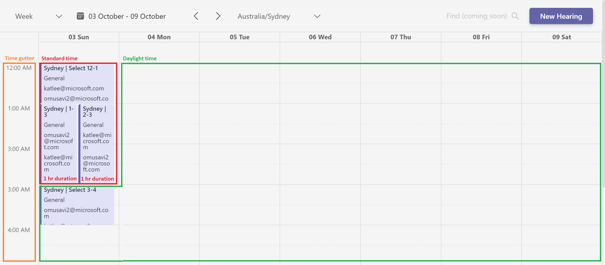
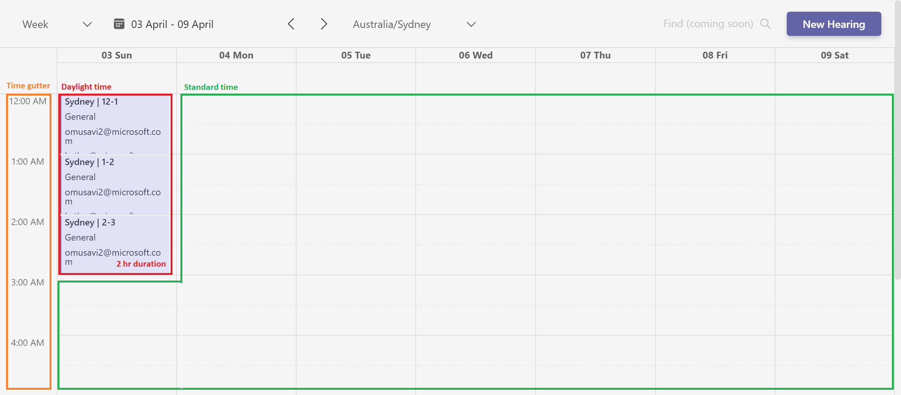

# Date and time in the UI

There are 3 variations of dates and times that the UI must manage and control. They are defined as follows:

| Name           | Definition and use                                                                                                                                                                                                                  |
| -------------- | ----------------------------------------------------------------------------------------------------------------------------------------------------------------------------------------------------------------------------------- |
| System time    | The time on the user's machine. Basic methods from JavaScript `Date` objects use this time. By default, `react-big-calendar` uses system time to calculate the current date, the current time, starts and ends of events, and more. |
| Time zone time | The time in the time zone that's been selected by the user in the `TimeZoneDropdown` on the UI. We overwrite the defaults on `react-big-calendar` to use the selected time zone time instead of system time.                        |
| UTC time       | The time converted to have a UTC offset of 0. The API stores events times in UTC time, so the UI must save time in UTC as well.                                                                                                     |

Date and time in the UI are controlled in three main components: `HearingCalendar`, `Navbar`, and `HearingDetails`.
Ultimately the UTC start and end times for a hearing are passed from the `HearingCalendar` to `HearingDetails`.

### DST starts

DST starts the first Sunday of October. At 2:00 AM, clocks are turned forward 1 hour to become 3:00 AM daylight time.
2:00 AM to 3:00 AM is essentially lost from that day.

Below is an example in 2021:

The event titled "1-3" also seems to have a duration of 2 hours, but is actually 1 hour long since its selected end time
(2:00 AM) will immediately become 3:00 AM.

The event titled "2-3" also appears to have a duration of 2 hours, but is actually 1 hour long. Again, 2:00 AM does not
exist the day of the DST start and will automatically save as 1:00 AM.

### DST ends

DST ends the first Sunday of April. At 3:00 AM, clocks are turned backward 1 hour to become 2:00 AM standard time.

Below is an example in 2021:

Notice the event titled "2-3" appears to have a duration of 1 hour, but actually has a duration of 2 hours since 2:00
AM, its selected start time, will immediately become 1:00 AM.

The end of DST is a simpler case. The 24 times appear as expected in the time gutter, and since an hour is gained, there
are less edge-case calculations.
