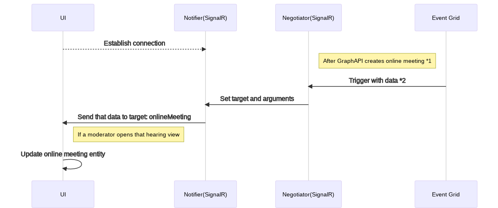
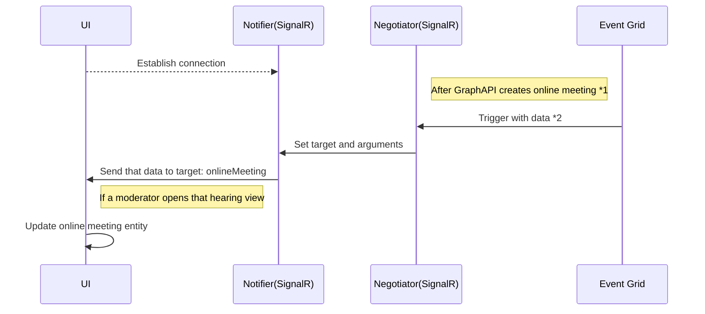

<!-- omit in toc -->

# Technical Design for SignalR

- [Background](#background)
- [Research](#research)
- [Plan](#plan)

## Background

The objective of this feature is to allow moderators to see the real-time view of rooms and participants.

## Research

The technical research behind the design used for the implementation is captured [here](../../trade-studies/realtime-view-of-rooms-and-participants.md).
This documentation describes Solution 3 - SignalR.

## Plan

SignalR has the following 3 types of notifications.

1. [Online meeting join URL](#online-meeting-join-url)

   - Join URL for case room
   - Reception URL for case room
   - Join URL for party room

2. [Move around participants](#move-around-participants)

   - Move into case room
   - Move out from case room
   - Move into party room
   - Move out from party room
   - Move into solo room
   - Move out from solo room

3. [Create a new room](#create-a-new-room)

   - New room's `roomId`

### Online meeting join URL

After creating a new hearing/room, the creation of an online meeting for each room will be executed on the backend.
During that time, the "Join room" button and the "Share the reception room URL" icon
are disabled until those online meetings are ready.

Once the online meetings are ready, SignalR needs to notify UI with appropriate data.

<!-- generated by mermaid compile action - START -->

  
Mermaid markup

<!-- generated by mermaid compile action - END -->

\*1 Filters: `CaseRoomOnlineMeetingInfoAvailable`, `HearingRoomOnlineMeetingInfoAvailable`

\*2 The following data is available from Event Grid.

- Case room `CaseRoomOnlineMeetingInfoAvailable`

  - id: string;
  - caseId: string;
  - caseNo: string;
  - roomType: CaseRoomType;
  - onlineMeeting: OnlineMeetingInformation;

- Party room `HearingRoomOnlineMeetingInfoAvailable`

  - id: string;
  - hearingRoomId: string;
  - name: string;
  - organisationId: string;
  - courtId: string;
  - courtroomId: string;
  - caseId: string;
  - hearingId: string;
  - expectedParticipantParty: string;
  - onlineMeeting: OnlineMeetingInformation;

### Move around participants

This should be covered by

- [T4J-1037: Signal R - UI- Participants Movements]
- [T4J-1035: Signal R Service - Participants Movements]

### Create a new room

Currently, a new room entity will be added by the UI once it's created.
However, if more than one moderator opens the same hearing,
the new room will be shown only on the one moderator's screen who created it.

To ensure that the UI is consistent for all moderators we use SignalR to notify all current screens.
However, one screen will already have the new room in the `partyRooms` array.
For that scenario we also need some logic to check if the new room is in that array already.
