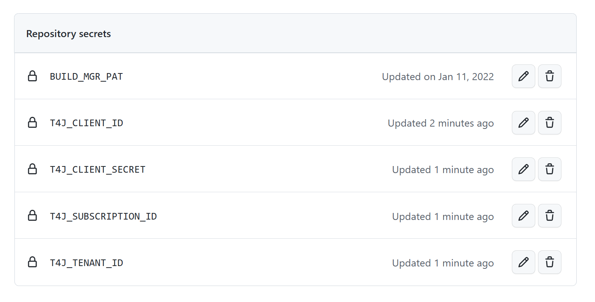

# README

This terraform script deploys the necessary terraform resources to handle remote
state as well as the shared keyvault used for CI/CD.

This README shows how to run the script, as well as configure GitHub and the
required service principals that will run the deployments in Github Actions.
This only needs to be done once and is logged here for disaster recovery
scenarios

## Installation

1. Make sure you have the latest version of Azure CLI and PowerShell installed.
2. Open PowerShell console window.
3. Run the following command:

   ```shell
    set export MSYS_NO_PATHCONV=1
   ```

4. Create a new Environment Variable for your Subscription by running this command:

   ```shell
    set export ARM_SUBSCRIPTION_ID="<Enter here your Azure subscription Id>"
   ```

5. Login to Azure CLI by running `az login` and signing in with an account that
   has Owner permissions to the subscription
6. Create service principal with subscription level permissions by running:

   ```shell
     az ad sp create-for-rbac -n <Name of SPN> --role Contributor --scopes /subscriptions/<Your Subscription ID>
   ```

   For example:

   ```shell
   az ad sp create-for-rbac -n t4jadmin --role Contributor --scopes /subscriptions/XXXXXXX-XXXX-XXXX-XXXX-XXXXXXXXXX
   ```

   This will return a JSON block that looks similar to this:

   ```json
   {
     "appId": "",
     "displayName": "",
     "name": "",
     "password": "",
     "tenant": ""
   }
   ```

7. Go to the `Github Repo -> Settings -> Security -> Secrets and variables -> Actions -> Repository secrets`.
   
   Each tenant needs its own service principal, so the secret names should indicate which tenant this service principal is for. As an example, if the tenant is for the company Contoso, the secret names could be something like:

   | Secret Name         | Secret Value                  |
   | ------------------- | ----------------------------- |
   | T4J_CLIENT_ID       | `appId` from SPN JSON         |
   | T4J_CLIENT_SECRET   | `password` from SPN JSON      |
   | T4J_SUBSCRIPTION_ID | `subscriptionId` from the cmd |
   | T4J_TENANT_ID       | `tenant` from SPN JSON        |

   Make a note of these secret names as they will be used when [setting up a new
   environment](../docs/wiki/setting-up-a-new-environment.md).

8. Before you can create the Shared Azure Resources in Azure using Terraform scripts below, you need to assign the role of the `Owner` to the Service Principal account you've created in the Step #6. You can do it by following these steps:

   1. Go to Azure Portal.
   2. Navigate to your Azure Subscription resource.
   3. Select `Access control (IAM)` from the left menu.
   4. Click `+Add` menu item and then select `Add role assignment`.
   5. Click on the `Privileged administrator roles` tab.
   6. Select `Owner` from the list or roles.
   7. Click `Next` button below.
   8. Click `+ Select members`, and from the list of members find the Service Principal you've created earlier.
   9. Select the Service Principal and click `Select` button.
   10. Review your selection for validation and click `Review + assign`.

9. Navigate to the `terraform/shared` directory.
10. Comment out the `backend` block in `backend.tf`. This will configure the
    backend with local state for now.
11. Run `terraform init`.
12. Create a new Terraform workspace and switch to it by running this command: `terraform worksace new <workspace_name>`. For example: `terraform workspace new dev` will create a new workspace environment called `dev` and all the following terraform commands will be run in that workspace.
13. Create a new file `terraform.tfvars` (example formatting can be found
    [here](https://www.terraform.io/docs/language/values/variables.html#variable-definitions-tfvars-files) with the following entries (the values are shown as example):

    ```tfvar
    location = "eastus"
    org_name = "contoso"
    project_name = "t4j"
    environment = "dev"
    subscription_id = "XXXXXXXX-XXXX-XXXX-XXXX-XXXXXXXXXXXX"
    service_principal_object_id= "XXXXXXXX-XXXX-XXXX-XXXX-XXXXXXXXXXXX"
    ```

    The `service_principal_object_id` value, which is the ObjectId of the SPN account we created earlier, you can obtain from the next command:

    ```shell
    az ad sp show --id <appId from SPN JSON> --query id --output tsv
    ```

14. Run `terraform plan` and verify there are no errors and the correct
    resources are being created.

15. Run `terraform apply`. All backend resources should now be created. Note:
    you can silently run this command by adding the `-auto-approve` option at
    the end.

    > Note: If the Terraform script fails to apply the planned changes, there might be tens of different reasons, and they need to be investigated thoroughly before trying to apply terraform plan again. But sometimes, the script fails due to some intermitten network and Azure resource allocation problems - in this case, you can try to re-run the last two steps: `Step 14` and `Step 15` verifying first that the resources are intended to be created with this script do not already exist in Azure subscription. If they do, and the terraform plan is intended to create them, then remove those resources from Azure before applying your terraform plan.

16. [Optional but Recommended] Upload state to the new backend.

    1. Create a new file named `backend.tf`
    1. Initialize this file with the following values:

    ```terraform
    terraform {
     backend "azurerm" {
      resource_group_name   = "<backend resource group>"
      storage_account_name  = "<backend storage account name>"
      container_name        = "<backend storage container name>"
      key                   = "terraform.tfstate"
      subscription_id      = "<subscription id>"
     }}
    ```

    1. Run the following command (enter the required backend variables based on the
       deployed values in step 4):

    ```shell
    terraform init -reconfigure
    ```

17. We will use the Key Vault managed storage account key feature to list (sync) keys with an Azure storage account, and regenerate (rotate) the keys periodically.

When you use the managed storage account key feature, consider the following points:

- Key values are never returned in response to a caller.
- Only Key Vault should manage your storage account keys. Don't manage the keys yourself and avoid interfering with Key Vault processes.
- Only a single Key Vault object should manage storage account keys. Don't allow key management from multiple objects.
  Regenerate keys by using Key Vault only. Don't manually regenerate your storage account keys.

In order to set up the required permissions, run the following PowerShell script in the command terminal in `terraform/shared` folder:

```powershell
.\set-kv-permissions.ps1 -ServicePrincipalId <value> -TenantId <value> -UserUpn <value> [-Help]
```

For example:

```powershell
.\set-kv-permissions.ps1 -ServicePrincipalId XXXXX -UserUpn admin@contoso.onmicrosoft.com
```

## SAS Token for Azure Storage Account

We need to create a user delegation, shared access signature (SAS) token for the Azure Storage Account that was just created by the terraform script. We can do it in different ways, but here we provided the steps using the Azure portal.

1. Go to the Azure portal and navigate to your storage account.
2. Click on `Shared access signature`
3. Make sure that `Blob` is selected for `Allowed services`, and all `Allowed resource types` are also selected.
4. Leave all `Allowed permissions` to their default values
5. Change the `End` date for when the token expires to some date in a future.
6. Leave all other settings as their default values
7. Click `Generate SAS and connection string` button to generate a new SAS token.
8. Copy `SAS token` from the `SAS token` text field, you'll use it in the next step.

### Update GitHub Secrets with the SAS Token

Go to the `Github Repo -> Settings -> Security -> Secrets and variables -> Actions -> Repository secrets`.

And add the following secret to the earlier created secrets for your GitHub repository:

| Secret Name     | Secret Value                   |
| --------------- | ------------------------------ |
| T4J_STORAGE_SAS | `SAS token` from previous step |

## Troubleshooting

### Terraform Errors

If, when applying the terraform `terraform apply` command you get an error
stating that this operation cannot perform write operation because the resource
group in which to be destroyed resource is locked, you can temporarily unlock
your resource group by executing the following terraform commands in `lock`
folder:

To initialize terraform in `lock` folder:

```terraform
terraform init
```

To import the existing lock (was created earlier by the backend) into a new lock
state:

```terraform
terraform import 'azurerm_management_lock.resource-group-level' '/subscriptions/<insert here your subscription id>/resourceGroups/<insert here your resource group name>/providers/Microsoft.Authorization/locks/resource-group-level'
```

To execute plan in the lock state:

```terraform
terraform plan
terraform apply
```

To temporarily destroy lock:

```terraform
terraform destroy -target 'azurerm_management_lock.resource-group-level'
```

Now, you can go back to `backend` folder, for example, and re-apply the last
`terraform plan` that failed due to the lock. This will ensure the resource(s)
needed to be deleted will be deleted, and the lock will be re-established back.

### Custom Role failed to be created with Terraform script

In the event a custom role for the storage account failed to be created as part of the terraform script, you can create it manually and then assign it to the SPN account, as well as, to your Azure admin user following these steps:

1. Next, you will create a custom role for the backend Azure resource group
   resource with the set of permissions provided in the
   [CustomRoleDefinition.json.template](../deploy/CustomRoleDefinition.json.template).
   First, clone `CustomRoleDefinition.json.template` file into
   `CustomRoleDefinition.json` document that is located in the `deploy` folder. Then, replace all replacement
   placeholders with corresponding values.
2. Open the Azure Portal, navigate to your backend resource group and select
   `Access Control (IAM)` menu.
3. Click `Add` in the `Create a custom role` option.
4. Select `JSON` tab, click `Edit` button and then replace the content in the
   edit window with the content from your `CustomRoleDefinition.json` document.
5. Click `Next` button and then finish creation of the new custom role: `T4J Storage Account & Role Assignment Owner`.
   > Note: It may take a few minutes for this role to appear in the subscription.
